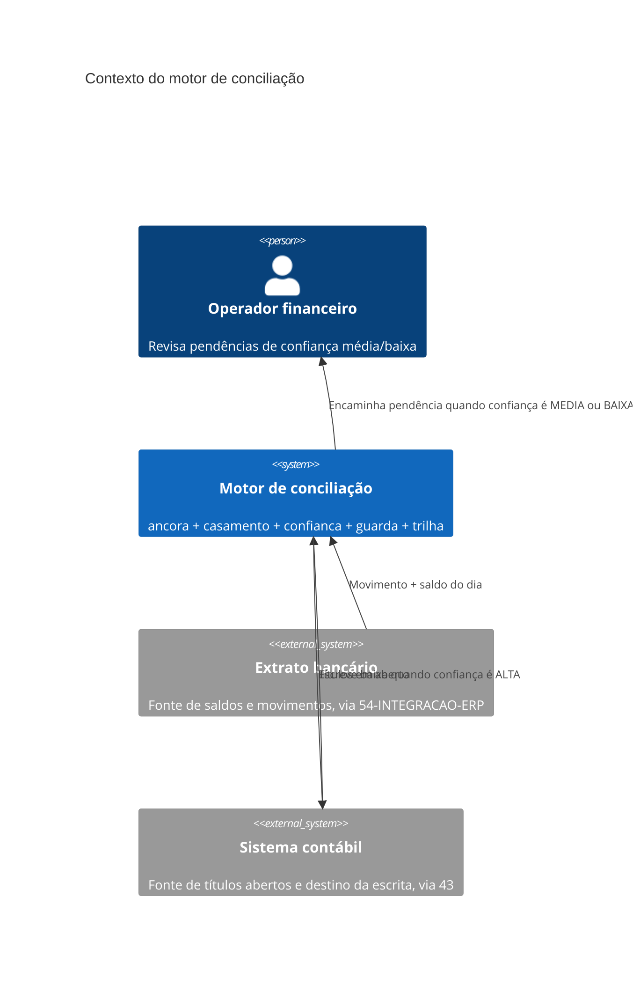

# Arquitetura

O motor é composto por cinco módulos de biblioteca padrão, sem dependência externa, cada um
resolvendo exatamente uma decisão. Nenhum módulo conhece os outros quatro por importação direta
— a composição acontece em quem chama, ilustrada em
[`exemplos/45-conciliacao-contas/tests/test_fluxo_completo.py`](../exemplos/45-conciliacao-contas/tests/test_fluxo_completo.py).
Essa escolha existe porque cada módulo tem uma pergunta de teste diferente (a âncora responde
"os saldos fecham?", não "quem é a contraparte?") e acoplar os cinco num único objeto obrigaria
todo teste de uma pergunta a montar o estado das outras quatro.

O diagrama mostra o motor como uma caixa que recebe dado de duas fontes externas — o extrato
bancário e o sistema contábil, ambos fora do escopo deste volume — e produz dois resultados
possíveis: uma escrita automática de volta no sistema contábil, ou uma pendência encaminhada a
um operador humano. Nenhuma seta liga o motor diretamente ao banco: a integração real (formato
de arquivo, autenticação, paginação) é responsabilidade de `54-INTEGRACAO-ERP`, e este volume
consome apenas as estruturas de dados já normalizadas (`Movimento`, `TituloAberto`).

## Os cinco módulos

`ancora.py` decide se o dia fecha; `casamento.py` decide qual título corresponde ao movimento;
`confianca.py` decide se a decisão de casamento é confiável o bastante para escrever sozinha;
`guarda.py` impede que a mesma escrita aconteça duas vezes; `trilha.py` registra o que foi
decidido, de forma que a pergunta "isso já foi processado?" tenha uma resposta que sobrevive a
mudanças no sistema externo. A ordem de leitura recomendada é essa mesma ordem — cada módulo é
escrito assumindo que o leitor já conhece o anterior, detalhado em `11-Implementacao.md`.
