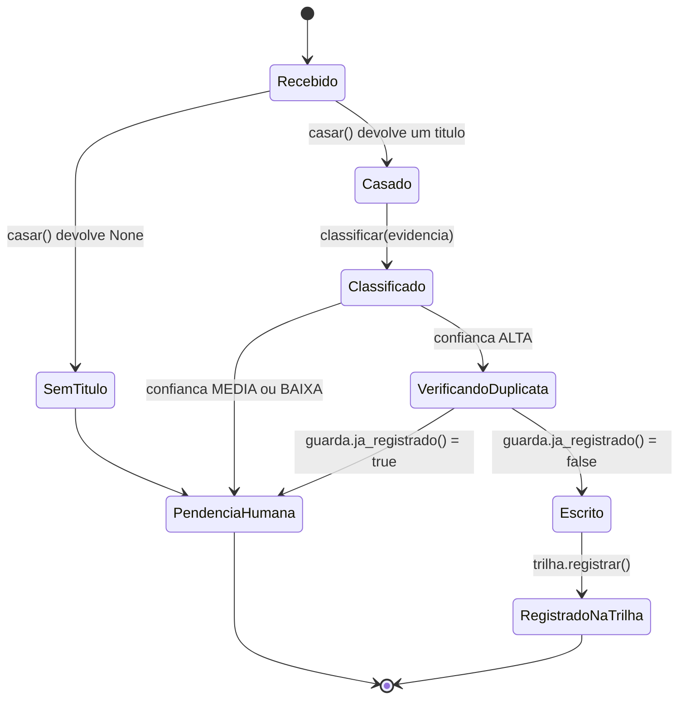

# Fluxogramas

O estado `Recebido` é o ponto de entrada de todo movimento bancário. Dali em diante existem
exatamente dois destinos finais: `RegistradoNaTrilha`, quando o movimento foi casado, classificado
como ALTA, não era duplicata e foi escrito; ou `PendenciaHumana`, em qualquer um dos três pontos
em que a máquina decide não prosseguir sozinha — sem título casado, confiança insuficiente, ou
suspeita de duplicata. Não existe caminho de `VerificandoDuplicata` de volta para `Escrito` sem
passar por `guarda.ja_registrado()` retornando falso: é o ponto único onde a idempotência é
imposta, e é também o ponto que os testes de `test_guarda.py` cobrem isoladamente do resto da
máquina, para que uma mudança no casamento ou na confiança nunca corrompa silenciosamente a
garantia de não duplicar.

## O caminho de decisão de confiança em detalhe

A transição de `Classificado` para `VerificandoDuplicata` só acontece sob duas condições
alternativas, implementadas em `classificar()`: match exato de valor combinado com similaridade
de nome alta, ou histórico forte (fornecedor recorrente reconhecido pelo nome, com número mínimo
de ocorrências e dominância mínima do mesmo destino). A segunda condição existe para cobrir
casos em que o valor varia mas o fornecedor é sempre o mesmo — um débito de cartão recorrente,
por exemplo — e está coberta pelo teste
`test_historico_forte_promove_a_alta_mesmo_sem_valor_exato`. Nenhuma das duas condições, sozinha,
é permissiva o bastante para produzir falso positivo sistemático: a primeira exige os dois
sinais ao mesmo tempo, e a segunda exige volume e consistência histórica, não uma ocorrência
isolada — `test_ocorrencia_isolada_nao_vira_regra` prova essa fronteira.
