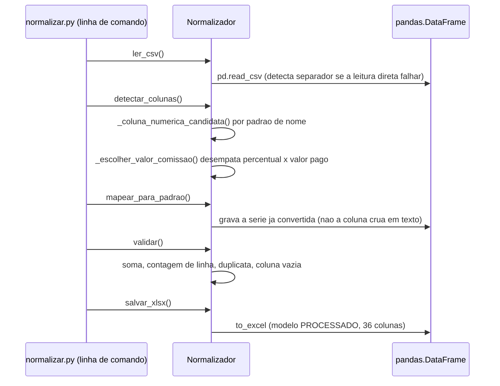

# Diagramas

A sequência mostra a ordem real de chamada dentro de `Normalizador.executar()`: cada etapa
depende do resultado da anterior, e nenhuma delas é opcional — `mapear_para_padrao()` lança
`ValueError` se `detectar_colunas()` não tiver rodado antes, e `validar()` faz o mesmo em relação
a `mapear_para_padrao()`. O passo que mais concentra decisão é `detectar_colunas()`: é ali que
`_escolher_valor_comissao()` resolve o caso em que duas colunas do CSV casam com o mesmo padrão
de nome (`% da Comissão` e `Valor Comiss`, no caso real do DIGIO), detalhado em
`06-Fluxogramas.md` como árvore de decisão.

## Por que a conversão numérica acontece antes do mapeamento, não durante

`_coluna_numerica_candidata()` já devolve a série convertida (não o nome da coluna crua), e
`mapear_para_padrao()` usa essa série guardada em `self._series_numericas`, nunca volta a ler
`self.df_original` diretamente para os campos monetários. Essa escolha existe porque a conversão
de formato brasileiro (`_para_numerico`) tem lógica própria — tentar primeiro o formato direto,
só então aplicar a troca de separador — e repetir essa lógica em dois lugares (detecção e
mapeamento) criaria a chance real de as duas divergirem depois de uma mudança futura.

## Por que `salvar_xlsx` não recebe a série numérica diretamente

O último passo da sequência escreve o `DataFrame` inteiro de uma vez, não campo a campo — a
conversão já aconteceu antes, em `mapear_para_padrao()`, então `salvar_xlsx()` não precisa saber
nada sobre formato brasileiro nem sobre qual coluna era candidata a quê. Essa separação é o que
permite testar a conversão numérica (`test_para_numerico_converte_formato_brasileiro`) sem
precisar gerar um arquivo XLSX de verdade a cada execução do teste.
