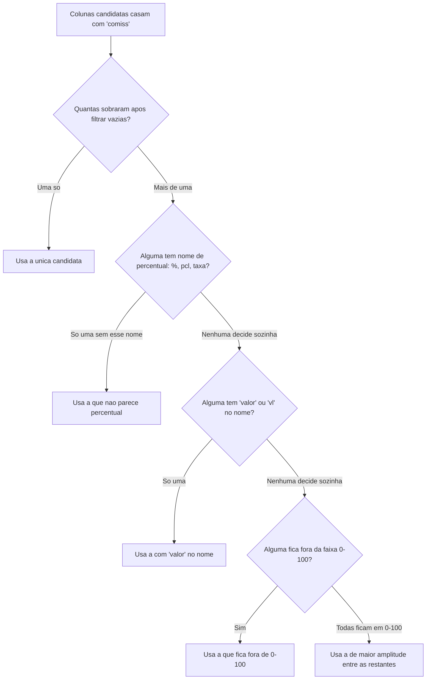

# Fluxogramas

Esta árvore é `_escolher_valor_comissao()` desenhada, e existe porque o caso real do DIGIO — "%
da Comissão" e "Valor Comiss" casando com o mesmo padrão de nome — provou que uma única regra de
desempate não bastava. O primeiro nó que decide sozinho encerra a árvore ali: se o nome já
resolve (percentual descartado, ou "valor" identificado sem ambiguidade), a magnitude nunca é
consultada. Magnitude só entra como último recurso porque é a mais frágil das três: um valor de
comissão pequeno pode acidentalmente ficar dentro de 0-100 e parecer percentual, o que o teste
`test_escolhe_valor_comissao_e_nao_o_percentual` não cobre — é o motivo de o nome ter prioridade
sobre magnitude sempre que consegue decidir por si só.

## O caminho que nunca deveria ser alcançado

Antes de qualquer nó desta árvore, `_coluna_numerica_candidata()` já filtrou toda coluna 100%
vazia. Isso significa que o nó `B` nunca recebe zero candidatas por esse motivo — se zero
colunas sobrarem depois desse filtro, o fluxo não entra nesta árvore: `detectar_colunas()`
levanta `ValueError("Não consegui detectar coluna de COMISSÃO")` antes, tratado como falha de
layout do banco, não como entrada nesta árvore de decisão. A árvore assume, por construção, que
chegou aqui com pelo menos uma candidata real.

A mesma árvore, com os nós de nome trocados, descreve `detectar_colunas()` para valor bruto e
base de comissão — a diferença é que essas duas colunas não têm passo de desempate por
percentual, porque nenhum padrão de nome equivalente a "% da Comissão" existe para elas no CSV
real observado até hoje.
