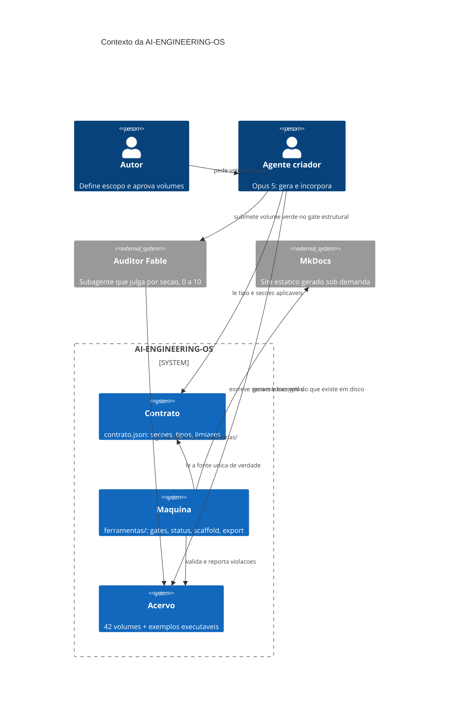
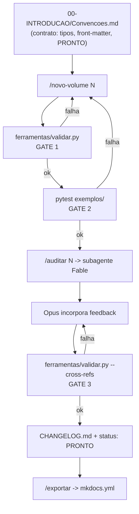
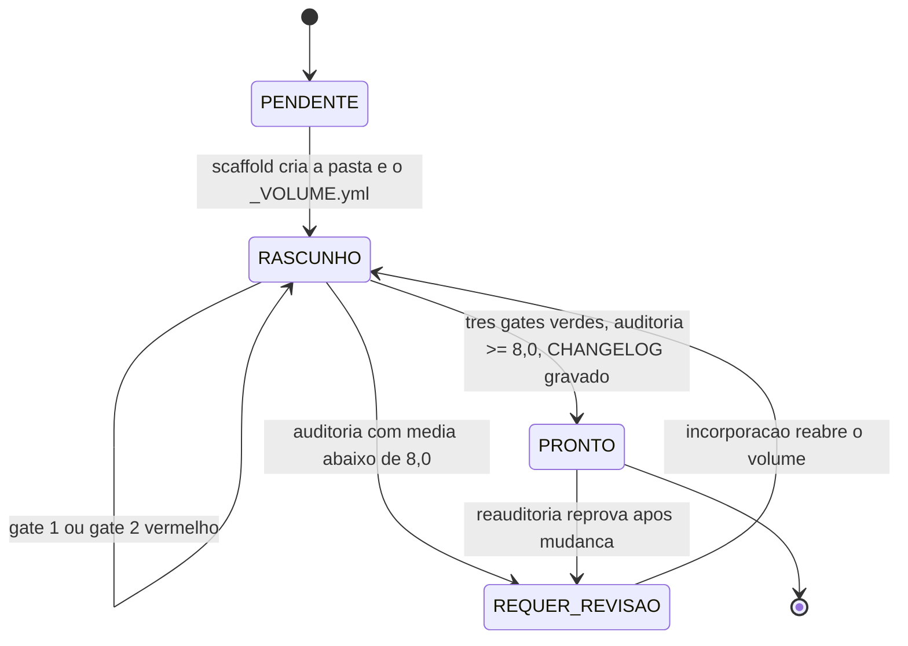

# Arquitetura geral da plataforma

A AI-ENGINEERING-OS não é uma coleção de documentos com um índice. É uma **linha de
produção** com portas de qualidade executáveis, e o acervo é o que sai dela. Este arquivo
descreve a linha: as peças, o fluxo e por que cada porta existe onde está.

## As quatro camadas

A plataforma se organiza em quatro camadas, e a dependência entre elas só aponta para
baixo.

1. **Contrato.** `00-INTRODUCAO/contrato.json` declara as 18 seções, os cinco tipos de
   volume, os três status válidos, os limiares de palavras, os marcadores proibidos, os
   diagramas obrigatórios por tipo e os 42 volumes com nome, tipo e marca de perecível.
   Nada acima dessa camada tem regra própria.
2. **Máquina.** `ferramentas/` lê o contrato e o transforma em decisão automática:
   `frontmatter.py` (gramática), `contrato.py` (resolução de seções por tipo), `regras.py`
   (uma função pura por regra), `validar.py` (orquestração e CLI dos gates), `status.py`
   (leitura de estado), `scaffold.py` (materialização das pastas), `exportar.py` (site).
3. **Acervo.** Os volumes `NN-NOME/`, cada um com `_VOLUME.yml` e um Markdown por seção,
   mais o código executável em `exemplos/<vol>/` e as bibliotecas transversais
   (`frameworks/`, `agentes/`, `prompts/`, `templates/`, `diagramas/`, `referencias/`,
   `sdk/`).
4. **Operação.** As cinco skills e o subagente auditor, que orquestram criação, auditoria,
   inspeção, checagem cruzada e exportação chamando a camada 2 — nunca reimplementando
   regra.

O diagrama de contexto mostra que a máquina é a única peça que fala com o contrato e com o
acervo ao mesmo tempo — é ela que converte regra declarada em veredicto. O agente criador
escreve no acervo, mas não decide se o que escreveu vale: essa decisão sai da máquina. O
auditor externo entra pela borda, lê o volume e grava um relatório; ele não edita conteúdo.
E o MkDocs consome apenas o que já existe em disco, de modo que o site nunca promete uma
página que não foi escrita.

## O fluxo dos três gates

O fluxograma mostra que nenhum caminho chega a `PRONTO` sem atravessar os três gates: o
validador estrutural, os testes dos exemplos e a checagem de referências cruzadas — com a
auditoria do Fable entre o segundo e o terceiro. Toda seta de falha volta para a etapa de
geração ou de incorporação; nenhuma segue adiante. É por isso que a definição de PRONTO
pode ser afirmada sem confiar na palavra de quem escreveu: o caminho até ela é fechado por
programa, não por disciplina.

A ordem dos gates não é arbitrária. O gate 1 é o mais barato e o que pega os erros mais
comuns, então roda primeiro. O gate 2 exige que o código exista e passe, o que só faz
sentido depois que a estrutura está de pé. A auditoria é o passo mais caro — consome um
modelo inteiro lendo prosa — e por isso só recebe volume já estruturalmente válido e
executável: gastar auditoria em volume que nem compila é julgar o problema errado. O gate 3
fecha por último porque referência cruzada só é verificável quando os dois lados existem.

## O ciclo de vida de um volume

A máquina de estados descreve os únicos três status graváveis mais o estado derivado
`PENDENTE`, que não existe em arquivo nenhum: `status.py` o calcula quando a pasta do
volume ainda não foi materializada. As transições para `PRONTO` têm uma única porta de
entrada, e ela exige as quatro condições da Definição de PRONTO simultaneamente. A
transição de volta, de `PRONTO` para `REQUER_REVISAO`, existe porque volume pronto não é
volume imutável: mudança no conteúdo ou no contrato pode reprovar o que antes passava, e o
acervo precisa poder admitir isso.

## Onde a regra vive, em uma frase

Regra de conteúdo vive em `contrato.json` e é aplicada por `ferramentas/regras.py`. Regra
de processo vive neste arquivo e em `CLAUDE.md`. Regra de forma humana vive em
[Convencoes.md](Convencoes.md), que o teste
`ferramentas/tests/test_contrato.py::test_convencoes_nao_derivou` mantém honesto. Nenhuma
regra vive em dois lugares com liberdade de divergir — quando parece que vive, é porque um
teste está faltando.
