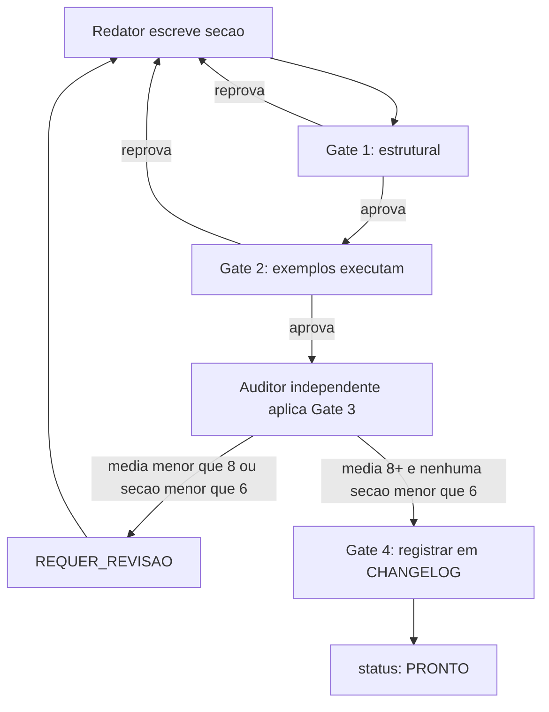

# Arquitetura

A governança deste acervo tem três camadas, cada uma com um dono e uma forma de verificação
diferente. A camada mais baixa é o **contrato legível por máquina**
(`00-INTRODUCAO/contrato.json`): campos de front-matter, seções por tipo, diagramas obrigatórios,
mínimo de palavras, marcadores proibidos. É a única fonte de verdade — quando qualquer outro
documento (incluindo este volume) descreve uma regra diferente, o contrato vence, e o teste
`test_convencoes_nao_derivou` existe para que essa divergência nunca fique silenciosa.

A camada intermediária é a **projeção humana** (`00-INTRODUCAO/Convencoes.md` e este volume):
prosa que explica o "porquê" de cada regra do contrato, para quem precisa decidir um caso que o
contrato não cobre explicitamente (por exemplo, se um novo tipo de volume deveria existir). A
camada mais alta é a **decisão do autor**, registrada como texto datado — a única camada que não
é derivável de código, porque envolve escopo (o que este acervo cobre) e prioridade (o que se
escreve primeiro), que são julgamento, não cálculo.

## Papéis

Não existe um papel "escritor" genérico neste acervo — existem funções específicas, cada uma
com um critério de saída diferente. Quem **redige** um volume produz prosa e código citável;
quem **audita** aplica os quatro critérios de PRONTO e não pode ser a mesma entidade que redigiu
(a auditoria por "outro modelo" no critério 3 existe precisamente para separar autor de
verificador); quem **decide escopo** (o autor humano) resolve o que nenhuma regra escrita
resolve — como a fronteira entre volumes que se sobrepõem, ou qual subconjunto de volumes é
prioridade num ciclo.

O fluxograma mostra a única porta de saída para `PRONTO`: passar pelos quatro gates em sequência,
sem atalho. Reprovar em qualquer ponto devolve o volume para o redator, nunca para uma correção
silenciosa feita pelo próprio gate — a máquina relata a violação, não conserta o texto. Essa
arquitetura é deliberadamente sem redundância de papel: um único humano pode desempenhar todos
eles em momentos diferentes, mas nunca simultaneamente no mesmo volume no mesmo gate, porque o
valor do papel de auditor está exatamente em não ser o mesmo julgamento que já aprovou o texto
uma vez.
