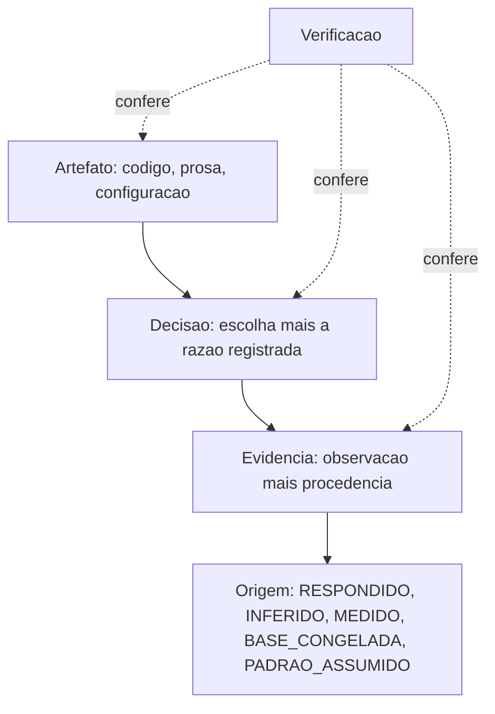
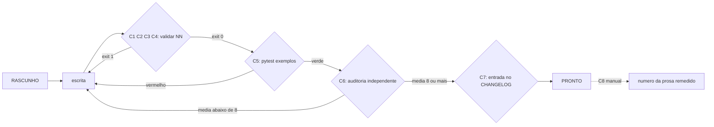

# Diagramas

Dois diagramas. O primeiro mostra as camadas e a direção permitida entre elas; o segundo mostra onde
cada controle da matriz se prende ao ciclo de vida de um volume.

## As quatro camadas e a direção das setas

A seta cheia é dependência: o artefato existe por causa da decisão, que existe por causa da
evidência. A seta pontilhada é conferência, e ela alcança as três camadas — verificação que só olha
o artefato não percebe decisão órfã, e decisão órfã é como o acervo adquire regra que ninguém
consegue explicar.

`PADRAO_ASSUMIDO` aparece na lista de origens de propósito, apesar de ser a única que a plataforma
trata como defeito quando chega numa entrega. Uma taxonomia que só nomeia as origens boas obriga quem
assumiu um padrão a classificá-lo como outra coisa, e o resultado é um valor assumido carimbado como
respondido.

## Onde cada controle se prende

Os laços de volta para `escrita` são o comportamento desejado, e não uma concessão: um gate cujo
único caminho é para frente não é gate. O único controle fora da cadeia é o C8, ligado por linha
pontilhada porque depende de disciplina humana — e é exatamente por isso que ele está desenhado, em
vez de subentendido.

A ordem entre os gates também é deliberada, e vale explicar porque a inversão é tentadora. O gate
estrutural roda **antes** do executável, e o executável **antes** da auditoria, na ordem crescente de
custo: validar seções custa milissegundos, rodar a suíte custa dezenas de segundos, e a auditoria
custa uma sessão inteira de outro modelo. Auditar um volume que ainda tem seção faltando gasta o
recurso mais caro para descobrir o que o mais barato descobriria — e, pior, produz um relatório sobre
um texto que vai mudar antes de alguém agir sobre ele.

Repare também que não existe seta de `PRONTO` de volta para `escrita`. Não é esquecimento: volume
promovido que precisa mudar volta a `RASCUNHO` primeiro, e a passagem por ali é o que obriga uma nova
entrada no `CHANGELOG`. Uma aresta direta permitiria corrigir um volume `PRONTO` em silêncio, que é a
forma mais discreta do anti-padrão A1.
