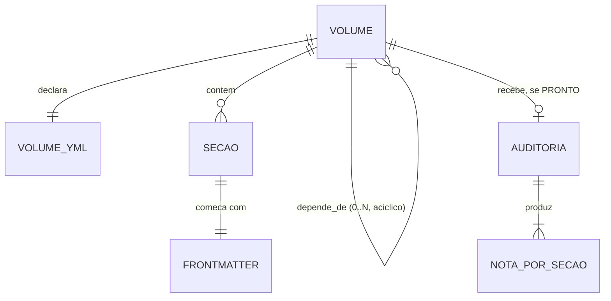
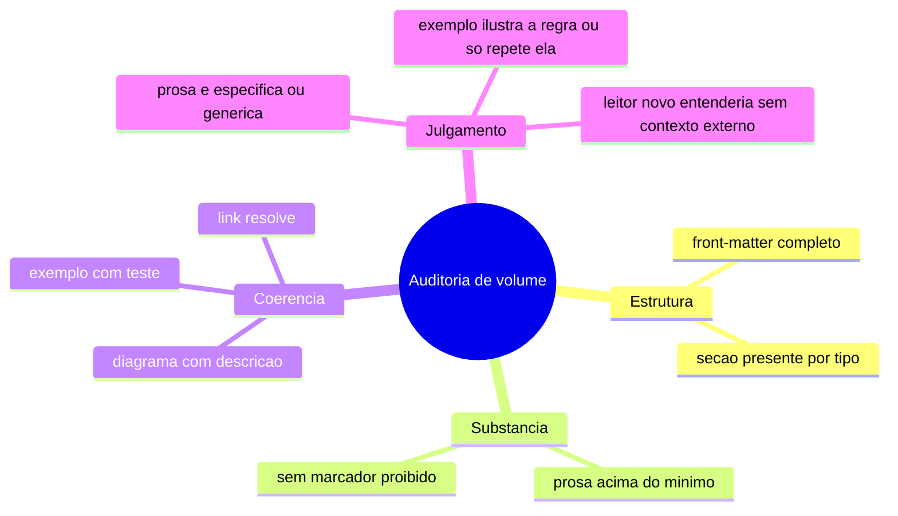

# Diagramas

O diagrama mostra a relação central deste volume: um `VOLUME` contém várias `SECAO`, cada uma
com seu próprio front-matter (não o do `_VOLUME.yml` da pasta, que é um arquivo separado e sem
delimitadores). A relação `depende_de` é do volume para outros volumes, nunca de uma seção para
outra seção — o grafo de pré-requisito de leitura opera no nível de volume inteiro, porque não
faz sentido dizer que só a seção `07-Regras` de um volume depende de outro volume, quando o
resto do mesmo volume não depende de nada. A `AUDITORIA`, quando existe, produz uma nota por
seção — é essa granularidade que permite o critério "nenhuma seção abaixo de 6" da Definição de
PRONTO, em vez de uma nota única para o volume inteiro que escondesse uma seção fraca atrás de
outras fortes.

## O que uma auditoria mede, por seção

Os três primeiros ramos são exatamente o que o gate mecânico (critérios 1 e 2 da Definição de
PRONTO) já verifica sem intervenção humana. O quarto ramo, "Julgamento", é o que só a auditoria
do critério 3 pode avaliar — é a diferença entre um texto que passa no contador de palavras e um
texto que de fato ensina algo a quem não escreveu. Um volume pode ter os três primeiros ramos
perfeitos e ainda reprovar no quarto, e é exatamente esse caso que a Definição de PRONTO cobre ao
exigir os dois tipos de verificação em conjunto, não um no lugar do outro.
