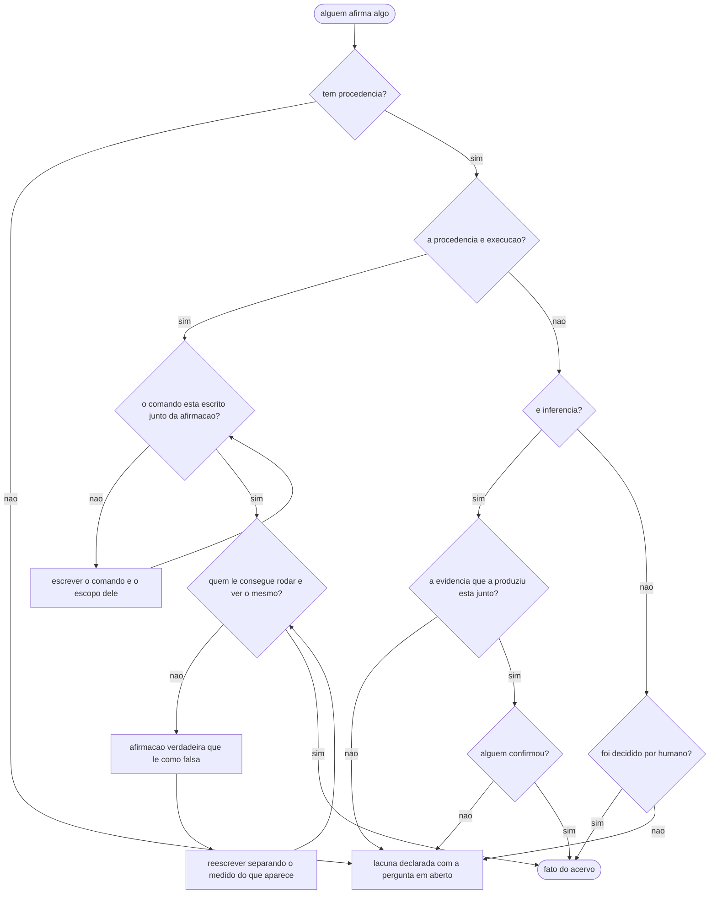

# Fluxogramas

O fluxo que este volume governa não é o de escrever um volume — esse está em
[`05-Diagramas.md`](05-Diagramas.md). É o fluxo menor e mais frequente: alguém afirma alguma coisa, e
essa afirmação precisa virar fato do acervo ou pendência declarada. Acontece dezenas de vezes por
volume, e é onde a disciplina se ganha ou se perde.

Sete pontos de decisão, e vale ler dois deles com atenção porque são os que custaram correção real.

O ponto `Q4` — "quem lê consegue rodar e ver o mesmo?" — não é redundante com `Q3`. Uma seção deste
acervo afirmava que a suíte roda em menos de dois décimos de segundo. Era **verdade** sobre os corpos
de teste, medida com ferramenta adequada, e mesmo assim quem rodava o comando via dezessete segundos
na tela e concluía que o texto mentia. Afirmação verdadeira que o leitor não consegue confirmar tem o
mesmo efeito prático de uma falsa, e por isso o fluxo tem um estado chamado exatamente assim.

O ponto `CONF` é o que impede o modo de falha mais caro da inferência: um palpite plausível que
ninguém recusou vira, três passos depois, um requisito que ninguém pediu. A saída dele para a lacuna
declarada não é punição — lacuna declarada é um resultado legítimo e barato.
