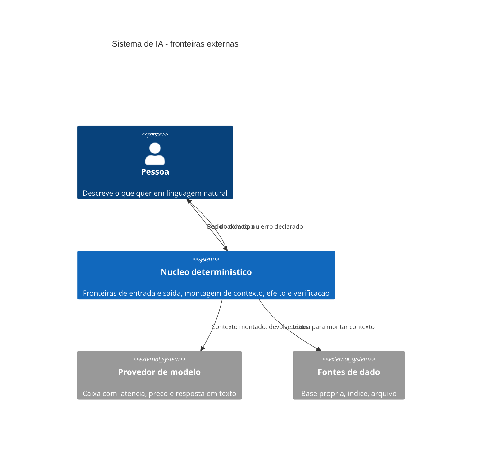

# Diagramas

Dois diagramas obrigatórios para volume de arquitetura: o de contexto, que mostra quem fala com quem,
e o de sequência, que mostra em que ordem e quantas vezes.

## Contexto



O que este diagrama afirma, e que costuma ser desenhado errado, é que **a pessoa nunca fala com o
modelo**. Toda seta que sai do núcleo para fora é responsabilidade do núcleo, inclusive a falha: se o
provedor está fora do ar, quem responde à pessoa é o núcleo, com erro declarado, e não um vazamento
de exceção com o nome do fornecedor.

## Sequência

```mermaid
sequenceDiagram
    participant P as Pessoa
    participant E as Fronteira de entrada
    participant C as Montagem de contexto
    participant M as Modelo
    participant S as Fronteira de saida
    participant EF as Efeito
    P->>E: pedido
    E->>E: valida forma; recusa cedo se invalido
    E->>C: estrutura com tipo
    C->>C: monta contexto de forma deterministica
    C->>M: uma chamada
    M-->>S: texto livre
    S->>S: valida contra o contrato declarado
    alt resposta obedece ao contrato
        S->>EF: dado com tipo
        EF-->>P: resultado
    else resposta nao obedece
        S-->>P: erro declarado; nenhum efeito
    end
```

O ramo `else` é a parte do diagrama que mais falta nos sistemas reais, e ele carrega a decisão mais
importante: **quando a resposta não obedece ao contrato, nenhum efeito acontece**. A alternativa —
seguir com o melhor palpite — é como um sistema grava dado que ninguém pediu.

Repare que há **uma** seta para o modelo. O número de chamadas por caminho é decisão de arquitetura:
cada uma acrescenta latência, custo e uma chance nova de resposta inútil. Um caminho que faz três
chamadas precisa justificar as três.

Duas ausências no diagrama são deliberadas, e valem mais que boa parte do que está desenhado.

Não existe seta de `Pessoa` para `Modelo`. Num sistema real ela às vezes existe de fato — alguém
expôs a chave no navegador para economizar uma camada — e o diagrama recusa isso de propósito: a
partir do momento em que a pessoa fala direto com o provedor, não há fronteira de saída possível, e
as oito regras deste volume deixam de valer todas de uma vez.

E não existe seta de `Modelo` para `Efeito`. É a representação gráfica da regra N2: o que sai do
modelo entra na fronteira de saída, e só dali segue. Quando alguém desenha essa seta — ou a escreve
em código, que é a forma comum — o sistema passou a permitir que o texto de uma resposta produza
gravação, cobrança ou envio sem passar por validação nenhuma. É o anti-padrão B1 e o B3 ao mesmo
tempo, e é o defeito que mais custa a reverter, porque cada chamador novo aumenta o preço.
