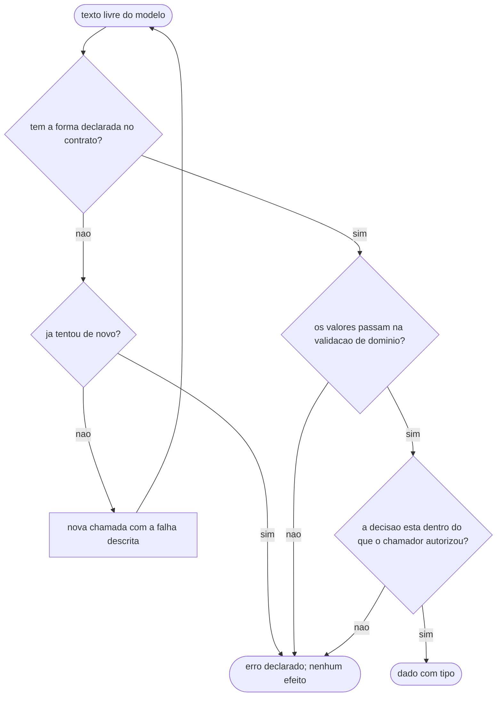

# Fluxogramas

O fluxo abaixo é o da fronteira de saída — a parte 4 da arquitetura. É curto de propósito, porque
fronteira complicada é fronteira que vaza.

Três perguntas, e elas são diferentes entre si — confundi-las é o defeito mais comum desta fronteira.

A primeira é **forma**: o texto é o JSON que se pediu, com os campos que se pediu. Falha aqui é
recuperável por repetição, porque descrever a falha na segunda chamada costuma resolver. É a única
das três em que repetir faz sentido.

A segunda é **domínio**: o valor cabe no mundo. Uma data de vencimento no passado tem forma perfeita
e conteúdo impossível. Repetir aqui é quase sempre desperdício — se o modelo produziu um valor fora
do domínio, é porque o contexto não continha a restrição, e a correção é no contexto.

A terceira é **autorização**, e é a que quase nunca existe. O modelo devolveu uma decisão que o
chamador não pediu: apagar em vez de arquivar, aprovar acima do limite, escrever num lugar fora do
escopo. Nenhuma validação de forma pega isso, porque a resposta está perfeitamente bem formada. É a
fronteira que separa "o modelo errou" de "o modelo fez algo que não podia".

Todos os três caminhos de falha convergem para o mesmo estado, e a propriedade que importa é que
**nenhum deles produz efeito**. Um sistema em que a falha de validação ainda grava alguma coisa
"para não perder" transforma o caso de erro no caminho mais perigoso do código.
