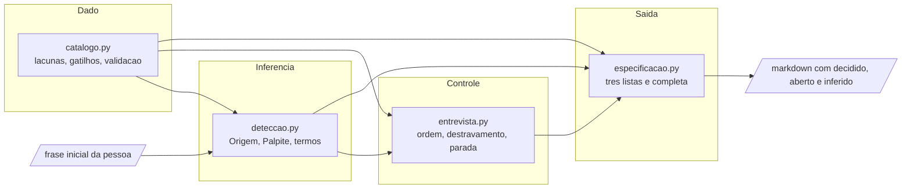

# Arquitetura

O motor tem quatro módulos e uma única direção de dependência. Nenhum módulo importa quem o
importa, e nenhum conhece o módulo que vem depois dele na cadeia. A regra não é estética: ela é o
que permite trocar a heurística de detecção sem tocar no controle, e revisar o texto de trinta e
sete perguntas sem risco de mudar a ordem em que elas são feitas.

O diagrama mostra que `catalogo.py` é a base de todos e não depende de ninguém: ele importa
apenas biblioteca padrão, e é por isso que o catálogo pode ser validado e testado sem instanciar
nada. `deteccao.py` depende do catálogo só para nomear os alvos das inferências, `entrevista.py`
depende dos dois, e `especificacao.py` depende dos três e é o único que enxerga a entrevista. As
setas nunca voltam: `especificacao.gerar` lê o objeto de entrevista e não escreve nele, o que faz
de uma especificação um retrato e não uma visão viva do estado.

## O que cada módulo é responsável por não fazer

A parte útil da fronteira é a negativa, porque é ela que se viola por conveniência.

`catalogo.py` **não ordena**. Ele devolve as lacunas ativas na ordem em que estão declaradas, e o
teste `test_ordem_de_lacunas_ativas_e_a_do_catalogo` fixa isso. Se ele ordenasse por peso, a
política de priorização estaria escondida atrás de um nome que promete filtrar, e mudá-la exigiria
mexer no arquivo onde vive o conteúdo das perguntas.

`deteccao.py` **não confirma e não decide**. Ele produz candidatos com procedência. Nenhum palpite
dele altera estado; alterar é `Entrevista.confirmar`, que exige que alguém chame.

`entrevista.py` **não formata e não julga completude**. Ele sabe qual pergunta vem agora e o que
uma resposta destrava. Se ele também decidisse se a especificação está completa, a regra de
completude ficaria no mesmo objeto que produz as perguntas — e a tentação de considerar completa a
entrevista em que não há mais o que perguntar seria irresistível. São coisas diferentes: `proxima()`
devolver `None` significa apenas que nenhuma lacuna ativa passa do limiar, e não que a
especificação fechou.

`especificacao.py` **não pergunta e não completa lacuna faltante com padrão**. `Origem.PADRAO_ASSUMIDO`
existe nomeado em `deteccao.py` justamente para que se possa proibir sua aparição aqui sem que
alguém a tenha escrito de propósito, e um teste verifica que a palavra não aparece no markdown do
caso incompleto.

## O estado, e por que ele é pequeno

Só um objeto muta: a `Entrevista`. Dentro dela o estado são quatro coisas — plataformas
confirmadas, contextos confirmados, palpites ainda pendentes e respostas por id. Tudo o que ela
devolve é imutável: tuplas e objetos congelados, para que o chamador não altere o estado por dentro
de um resultado de consulta. As lacunas ativas **não** são estado: são calculadas a cada consulta a
partir dos conjuntos confirmados, do mesmo jeito que a expiração no volume 12 é calculada por
consulta em vez de gravada. Guardá-las abriria a possibilidade de o conjunto guardado divergir dos
conjuntos que o produziram, e essa divergência é silenciosa por natureza.
