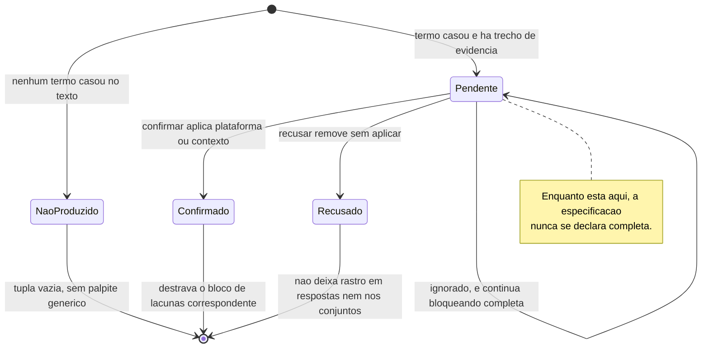
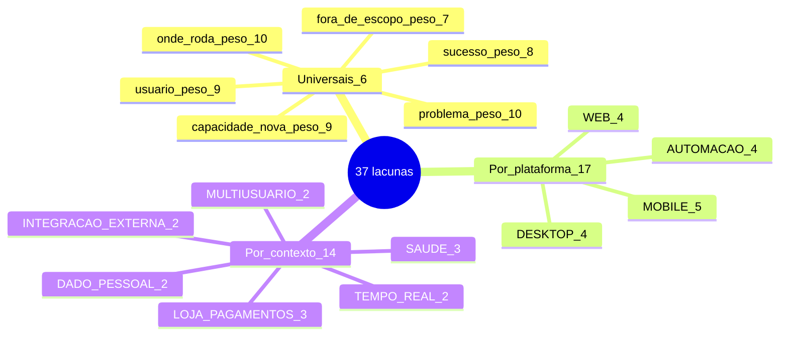

# Diagramas

Dois diagramas, e cada um responde uma pergunta que o outro não responde. O primeiro descreve o
ciclo de vida de um palpite — o que pode acontecer com uma inferência entre nascer e sair da
conversa. O segundo descreve a forma do catálogo, que é a estrutura que decide quais perguntas
existem para um caso.

## Ciclo de vida de uma inferência

O diagrama mostra que há dois estados terminais desejáveis e um estado de espera que é
deliberadamente incômodo. `NaoProduzido` é resultado legítimo e não erro: frase vazia ou sem sinal
não gera palpite algum, e o caminho de saída dali é uma tupla vazia. `Pendente` tem um laço em si
mesmo — o caso de quem simplesmente ignora o palpite — e esse laço é o que a propriedade `completa`
pune: ignorar não é decidir, e uma especificação que depende de uma afirmação que ninguém fez não
se declara pronta. As duas saídas úteis são simétricas apenas na aparência: `Confirmado` acrescenta
plataforma ou contexto e pode fazer aparecer quatro lacunas novas; `Recusado` não deixa rastro em
lugar nenhum — nem em `respostas`, nem nos conjuntos confirmados, nem entre as decisões abertas.

## A forma do catálogo

O mapa mostra a proporção que sustenta o argumento do volume: das trinta e sete lacunas, apenas
seis são universais. As outras trinta e uma existem condicionadas, e num caso concreto a maioria
delas simplesmente não aparece. No passo a passo medido em [`12-Exemplos.md`](12-Exemplos.md), a
combinação de uma plataforma com dois contextos deixou quinze lacunas ativas — as seis universais,
quatro de navegador e cinco dos dois contextos —, o que significa que vinte e duas perguntas do
catálogo nunca foram cogitadas. Um formulário fixo com as trinta e sete perguntas teria feito
todas, e é essa diferença entre trinta e sete e quinze que separa grafo de decisão de formulário.

A leitura do peso completa o quadro. As duas lacunas de peso dez são as duas que mudam mais coisa:
o problema, porque tudo se apoia nele, e onde o programa roda, porque é a única lacuna universal
cuja resposta altera **quais outras lacunas existem**. Nos blocos condicionais o peso máximo cai
para nove — o gatilho da automação e a pergunta da cobrança em duplicidade —, e o piso desce até
dois, no tema claro e escuro do programa instalado. O piso baixo não é enchimento de catálogo: é
o que permite ao motor registrar por escrito uma decisão que ele escolheu não perguntar.
