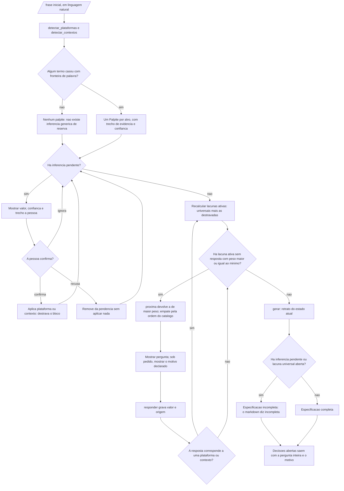
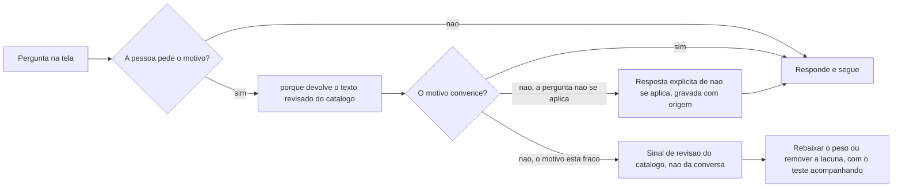

# Fluxogramas

Os diagramas de [`05-Diagramas.md`](05-Diagramas.md) descrevem o que as coisas são. Os fluxogramas
desta seção descrevem o caminho que o código percorre e onde uma pessoa decide. A diferença
importa: o ciclo de vida diz quais estados um palpite pode ter, o fluxograma diz em que ponto a
conversa para e o que sobra por escrito quando ela para.

## O ciclo completo, da ideia à especificação

O fluxograma tem seis pontos de decisão — `C`, `F`, `H`, `L`, `P` e `R` — e apenas um deles
depende de julgamento humano: `H`, onde a pessoa confirma ou recusa um palpite. `N` e `O` também
envolvem a pessoa, mas são passos de interação e não avaliações do motor, e por isso aparecem
como retângulo e não como losango. Quatro dos seis merecem comentário.

O primeiro é `C`. O ramo negativo não leva a um palpite de reserva: leva a nenhum palpite. É a
única resposta honesta quando o texto não sustenta conclusão nenhuma, e é o que impede a frase
vaga de gerar uma especificação que parece informada.

O segundo é a posição de `F` **antes** de `K`. Resolver as inferências vem antes de perguntar
porque confirmar altera o conjunto de lacunas ativas: gastar um turno numa pergunta de navegador
enquanto um palpite de aparelho de mão espera confirmação é gastar o turno na pergunta que talvez
não exista. O laço `H -- ignora --> F` existe para deixar visível que ignorar não é uma terceira
decisão: o palpite volta para a pendência e o ciclo não avança.

O terceiro é `P`, e ele é o destravamento por resposta. Se a resposta corresponder ao nome de uma
plataforma ou de um contexto — o caso da lacuna `onde_roda`, cujas opções são exatamente os nomes
das plataformas —, o fluxo volta para `K` e recalcula as lacunas ativas. A regra é genérica e não
trata nenhum identificador de forma especial, porque caso especial por identificador transforma o
catálogo em código.

O quarto é o desenho de `L` e `Q`. O ramo negativo de `L` não significa "terminou bem": significa
apenas que nenhuma lacuna ativa passa do limiar. `R` é quem julga, e ele é o único ponto do
processo que pode dizer "incompleta". Os dois caminhos convergem em `U` de propósito — decisão
aberta sai na especificação nos dois casos, e não apenas no ruim.

## Quando a pessoa pergunta "por que você quer saber isso?"

O segundo fluxograma existe porque a pergunta "por que você quer saber isso?" é o único teste de
qualidade do catálogo que acontece em produção. O ramo importante é `G`: quando o motivo declarado
não convence uma pessoa que conhece o próprio problema, o defeito está no catálogo e não na
conversa, e a correção é rebaixar o peso ou remover a lacuna — no arquivo, com o teste
acompanhando. Um motor que respondesse essa pergunta com texto gerado na hora perderia esse sinal
inteiro, porque texto gerado na hora sempre soa plausível e nunca é revisável. O ramo `F` também
tem consequência prática: "não se aplica" é uma resposta, e gravá-la com origem é diferente de
deixar a lacuna aberta — a primeira é decisão tomada, a segunda é decisão pendurada.
