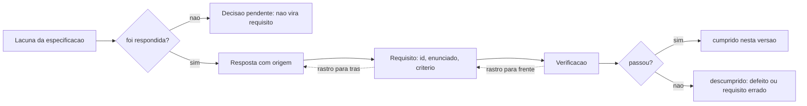

# Diagramas

Um diagrama de estrutura: o que liga uma lacuna da descoberta a uma verificação, passando pelo
requisito. É o rastro completo, e ele se lê nos dois sentidos.

O nó `DEC` é o que mais se ignora e o mais valioso. Uma lacuna que ficou sem resposta na descoberta
**não** vira requisito com o valor mais provável — vira decisão pendente, listada, que alguém precisa
tomar antes ou durante a construção. A tentação de preenchê-la é grande porque uma lista sem buracos
parece mais profissional, e é exatamente o anti-padrão A6 do volume `01`: a lacuna preenchida em
silêncio vira, semanas depois, um requisito que ninguém pediu.

O nó `FALHA` tem duas leituras, e distingui-las é o trabalho de quem recebe a falha. Ou o sistema
está errado — é defeito —, ou o requisito estava errado — e aí a correção é no requisito, com
registro de mudança. Tratar toda falha de verificação como defeito produz o hábito de consertar o
sistema para satisfazer um enunciado que ninguém mais concorda; tratar toda falha como requisito
errado produz um conjunto que se ajusta ao que o sistema faz, e um conjunto assim não verifica nada.

As duas setas pontilhadas são o rastro, e a propriedade que importa é que ele se percorre **nos dois
sentidos**. De trás para frente responde "o que aconteceu com aquilo que a pessoa pediu?". De frente
para trás responde "por que este teste existe?" — a pergunta que aparece quando alguém quer apagar
um teste que está atrapalhando.
