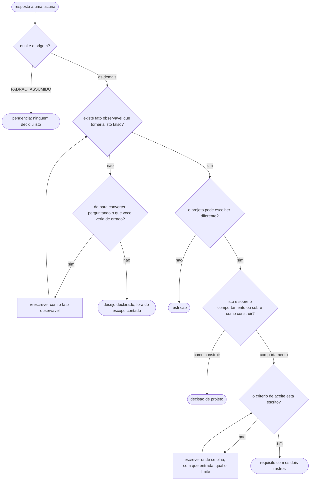

# Fluxogramas

O fluxo de conversão: uma resposta da descoberta entra, e sai requisito, restrição, decisão de
projeto, desejo declarado ou pendência. Cinco destinos, e nenhum deles é "descartado".

Sete pontos de decisão. Dois merecem comentário porque são onde o processo costuma falhar.

O primeiro é a porta de entrada por **origem**. Uma resposta cuja origem é `PADRAO_ASSUMIDO` não
entra no funil: ninguém decidiu aquilo, e promovê-la a requisito é dar status de combinado a uma
suposição. Colocar esse teste **antes** de todos os outros é deliberado — ele é barato e elimina a
categoria mais perigosa logo na entrada.

O segundo é o laço de conversão em `T`. A pergunta "o que você veria acontecer que te faria dizer que
isto não está bom?" converte a maioria dos desejos em uma frase, e quem a faz descobre coisas que a
descoberta não pegou. "O sistema tem que ser confiável" vira, com uma pergunta, "não pode perder
lançamento quando a internet cai no meio do envio" — que é falsificável, testável e revela um
requisito que ninguém tinha enunciado.

O destino `D` existe para que a conversa acabe. Um desejo que não converte não é apagado nem
discutido de novo a cada reunião: fica registrado, fora da contagem de escopo, e volta se alguém
trouxer o fato observável que faltava.
