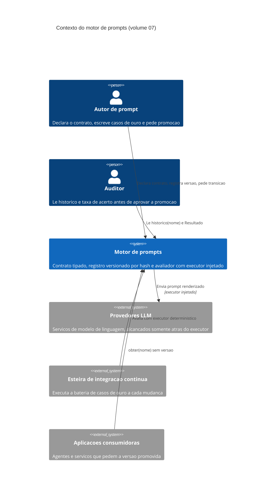
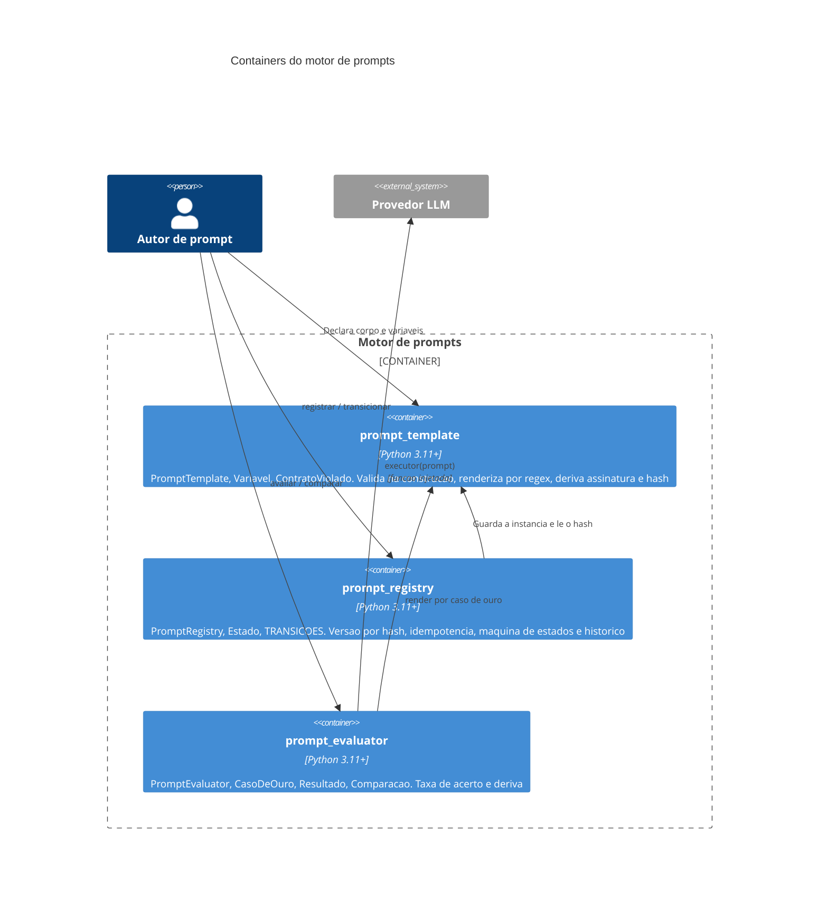

# Arquitetura

A arquitetura do motor tem três módulos e uma única superfície de acoplamento externo.
Os módulos são o contrato (`prompt_template`), o registro (`prompt_registry`) e o
avaliador (`prompt_evaluator`). A superfície é o executor: uma função que recebe o prompt
renderizado e devolve texto. Nenhum dos três módulos importa cliente de provedor, e essa
ausência é a decisão arquitetural central do volume.

## Contexto

O diagrama mostra que o motor tem quatro interlocutores e apenas um deles é um serviço
pago. O autor e o auditor entram pela mesma porta, com verbos diferentes: o autor
escreve, o auditor apenas lê. A esteira de integração contínua entra pela porta do
avaliador com um executor determinístico, e é por isso que o gate de teste pode rodar em
cada mudança sem custo de rede. As aplicações consumidoras pedem a versão promovida sem
nomeá-la, o que faz da promoção o único ato que altera o comportamento em produção.

## Containers

O grafo de dependência entre os containers é uma árvore com raiz no contrato: o registro
depende do contrato, o avaliador depende do contrato, e nenhum dos dois depende do outro.
Essa forma é o que permite importar o contrato isoladamente em um projeto que não precisa
de registro, e é o que garante que registrar uma versão não custa execução de modelo. O
preço dessa independência é que a regra "não promove sem avaliar" precisa ser expressa na
máquina de estados, e não como uma verificação de resultado dentro do registro.

## Decisões arquiteturais e o que elas custam

A primeira decisão é validar o contrato na construção, e não na renderização. O ganho é
que o erro aparece no carregamento do módulo, antes de qualquer chamada paga; o custo é
que um prompt gerado dinamicamente em tempo de execução precisa ser construído dentro de
um bloco de tratamento de exceção. A segunda é substituir placeholders por expressão
regular em vez de `str.format`, porque prompt que pede saída em JSON carrega chaves
literais que fariam a formatação padrão falhar; o custo é que a gramática de placeholder
fica restrita a identificadores. A terceira é derivar a versão do hash do conteúdo em vez
de um contador manual, o que torna o registro idempotente e o histórico limpo mesmo com
reimportações repetidas em cada implantação.
