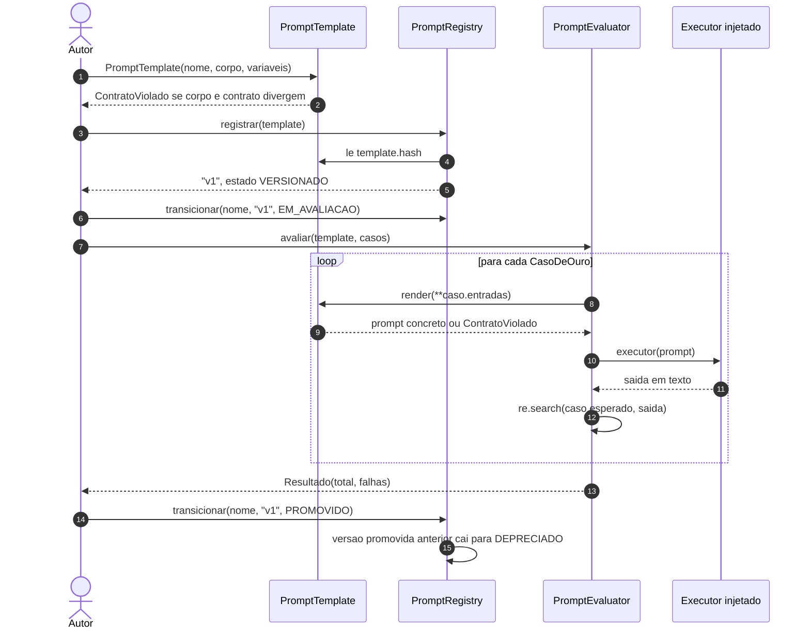
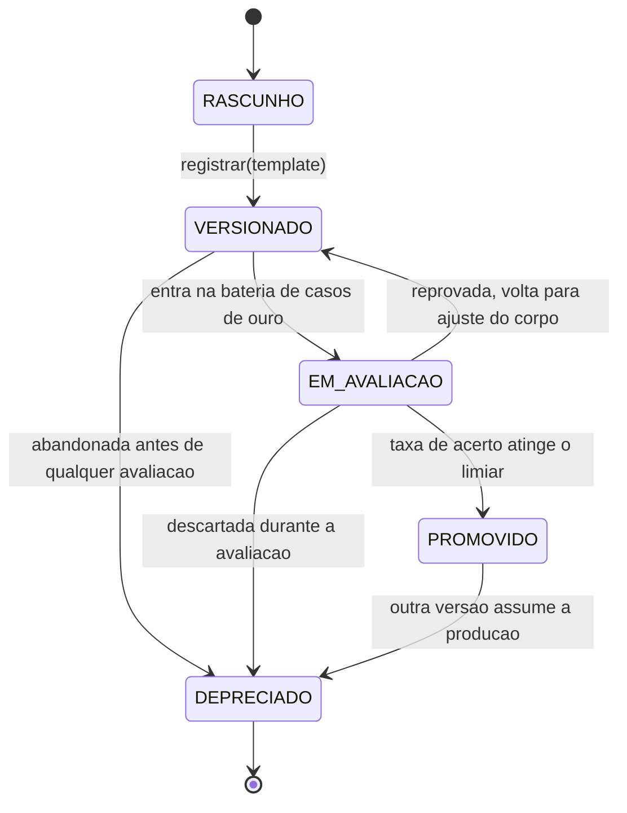
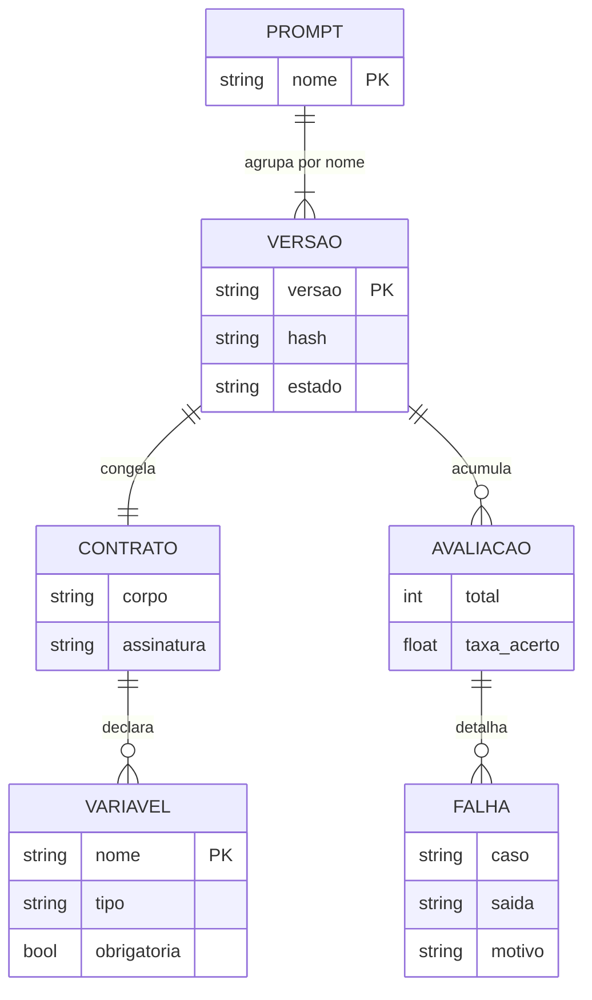
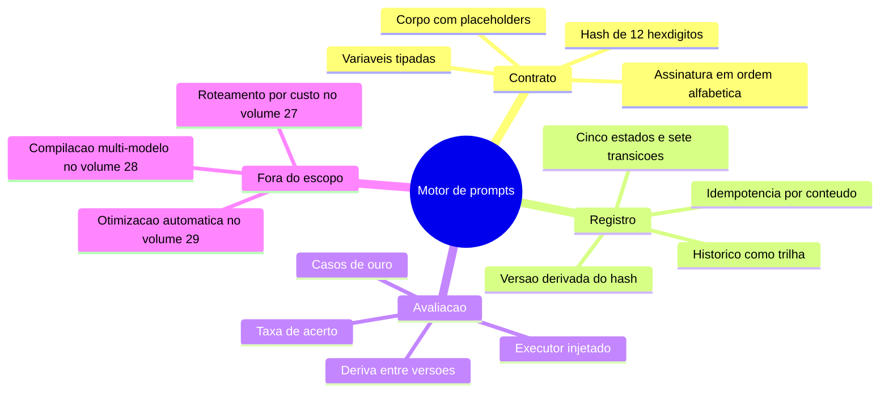

# Diagramas

Esta seção reúne os quatro diagramas de comportamento e de dados do motor. Eles não
ilustram o código: eles são a leitura humana de estruturas que existem em um único lugar
no código. A máquina de estados abaixo, em particular, tem os mesmos cinco nomes e as
mesmas transições do dicionário `TRANSICOES` em `prompt_registry.py`; se um dos dois
mudar sem o outro, o volume passa a mentir e a auditoria detecta a divergência.

## Sequência de uma versão, do contrato à promoção

A sequência deixa visíveis dois detalhes que costumam ser esquecidos na descrição verbal
do fluxo. O primeiro é que o avaliador chama `render` uma vez por caso de ouro, dentro do
laço, e trata a falha de renderização como falha do caso — um caso malformado não derruba
a bateria inteira. O segundo é que o rebaixamento da versão promovida anterior acontece
dentro do mesmo `transicionar`, e não em uma segunda chamada: não existe instante em que
duas versões do mesmo nome se declarem a de produção.

## Ciclo de vida de uma versão

São cinco estados e sete transições — uma saindo de `RASCUNHO`, duas de `VERSIONADO`, três de
`EM_AVALIACAO`, uma de `PROMOVIDO` e nenhuma de `DEPRECIADO`, exatamente a contagem das chaves de
`TRANSICOES`. As duas setas restantes do diagrama, ligadas a `[*]`, marcam entrada e saída do
ciclo e não são transições do dicionário. A ausência mais importante do diagrama é a aresta
que não existe: não há caminho de `VERSIONADO` para `PROMOVIDO`. Prompt sem avaliação não
promove, e essa regra não depende de disciplina de quem opera — ela é uma chave ausente
no dicionário de transições. `RASCUNHO` é o estado de quem ainda não entrou no registro:
toda versão registrada nasce em `VERSIONADO`, e o estado inicial existe no enumerado
porque a transição rascunho para versionado é parte do fluxo documentado mesmo
acontecendo fora do registro. `DEPRECIADO` é terminal; ressuscitar uma versão antiga é
registrá-la de novo, o que preserva a trilha em vez de reescrevê-la.

## Modelo de dados do registro

O modelo mostra que a chave de identidade não é o nome do prompt, e sim o par nome mais
versão, e que o hash é atributo da versão porque é dele que a versão nasce. A relação
entre versão e avaliação é de zero ou muitas: uma versão pode nunca ter sido avaliada, e
é exatamente esse caso que a máquina de estados impede de chegar à produção. A relação
entre contrato e variável é de zero ou muitas, e isso não é frouxidão do diagrama: um
prompt inteiramente estático — corpo sem placeholder algum e tupla de variáveis vazia — é
válido e constrói sem erro. A restrição que o código impõe não é um mínimo de variáveis, e
sim concordância nas duas direções: placeholder sem declaração e variável declarada sem
placeholder correspondente reprovam na construção, cada um pelo seu lado. O atributo
`obrigatoria` de `VARIAVEL` aparece no diagrama porque entra na assinatura e, por
consequência, na identidade da versão — a regra R2 de [`07-Regras.md`](07-Regras.md).

## Domínio do volume em um olhar

O mapa mental serve como índice de leitura, e não como especificação. Ele existe porque os
três ramos internos correspondem exatamente aos três módulos do volume, e o quarto ramo
repete as fronteiras de [`03-Escopo.md`](03-Escopo.md) no mesmo lugar em que o leitor
forma sua primeira impressão do domínio — declarar a fronteira só no meio do documento
chega tarde para quem está decidindo se este é o volume que procura.
