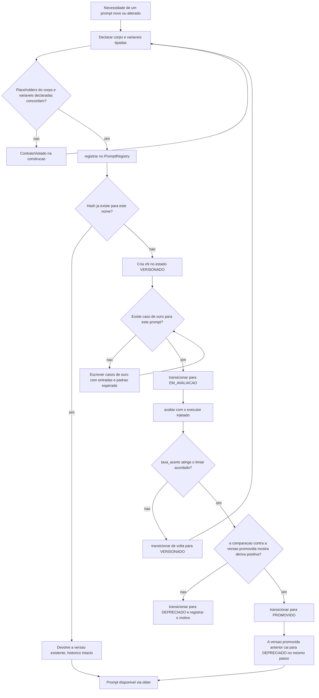
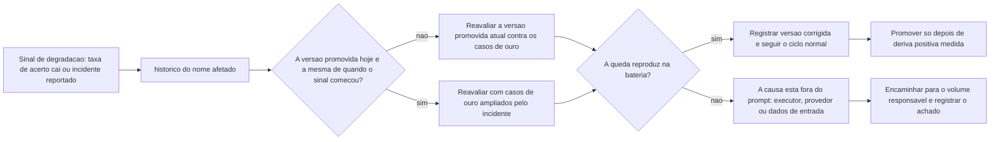

# Fluxogramas

Os diagramas de [`05-Diagramas.md`](05-Diagramas.md) descrevem o que o motor é. Os
fluxogramas desta seção descrevem o que o operador faz, e onde ele decide. A diferença
importa: a máquina de estados diz quais transições são possíveis, o fluxograma diz em que
ponto alguém tem de olhar um número e escolher.

## Ciclo completo, do rascunho à produção

O fluxograma tem quatro pontos de decisão e nenhum deles é uma questão de gosto. O
primeiro é verificado pelo construtor. O segundo é verificado pelo hash e é o que impede
que reimplantar o mesmo prompt polua o histórico. O terceiro exige que exista caso de
ouro antes da avaliação, porque uma bateria vazia devolve taxa de acerto zero e nunca
atinge limiar algum — a ausência de evidência não é tratada como evidência de acerto. O
quarto compara a candidata contra a versão que está em produção sobre a mesma amostra, e
é aqui que a decisão deixa de ser "o prompt novo parece melhor" e passa a ser um número
com sinal.

## Queda de qualidade em produção

O segundo fluxograma existe porque a pergunta mais frequente em um incidente não é "qual
prompt usar" e sim "o prompt mudou?". Sem registro, essa pergunta consome horas; com
registro, ela é uma leitura de `historico`. O ramo que termina fora do prompt é
deliberadamente explícito: quando a queda não reproduz na bateria de casos de ouro, a
causa provável está no executor, no provedor ou nos dados de entrada, e insistir em
reescrever o prompt nesse cenário produz mudança sem efeito e ainda gasta uma versão do
histórico. Cada incidente que reproduz na bateria deve terminar com um caso de ouro novo,
porque é assim que a bateria cresce na direção dos erros que realmente aconteceram em vez
de crescer na direção do que era fácil imaginar.
