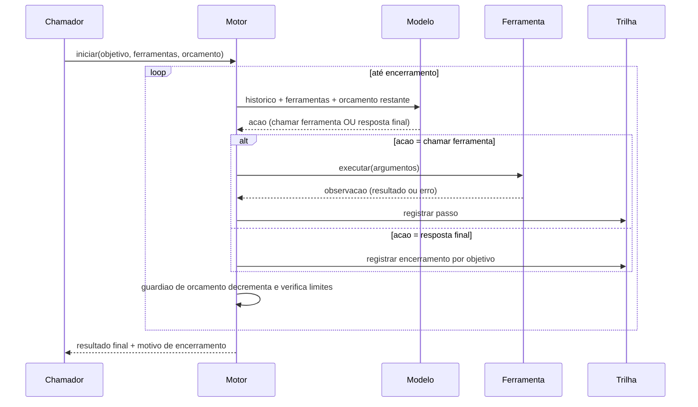
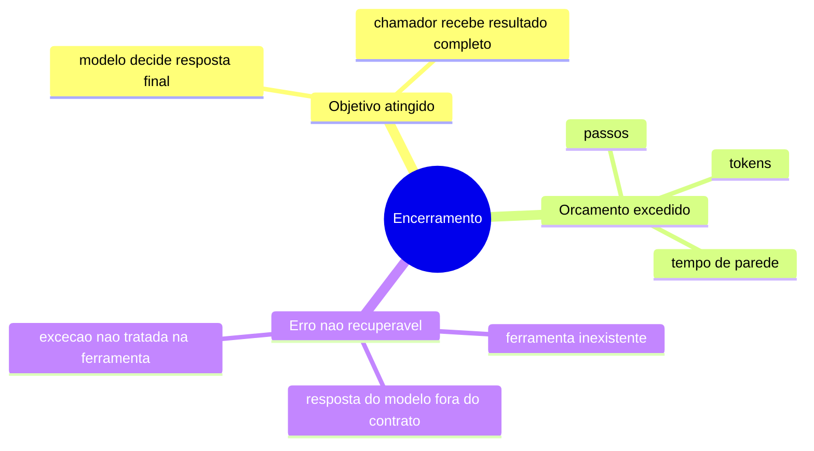

# Diagramas

A sequência mostra o loop central: cada iteração consulta o modelo com o histórico atualizado,
decide entre chamar ferramenta ou encerrar com resposta final, e em qualquer um dos dois casos
passa pelo guardião de orçamento antes da próxima iteração — mesmo quando o modelo decide chamar
mais uma ferramenta, o guardião pode forçar encerramento se o orçamento já foi consumido. Essa
ordem (decisão do modelo, depois verificação de orçamento) é o que garante que o motor nunca
execute um passo que já sabia ser inviável, mas também nunca decida por conta própria continuar
além do que o orçamento permite, mesmo que o modelo "queira" continuar. A trilha recebe um
registro em cada ramo do `alt`, não só no de sucesso — é essa simetria que permite reconstruir,
depois do fato, a sequência exata de decisões que levou ao resultado final, incluindo toda
tentativa de ferramenta que falhou no meio do caminho antes do encerramento.

## Motivos de encerramento

Os três ramos não são igualmente informativos para quem chama o motor: "objetivo atingido"
significa que o resultado é utilizável; "orçamento excedido" significa que o resultado, se
existir, é parcial e precisa de decisão humana sobre continuar ou descartar; "erro não
recuperável" significa que o motor não tem confiança nenhuma no estado alcançado. Um chamador
que trata os três ramos como equivalentes ("terminou") perde exatamente a informação que a
trilha de auditoria existe para preservar.
