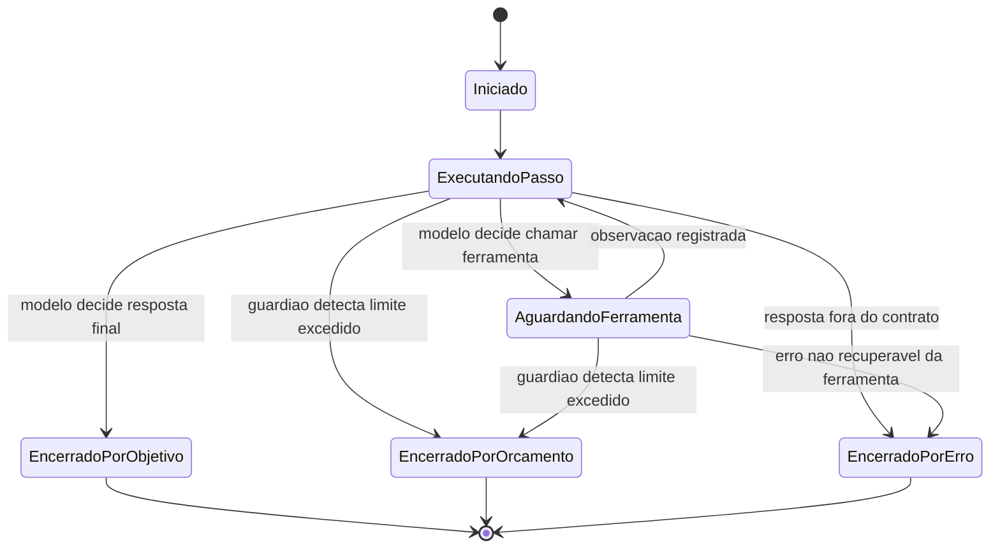

# Fluxogramas

O estado `AguardandoFerramenta` é o único ponto em que o motor cede controle para código externo
(a ferramenta) e espera resultado antes de decidir o próximo passo — é também o ponto mais caro
em tempo de parede, e por isso o guardião de orçamento verifica limite tanto na entrada quanto na
saída desse estado, não só entre passos completos. Os três estados de encerramento são finais e
mutuamente exclusivos: uma execução nunca alcança dois motivos de encerramento, porque o
guardião de orçamento é consultado antes de qualquer transição que levaria a `EncerradoPorObjetivo`
poder competir com `EncerradoPorOrcamento` no mesmo passo — a ordem de verificação (orçamento
primeiro, decisão do modelo depois) resolve esse empate de forma determinística.

## Caminho de erro em detalhe

Erro de ferramenta (exceção, timeout, resultado malformado) não encerra o loop diretamente —
ele vira uma observação de erro que volta ao modelo no próximo passo, e é o modelo quem decide
se tenta de novo, tenta outra abordagem, ou desiste. Só uma categoria de erro pula essa
recuperação: erro marcado como não recuperável pela própria ferramenta (por exemplo,
credencial inválida, que não vai se resolver com retry) — esse tipo de erro encerra
imediatamente em `EncerradoPorErro`, porque dar ao modelo a chance de "tentar de novo" um erro
que é sempre vai falhar da mesma forma desperdiça passos do orçamento sem chance real de sucesso.
