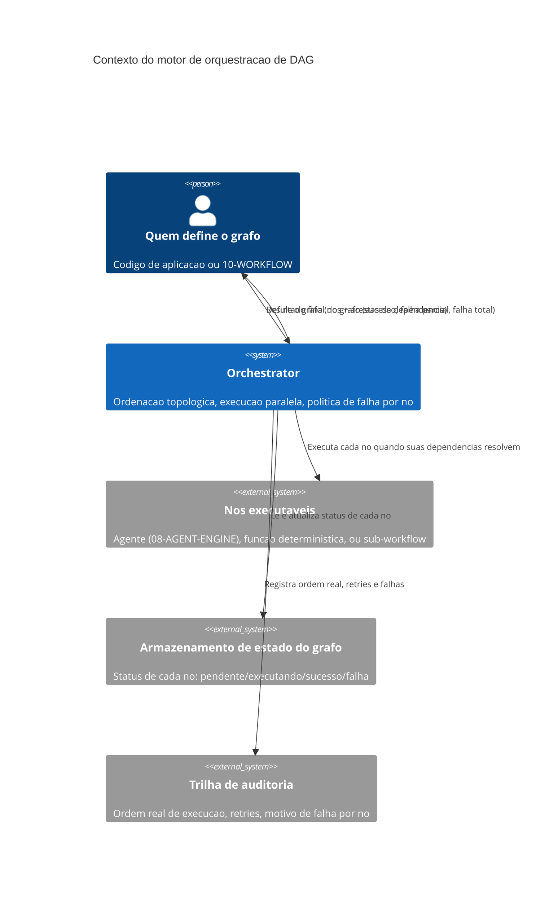

# Arquitetura

O motor recebe um grafo já definido — não decide a decomposição da tarefa em nós, isso é
responsabilidade de quem chama (código de aplicação ou `10-WORKFLOW`). A partir do grafo, ele
mantém o estado de cada nó e decide, a cada momento, quais nós têm todas as dependências
resolvidas e podem começar a executar. Os nós em si são caixas-pretas do ponto de vista deste
motor — podem ser uma execução de agente, uma função determinística, ou até um sub-workflow
tratado como nó único, e o motor trata os três de forma idêntica: entrada, execução, saída ou
falha.

## Componentes internos

O **planejador topológico** calcula, a partir do grafo, a ordem de dependência e detecta ciclo
antes de qualquer execução começar — um grafo cíclico é rejeitado na entrada, nunca durante a
execução. O **executor concorrente** mantém um conjunto de nós "prontos" (dependências
resolvidas) e os dispara respeitando um limite de concorrência configurável. O **gestor de
política de falha** decide, quando um nó falha, se propaga a falha para os dependentes
(abortando aquele ramo), tenta novamente com backoff, ou marca falha parcial e deixa ramos
independentes continuarem. O **registrador de trilha** grava a ordem real de execução — que pode
diferir entre execuções do mesmo grafo, já que a ordem entre nós paralelos não é garantida
determinística, só a ordem de dependência é.
