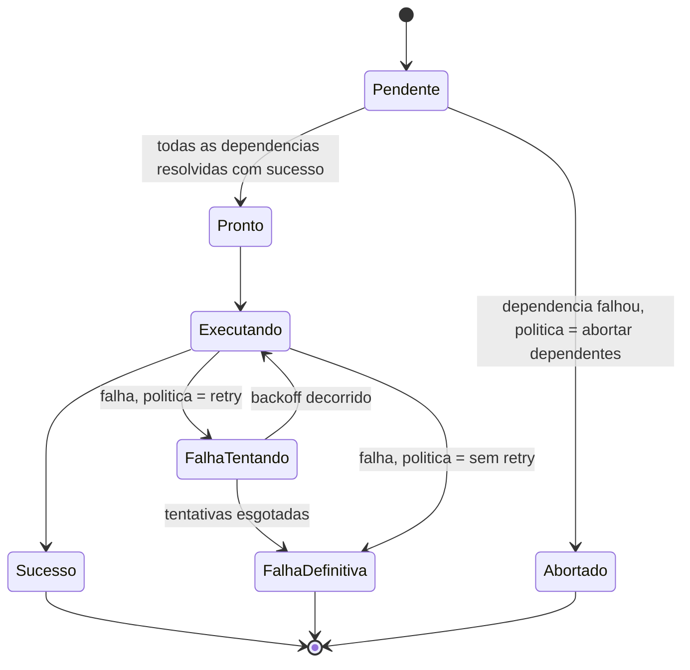

# Fluxogramas

Cada nó do grafo percorre esta máquina de estados de forma independente, mas o estado de um nó
influencia diretamente a transição de seus dependentes: um nó em `Pendente` só avança para
`Pronto` quando todas as suas dependências chegam a `Sucesso` — se qualquer dependência chega a
`FalhaDefinitiva` e a política do nó dependente é "abortar dependentes", o nó pendente transita
direto para `Abortado`, sem nunca chegar a `Pronto` ou `Executando`. O estado `FalhaTentando` é
transitório por definição — existe só durante o intervalo de backoff, e a máquina garante que ele
sempre resolve para `Executando` de novo ou para `FalhaDefinitiva`, nunca fica parado.

## Caminho de falha parcial

Quando a política de um nó é "pular apenas dependentes" em vez de "abortar o grafo inteiro", o
grafo inteiro não termina em falha só porque um ramo falhou — os ramos independentes do ramo
falho continuam normalmente, e o resultado final do grafo é reportado como "sucesso parcial",
listando explicitamente quais nós tiveram sucesso, quais falharam, e quais foram abortados por
dependência. Essa granularidade de resultado é o que permite ao chamador decidir se o sucesso
parcial é suficiente para a tarefa maior ou precisa de intervenção — decisão que este motor não
toma por conta própria, só relata os fatos com precisão.
