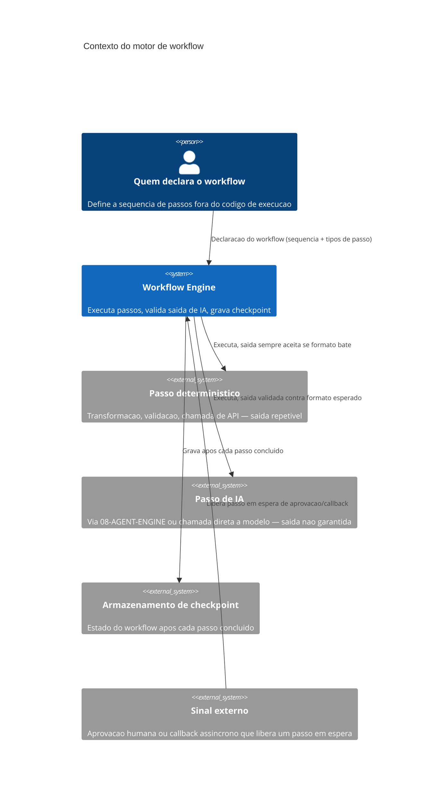

# Arquitetura

O motor recebe uma declaração de workflow — não decide a sequência, só a executa. Cada passo é
despachado para uma de duas categorias: determinístico (cuja saída é aceita se o formato bate,
sem verificação de conteúdo além disso) ou de IA (cuja saída passa por validação de formato antes
de alimentar o próximo passo, porque o modelo pode devolver algo fora do esperado mesmo quando a
chamada em si tem sucesso). Depois de cada passo concluído, o motor grava um checkpoint — estado
suficiente para retomar exatamente do próximo passo sem reexecutar os anteriores.

## Componentes internos

O **executor de passo** despacha para o tipo correto (determinístico ou IA) e aplica a validação
de saída apropriada. O **validador de saída de IA** compara a saída devolvida contra o formato
declarado para aquele passo — se não bate, decide entre reexecutar o passo (com uma instrução de
correção, se o desenho do workflow especificar isso) ou pausar o workflow para intervenção. O
**gestor de checkpoint** serializa o estado necessário para retomada e o grava de forma durável
antes de avançar para o próximo passo — a gravação precisa ser confirmada antes do avanço, não
depois, porque um avanço sem checkpoint confirmado perderia a garantia de retomada segura. O
**gestor de sinal externo** pausa a execução num passo declarado como "espera aprovação" e
retoma quando o sinal correspondente chega, independente de quanto tempo isso leva.
