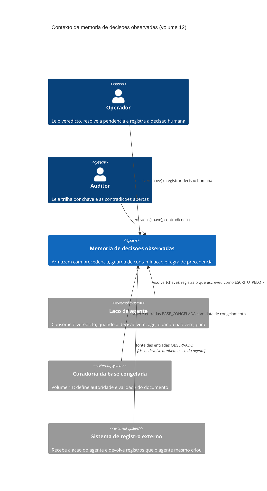
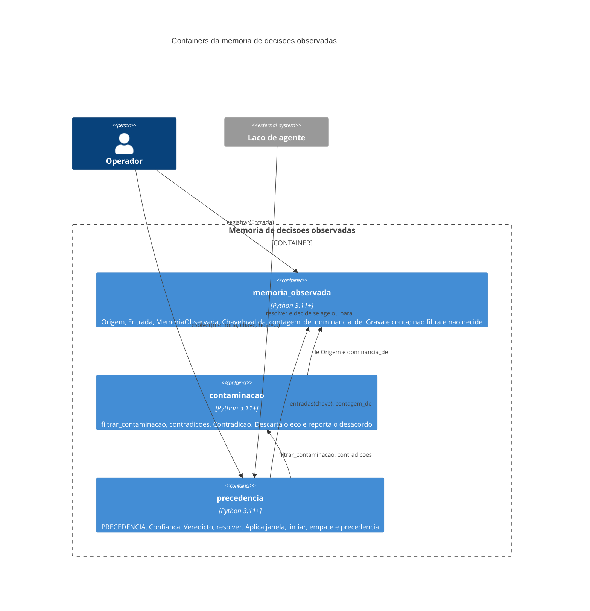

# Arquitetura

A arquitetura tem três módulos em cadeia e nenhuma dependência externa. Os módulos são o
armazém (`memoria_observada`), a guarda (`contaminacao`) e a regra de precedência
(`precedencia`). A cadeia é dirigida e não tem ciclo: a guarda importa o armazém, a
precedência importa os dois, e nenhum dos de baixo conhece quem está acima. A decisão
arquitetural central é essa direção — o armazém não sabe que existe uma guarda, e por isso
não pode contornar a guarda por conveniência.

## Contexto

O diagrama mostra o interlocutor que é a origem do defeito mais caro: o sistema de
registro externo devolve, misturados, registros de terceiros e registros que o próprio
agente acabou de criar. É por isso que a seta dele carrega a anotação de risco, e é por
isso que quem alimenta o armazém precisa declarar a origem no ato do registro — depois
que a entrada está gravada sem procedência, não há como reconstruí-la. O operador e o
auditor entram pela mesma porta com verbos diferentes: o auditor apenas lê, e a única
escrita privilegiada do sistema é a decisão humana.

## Containers

O grafo de dependência entre os containers é uma cadeia com raiz no armazém: a guarda
depende do armazém, a regra depende dos dois, e nada aponta para cima. Essa forma permite
importar o armazém isolado num projeto que só queira registrar procedência, e garante que
adicionar uma origem nova exige tocar em um arquivo para declará-la e em outro para dizer
se ela decide — dois pontos explícitos, em vez de uma condição espalhada. O preço da cadeia
é que a filtragem não é automática: quem consultar o armazém direto obtém número cru, e
essa consequência está declarada em [`03-Escopo.md`](03-Escopo.md) em vez de deixada por
descobrir.

## Decisões arquiteturais e o que elas custam

A primeira decisão é que **`Origem` é campo obrigatório da entrada, e não metadado
opcional**. O ganho é que a evidência sabe de onde veio no instante em que nasce; o custo é
que integrar uma fonte nova obriga a classificá-la antes de gravar, e não há valor padrão
que permita adiar essa classificação. Um padrão como "observado" seria conveniente e
reintroduziria o defeito, porque a fonte mais fácil de esquecer de classificar é exatamente
a própria escrita do agente.

A segunda é que **`ESCRITO_PELO_AGENTE` está fora de `PRECEDENCIA`, e não na última
posição**. Ausência é mais forte que última posição: última posição ainda decide quando
todas as outras faltam, e o caso em que todas as outras faltam é justamente o caso novo,
onde o agente é a única coisa que já escreveu. O custo é que uma chave só com eco produz o
mesmo veredicto de uma chave vazia, o que pode parecer perda de informação — e não é: a
contagem de descartadas viaja no veredicto e distingue os dois casos.

A terceira é que **a data de referência entra por parâmetro**. O ganho é injeção de
dependência: expiração testável offline, determinística, sem relógio. O custo é uma
palavra-chave obrigatória em toda chamada, e ela é obrigatória de propósito — um padrão
para "hoje" faria a suíte depender do dia em que roda.
