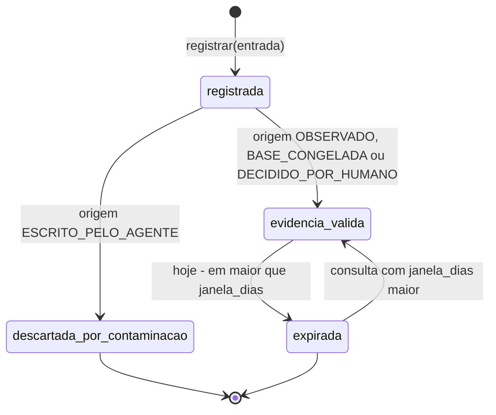
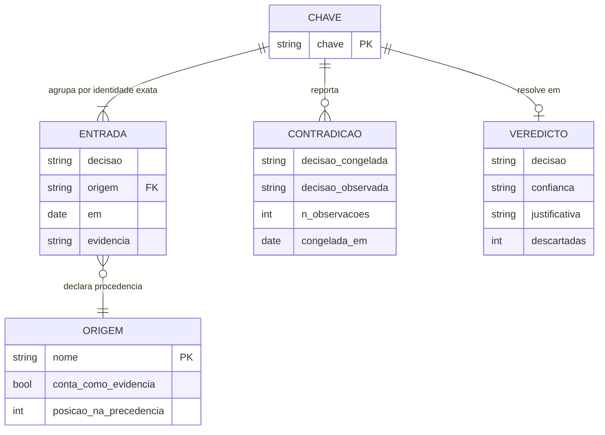

# Diagramas

Esta seção reúne as três visões formais do componente: o ciclo de vida de uma entrada, a
sequência de uma consulta que termina em pendência humana, e o modelo de dados do armazém.
Eles não ilustram o código — são a leitura humana de estruturas que existem em um único
lugar nele. A máquina de estados abaixo, em particular, descreve estados que **não são
campos armazenados**, e essa é a informação mais importante da seção.

## Ciclo de vida de uma entrada



São quatro estados e sete setas, e vale declarar o critério de contagem em vez de deixar o
leitor conferir: uma seta de entrada, **quatro** transições entre estados nomeados e duas de
término. Duas propriedades merecem ser lidas com atenção. A
primeira é que `descartada_por_contaminacao` é **terminal**: nenhuma seta sai dele para
`evidencia_valida`, e não existe parâmetro que a crie. Essa ausência é a regra R1 de
[`07-Regras.md`](07-Regras.md) desenhada como forma, e não como verificação — um limiar
configurável de tolerância ao eco viraria, no primeiro dia apertado, o caminho de volta ao
defeito. A segunda é que `expirada` **não** é terminal: a seta de volta existe porque a
expiração é calculada por consulta, contra o `hoje` e o `janela_dias` daquela chamada, e
não gravada na entrada. A mesma entrada é expirada numa consulta com janela de trezentos e
sessenta e cinco dias e vigente numa consulta com janela de dez anos. Foi assim que, no
exemplo executável de [`12-Exemplos.md`](12-Exemplos.md), a mesma memória devolveu duas
decisões diferentes e ambas corretas. Nada no armazém muda entre as duas chamadas: o que
muda é a pergunta.

## Consulta que termina em pendência humana

```mermaid
sequenceDiagram
    autonumber
    actor O as Operador
    participant P as resolver
    participant M as MemoriaObservada
    participant C as filtrar_contaminacao
    participant D as contradicoes
    O->>P: resolver(memoria, chave, hoje, dominancia_minima=0.7)
    P->>M: entradas(chave)
    M-->>P: entradas em ordem de registro
    P->>C: filtrar_contaminacao(entradas)
    C-->>P: validas, descartadas (eco do agente)
    P->>P: expira as validas fora da janela
    P->>D: contradicoes(vigentes)
    D-->>P: uma Contradicao: base congelada discorda da dominante observada
    P->>P: precedencia: sem DECIDIDO_POR_HUMANO, com OBSERVADO
    P->>P: dominancia 3/5 = 0.600 abaixo do minimo 0.700
    P-->>O: Veredicto(decisao=None, confianca=None, justificativa, descartadas, contradicoes)
    Note over O,P: decisao None e pendencia humana; a base congelada NAO assume
```

A sequência deixa visíveis três detalhes que a descrição verbal costuma perder. O primeiro
é a ordem das etapas: descartar o eco vem **antes** de procurar contradição, e a inversão
seria grave — com o eco dentro da conta, o próprio agente poderia silenciar a contradição
que ele mesmo criou, bastando escrever algumas vezes concordando com a base congelada. O
segundo é que a contradição viaja no veredicto mesmo quando não há decisão: a chave é
conhecidamente inconsistente, e essa informação não se perde por não haver resposta. O
terceiro é a nota final, que é a regra R5 em forma de diagrama — a base congelada estava
presente e discordava, e ainda assim não assumiu o lugar da observação que não decidiu.
Precedência não é cascata de reserva.

## Modelo de dados do armazém



O modelo mostra que a chave agrupa uma ou mais entradas, mas **zero ou mais contradições** e
zero ou um veredicto — porque contradição e veredicto são **derivados**, calculados na
consulta, e não guardados. A cardinalidade das duas relações derivadas é diferente de
propósito, e a diferença está no código: `resolver` devolve um `Veredicto` por chamada, logo
zero ou um, enquanto `contradicoes` emite uma `Contradicao` **por entrada `BASE_CONGELADA`
que discorde** da dominante observada. Duas bases congeladas discordantes na mesma chave
produzem duas contradições, e isso está fixado em
`test_duas_bases_congeladas_discordantes_geram_duas_contradicoes`. É por isso que o diagrama
declara `CHAVE ||--o{ CONTRADICAO` e não `||--o|`: agregar as duas numa só exigiria escolher
qual base reportar, que é escolher lado em silêncio — a regra R3 de
[`07-Regras.md`](07-Regras.md) violada pelo modelo de dados. Vale registrar com honestidade o
que a caixa `ORIGEM` faz: os dois
atributos abaixo do nome não são campos do enumerado no código. Eles são os dois fatos que
governam cada origem e que vivem em outros lugares — `conta_como_evidencia` é a guarda em
`filtrar_contaminacao`, e `posicao_na_precedencia` é o índice na tupla `PRECEDENCIA`. Estão
desenhados aqui porque quem lê o modelo precisa saber que toda origem responde a essas duas
perguntas; quem for adicionar uma quinta origem tem de responder as duas antes de escrever
a primeira linha. A relação entre entrada e origem é de muitos para um, e a obrigatoriedade
é o que impede uma entrada sem procedência: não existe entrada com origem nula, e o
construtor não oferece valor padrão.
