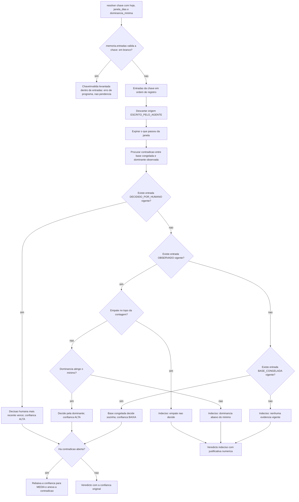
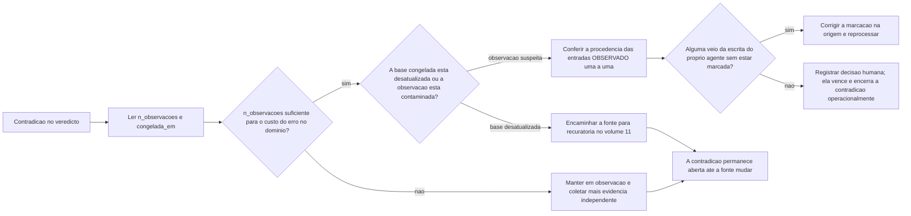

# Fluxogramas

Os diagramas de [`05-Diagramas.md`](05-Diagramas.md) descrevem o que o componente é. Os
fluxogramas desta seção descrevem o que o código percorre e onde uma pessoa tem de olhar um
número e agir. A diferença importa: a máquina de estados diz quais estados existem, o
fluxograma diz em que ponto a resolução para e quem fica com a conta.

## Resolução de uma chave, do armazém ao veredicto

O fluxograma tem sete pontos de decisão e nenhum depende de julgamento. Três merecem
comentário. O primeiro é que a chave em branco sai por um ramo próprio, que **levanta** em
vez de devolver veredicto: falta de evidência é estado normal do domínio, chave vazia é
defeito de quem chamou, e misturar os dois faria o chamador tratar bug como pendência. O
desenho desse ramo foi corrigido depois da auditoria para não mentir sobre o lugar da
verificação: ela não é um passo que `resolver` executa depois de obter as entradas, e sim
acontece **dentro** de `memoria.entradas`, que valida a chave antes de procurar o balde. A
diferença é operacional para quem for reimplementar — não existe ponto no meio em que a chave
já foi consultada e ainda não foi validada, e é por isso que a decisão aparece antes do nó
que devolve as entradas. O
segundo é o desenho dos ramos `J` e `P`: o ramo negativo de `J` é a única entrada para a
base congelada. Se a observação existe e não decide, o caminho segue para `L` ou `N`, e não
para `P` — a base congelada não é rede de segurança da observação que falhou. O terceiro é
que o nó `S` alcança os três caminhos que decidem, inclusive o da decisão humana: chave com
contradição aberta é chave conhecidamente inconsistente, e nenhum veredicto sobre chave
inconsistente sai como confiança alta, nem quando quem decidiu foi uma pessoa.

## Triagem de uma contradição aberta

O segundo fluxograma existe porque a contradição é reportada e não resolvida, e portanto
alguém precisa saber o que fazer com ela. A pergunta que abre a triagem não é "quem está
certo" e sim "quantas observações independentes sustentam o lado observado" — é para isso
que `n_observacoes` existe no relatório. O ramo mais importante é o de `H`: antes de
concluir que a base congelada envelheceu, vale conferir se a observação que a contradiz é
de fato independente, porque uma entrada mal marcada é o mesmo defeito de sempre com outra
roupa. O ramo de `J` merece um alerta explícito: registrar decisão humana encerra a
contradição **na prática**, porque a precedência a torna irrelevante para o veredicto, mas
não encerra na origem — a base congelada continua discordando, e a `Contradicao` continua
sendo emitida enquanto as duas entradas existirem na janela. Isso é intencional: silenciar
o relatório com uma decisão humana transformaria a decisão em tapa-buraco e deixaria a
fonte errada intacta para reaparecer na próxima chave.
