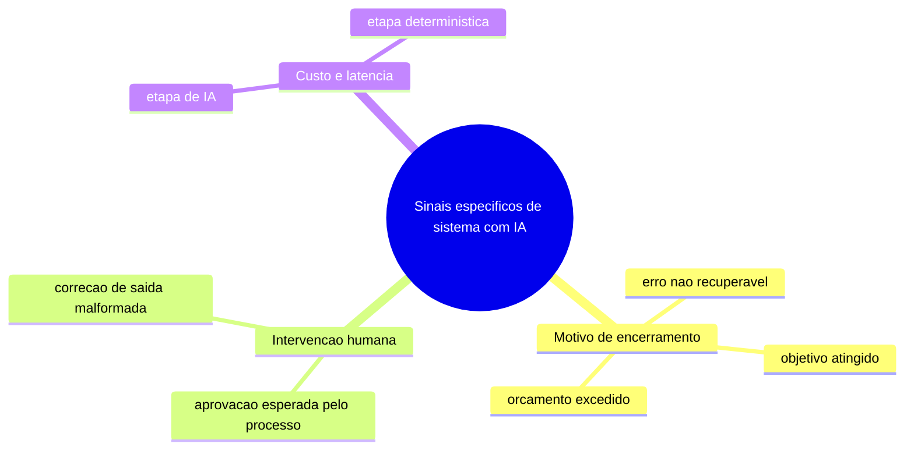
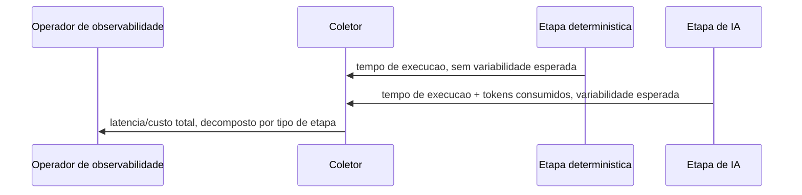

# Diagramas

Os três ramos correspondem diretamente a conceitos já definidos em outros volumes essenciais —
`08-AGENT-ENGINE` e `09-ORCHESTRATOR` definem motivo de encerramento; `10-WORKFLOW` define os dois
tipos de espera (`AguardandoSinal`, `Pausado`) que mapeiam para os dois sub-ramos de intervenção
humana. Este volume não inventa taxonomia nova — consolida a instrumentação desses conceitos já
definidos sob uma disciplina única, para que um painel de observabilidade não precise reimplementar
a mesma lógica de coleta separadamente para cada motor.

## Decomposição de custo por etapa

A decomposição existe porque as duas categorias de etapa pedem intervenção diferente quando
lentas ou caras: uma etapa determinística lenta é investigada como problema de código ou
infraestrutura; uma etapa de IA lenta ou cara é investigada como problema de seleção de modelo
(`27-LLM-ROUTER`) ou de desenho de prompt (`07-PROMPT-ENGINE`) — um painel que soma as duas sem
decompor esconde qual investigação é a correta para o caso concreto observado. O campo `tokens`
só existe para a etapa de IA porque só ela consome esse recurso — a ausência do campo para a
etapa determinística não é dado faltante, é a estrutura refletindo corretamente que a pergunta
"quantos tokens" simplesmente não se aplica a esse tipo de etapa. Um painel que apresenta as duas
etapas lado a lado sem essa distinção convida a comparação direta de tempo total, que por si só
já orienta a atenção para a etapa mais lenta — mas sem saber se essa lentidão vem de espera de
rede determinística ou de geração de tokens, a ação corretiva certa permanece invisível.
