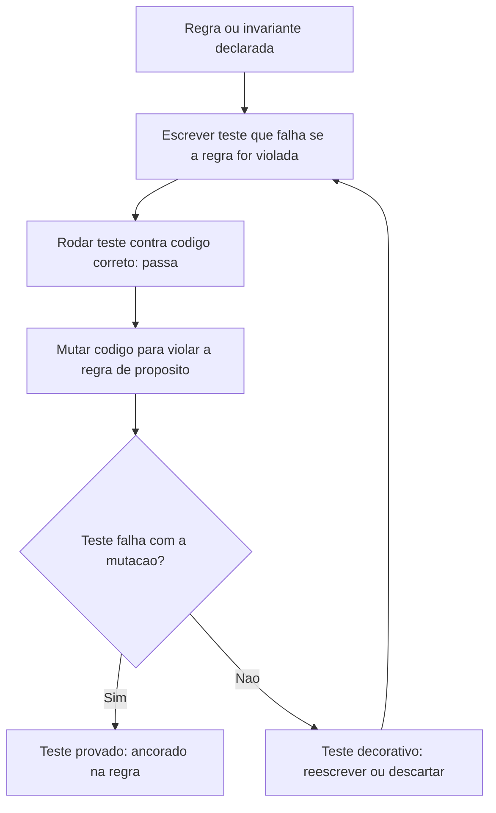

# Arquitetura

O fluxo mostra que escrever o teste é só o primeiro passo — a prova de que ele funciona como
especificação, e não como documentação que parece útil mas não protege nada, é o ciclo de
mutação. Um teste que nunca passou por esse ciclo carrega uma suposição não verificada: que ele
de fato falharia se a regra fosse violada. A diferença entre um acervo com testes decorativos e
um acervo com testes que travam comportamento, na prática observada neste próprio conjunto de
volumes, é exatamente esse ciclo sendo aplicado ou não a cada teste escrito.

## Processo, não ferramenta

Este volume descreve um processo de pensamento e verificação, não uma arquitetura de sistema com
componentes técnicos — por isso o tipo `PROCESSO` deste volume dispensa `08-Modelos.md`: não há
modelo de dados a descrever, porque o "sistema" aqui é a disciplina de trabalho aplicada por quem
escreve o teste, verificável por qualquer framework de teste em qualquer linguagem. A rastreabilidade
entre regra e teste, mencionada em `02-Objetivos.md`, é convenção de organização (nomenclatura,
comentário, agrupamento por arquivo), não estrutura de dado formal. Essa ausência deliberada de
modelo de dados é o próprio motivo pelo qual o contrato deste acervo permite que volumes tipo
`PROCESSO` dispensem `08-Modelos.md` — forçar uma seção sobre estrutura de dado onde não existe
nenhuma produziria enchimento, não conteúdo real.
