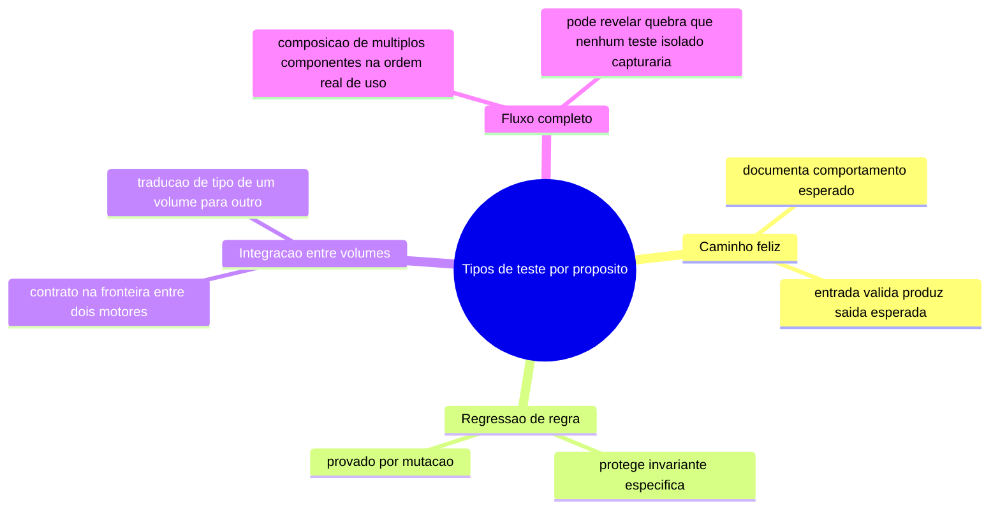
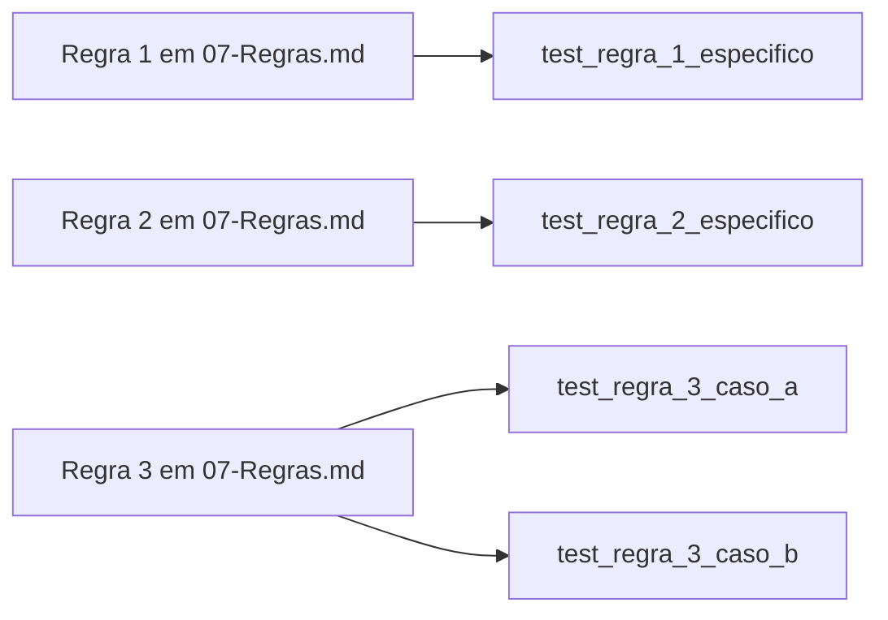

# Diagramas

Os quatro ramos não são mutuamente exclusivos numa suíte madura — um teste de fluxo completo, por
exemplo, também documenta caminho feliz, mas na composição inteira em vez de um componente
isolado. A distinção importa para decidir o que falta: uma suíte só com testes de caminho feliz
por componente, sem nenhum teste de fluxo completo, pode não detectar quebra que só aparece na
composição — exatamente o padrão que `test_fluxo_completo.py`, presente no volume irmão
`45-CONCILIACAO-CONTAS` do acervo-controladoria, existe para cobrir.

## Rastreabilidade regra-teste

Uma regra pode precisar de mais de um teste (como `R3` no diagrama) quando tem mais de um caso de
violação distinto a proteger — a rastreabilidade não exige um-para-um, exige que toda regra tenha
pelo menos um teste, e que a correspondência seja legível a partir do nome do teste, sem precisar
abrir o código do teste para descobrir qual regra ele protege. Uma regra sem nenhum teste
apontando para ela é lacuna visível neste diagrama — bastaria não haver seta chegando a `R1`,
`R2` ou `R3` para o problema ficar evidente numa revisão visual, sem precisar de ferramenta
adicional de análise de cobertura para detectar essa classe específica de omissão. Manter esse
mapeamento atualizado à mão, para uma suíte pequena, é mais barato do que construir automação
para o mesmo fim; a automação só se justifica quando o número de regras e testes cresce o
suficiente para tornar a revisão manual pouco confiável.
