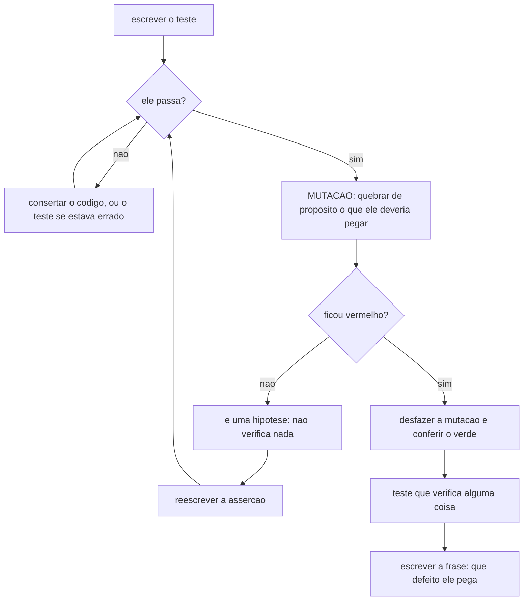

# Diagramas

O ciclo que separa um teste de uma hipótese. A parte de cima é o que todo mundo faz; a de baixo é a
que quase ninguém faz e é a que dá valor ao resto.

O nó `H` é o achado que este ciclo existe para produzir. Um teste que passa depois de o código ser
deliberadamente quebrado não está errado — ele está **vazio**, e vazio é pior que errado, porque
errado alguém conserta e vazio ninguém procura.

A mutação não precisa de ferramenta. É manual, leva menos de um minuto por teste crítico, e o
procedimento é sempre o mesmo: alterar o valor, a condição ou o dado que o teste deveria proteger,
rodar, conferir que ficou vermelho, desfazer, conferir que voltou ao verde. Este acervo aplicou
exatamente isso ao teste que executa os blocos de código de uma seção de prosa: trocar um número no
Markdown deixou a suíte vermelha, e o texto foi restaurado — o desfazer é parte do procedimento, e
conferir que o desfazer funcionou também.

O nó `F` fecha o ciclo por uma razão de manutenção, não de qualidade imediata. Sem a frase que diz
qual defeito o teste pega, ninguém consegue aposentá-lo com segurança quando o sistema mudar — e uma
suíte que só cresce acaba lenta, e uma suíte lenta acaba desligada.
