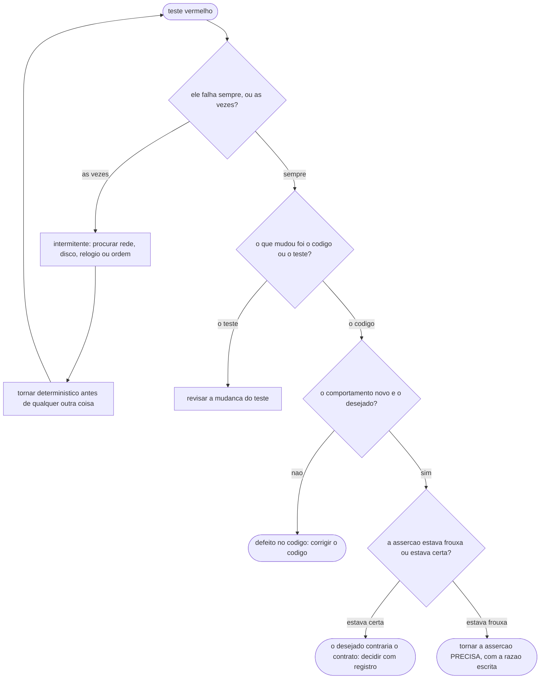

# Fluxogramas

O fluxo de decisão quando um teste fica vermelho. É curto e a ordem importa: as duas primeiras
perguntas eliminam as duas causas mais comuns, e a terceira é a que exige julgamento.

O ramo `INT` vem primeiro de propósito. Teste intermitente não se investiga como defeito de lógica:
investiga-se como defeito de determinismo, e as quatro causas cabem numa lista curta — rede, disco,
relógio e dependência de ordem de execução. Enquanto ele for intermitente, qualquer conclusão tirada
dele é ruído.

O ramo `PREC` é o único caminho legítimo para mexer numa asserção que estava passando, e a distinção
com "afrouxar" é o que a regra R2 do volume `01` protege. Este acervo tem o caso: um teste exigia que
uma lista de palpites ficasse **vazia** depois de recusar um deles. Acrescentar um termo novo ao
motor fez a frase-fixture gerar dois palpites, e o teste caiu.

O teste estava certo em cair. A asserção de lista vazia passava **por acidente** — só valia enquanto
o conjunto tivesse um elemento. A correção foi torná-la precisa: o palpite recusado não está mais na
lista, e os demais continuam. Afrouxar teria sido trocar a asserção por uma que aceitasse qualquer
coisa; precisar foi trocá-la por uma que sobrevive ao sistema crescer.

O ramo `CONTR` existe para o caso raro e importante: o comportamento novo é desejado **e** contraria
o que o teste protegia. Aí não se mexe no teste em silêncio — decide-se, com registro, que o contrato
mudou.
