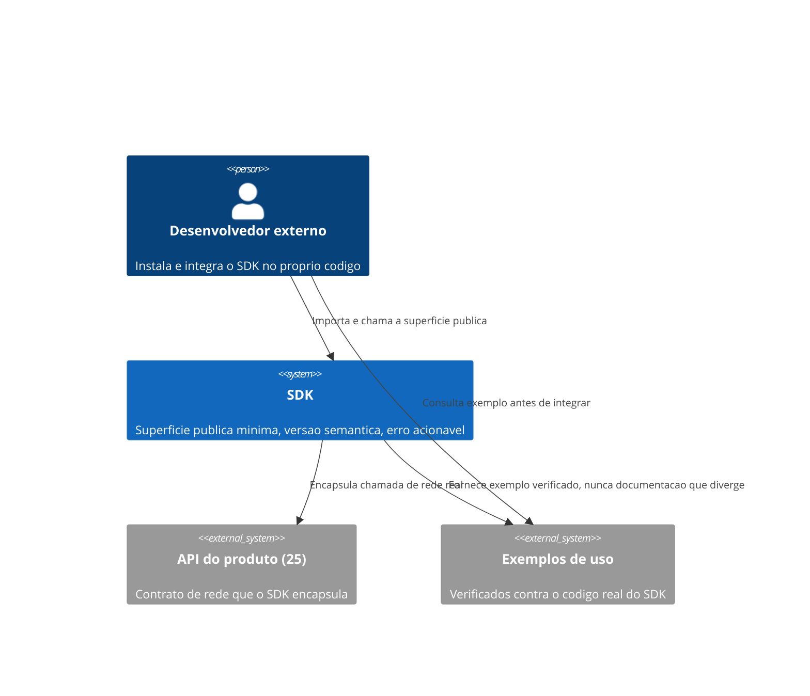
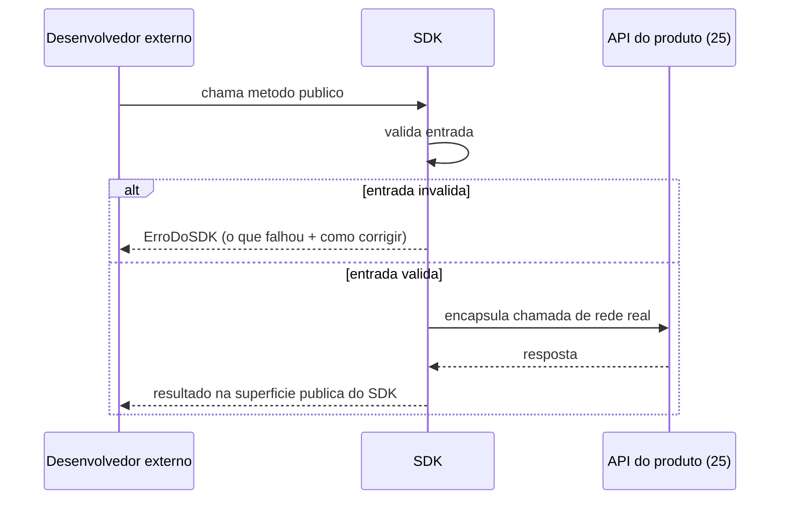

# Diagramas

O `SDK` nunca expõe o contrato de rede do `25-API-ARCHITECT` diretamente — ele encapsula essa
chamada atrás da superfície pública deliberada, o que permite ao SDK evoluir sua implementação
interna (incluindo como fala com a API) sem quebrar o código do desenvolvedor externo, desde que
a superfície pública em si permaneça estável dentro da mesma versão maior.

O erro retornado ao desenvolvedor nunca é a exceção bruta de rede ou de biblioteca interna — o
SDK sempre traduz para `ErroDoSDK`, carregando orientação de correção, mesmo quando a causa raiz
é uma falha de rede que o desenvolvedor externo não tem como diagnosticar sozinho sem essa
tradução.

Essa distinção de responsabilidade entre `SDK` e a `API do produto` que ele encapsula é o que
permite ao time responsável pelo SDK reagir a uma mudança na implementação interna sem quebrar
nenhum código de terceiros, desde que a superfície pública do SDK em si permaneça estável durante
essa mesma versão maior — o encapsulamento é o que absorve a mudança interna antes que ela chegue
ao desenvolvedor externo.

Os dois diagramas juntos mostram a jornada completa: o `C4Context` situa o SDK entre o
desenvolvedor externo e a API real que ele encapsula, enquanto o `sequenceDiagram` detalha o que
acontece dentro de uma única chamada, incluindo o caminho de erro traduzido.