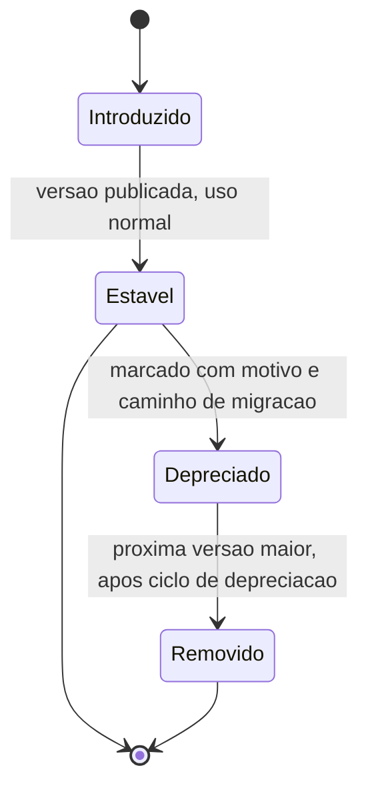

# Fluxogramas

Nenhum membro público alcança `Removido` sem passar por `Depreciado` — não existe transição
direta de `Estavel` para `Removido`, porque pular a depreciação quebraria código de terceiros sem
aviso prévio algum, exatamente o cenário que AC5 existe para prevenir.

## Por que superfície pública é decidida na introdução, não depois

`MembroDeSDK` exige `motivo_publico` já na criação, não como algo adicionado depois de alguém
notar que "esqueceram" de tornar algo privado — decidir publicidade retroativamente é sempre mais
arriscado, porque um elemento que já vazou como público, mesmo sem intenção, já pode ter sido
usado por código de terceiros, tornando difícil torná-lo privado de novo sem quebrar alguém.

Um membro que nunca foi usado por nenhum consumidor real pode, em teoria, pular direto para
remoção sem risco prático de quebrar alguém — mas o modelo aqui não distingue esse caso, porque
não existe forma confiável de saber com certeza que nenhum código de terceiros depende de um
elemento público, e tratar todo elemento público com o mesmo cuidado de depreciação é a escolha
mais segura por padrão.

O estado `Introduzido` existe separado de `Estavel` para deixar claro que um membro recém-criado
ainda pode, em teoria, sofrer ajuste antes de ser considerado parte estável da superfície —
uma vez em `Estavel`, porém, qualquer mudança que quebre compatibilidade passa a exigir o ciclo
completo descrito neste diagrama.