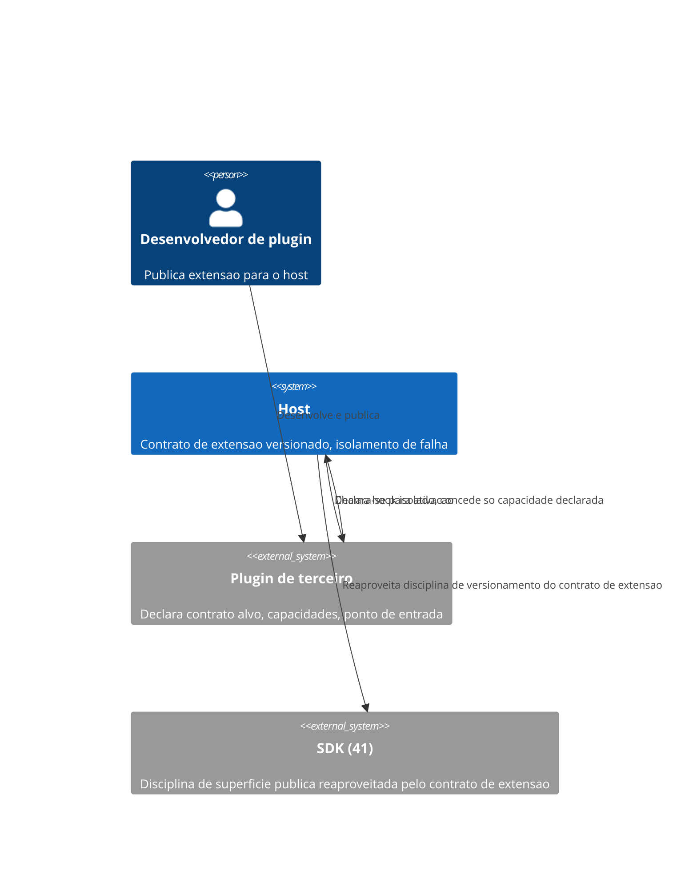
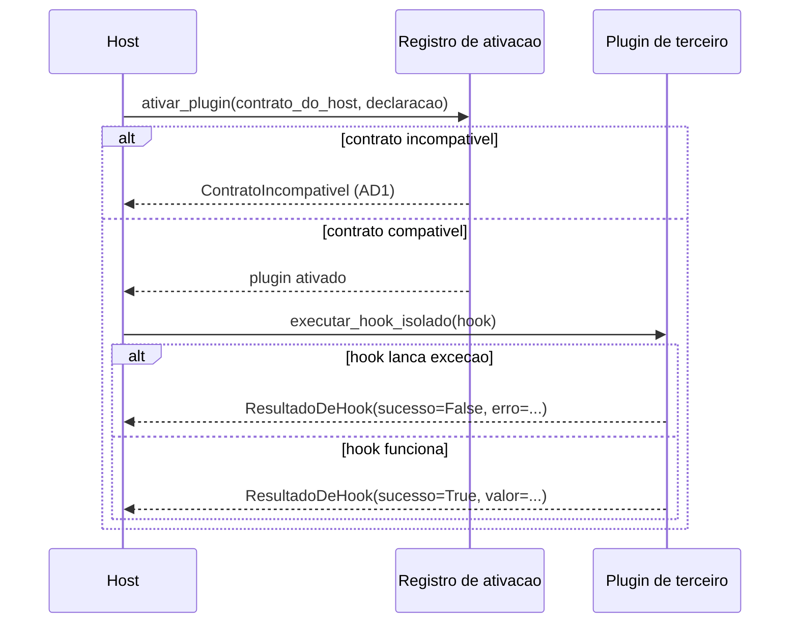

# Diagramas

O `Host` nunca chama um hook de `Plugin de terceiro` diretamente sem passar pela camada de
isolamento — toda chamada atravessa `executar_hook_isolado`, o que garante que uma falha dentro
do plugin nunca se propague além dessa fronteira, mesmo quando o plugin em si nunca foi
inspecionado linha a linha por quem mantém o host.

Note que o caminho de falha do hook nunca interrompe o fluxo do `Host` com uma exceção não
tratada — o resultado estruturado é sempre retornado, sucesso ou falha, permitindo que o host
decida o que fazer (registrar, desativar o plugin, seguir adiante) sem nunca arriscar propagação
não controlada de erro de terceiro.

Note que nenhum dos dois diagramas mostra o `Plugin de terceiro` chamando o `Host` diretamente —
toda interação passa por uma camada intermediária (registro de ativação, ou execução isolada de
hook), o que é exatamente o ponto: o host nunca confia ciegamente no código de terceiro, mesmo
depois de ativado com sucesso.

A ordem das setas no `sequenceDiagram` é deliberada: verificação de contrato sempre antes de
qualquer chamada de hook, nunca depois — inverter essa ordem tornaria possível, ainda que
brevemente, executar código de um plugin já sabido incompatível antes de rejeitá-lo, um risco que
o diagrama torna explícito para quem for implementar essa mesma sequência de eventos.