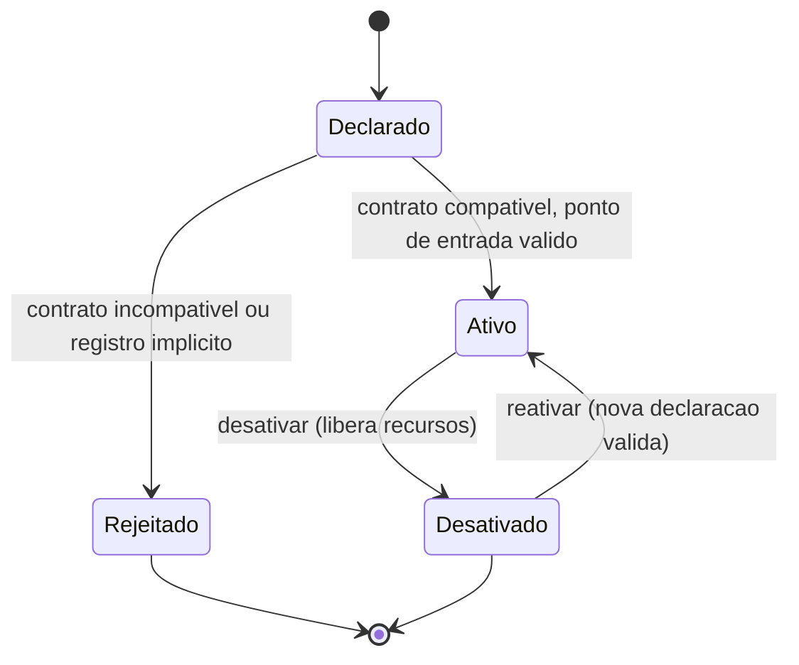

# Fluxogramas

Não existe transição direta de `Declarado` para `Ativo` sem passar pela verificação de
compatibilidade de contrato — a ativação é sempre condicional, nunca automática pela simples
presença de uma declaração de plugin no sistema.

## Por que desativação e reativação formam um ciclo simétrico

Um plugin desativado pode ser reativado com uma nova declaração válida, mas sempre repetindo o
mesmo processo de verificação de contrato — nenhum estado de ativação anterior é reaproveitado
silenciosamente, o que garante que uma reativação sempre reflete o estado atual do contrato do
host, mesmo que o host tenha evoluído seu próprio contrato de extensão entre a desativação e a
tentativa de reativação.

O ciclo `Ativo → Desativado → Ativo` nunca reaproveita o resultado da verificação de
compatibilidade feita na primeira ativação — cada reativação passa pela mesma verificação de
`ativar_plugin` outra vez, o que garante que uma mudança no contrato do host entre as duas
ativações seja corretamente detectada na segunda tentativa, sem depender de memória de estado
anterior que poderia estar desatualizada.

Um plugin `Rejeitado` não guarda estado algum no host — a transição termina ali, sem deixar
resíduo de uma tentativa de ativação que nunca chegou a se completar, e sem exigir nenhuma
operação de desativação explícita posterior, já que nada foi de fato registrado como ativo em
primeiro lugar.