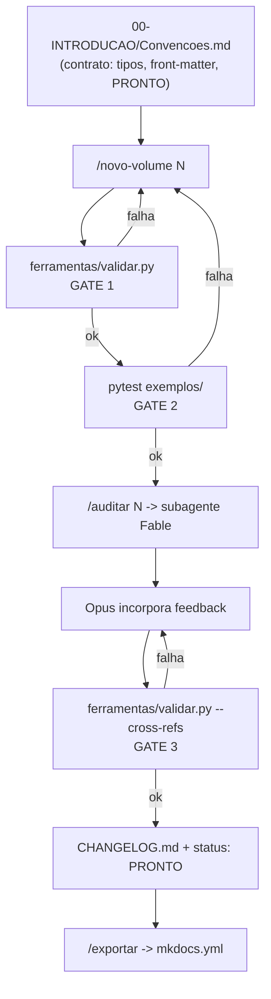

# AI-ENGINEERING-OS — Design

**Data:** 2026-07-29
**Status:** aprovado pelo autor
**Origem:** `Downloads/Plataforma para Engenharia de Projetos de IA.txt` (especificação do autor)

---

## 1. Contexto e problema

O autor especificou uma plataforma técnica de engenharia de IA em **42 volumes**, cada
um com **18 seções fixas**, mais bibliotecas transversais (prompts, agentes, frameworks,
templates, diagramas, exemplos, SDK). O resultado esperado declarado inclui "8.000+
páginas", "2.000+ prompts", "300+ agentes" e "500+ exemplos de código funcionais",
com ciclo de produção Opus 5 (criação) → Fable 5 (auditoria) → Opus 5 (incorporação).

A revisão da especificação encontrou sete problemas que impedem a construção literal:

1. **Escala inconsistente com a regra de qualidade.** 42 × 18 = 756 arquivos de seção.
   8.000 páginas ≈ 2 milhões de palavras ≈ ~3M tokens de saída, multiplicados por 3
   passes (gera → audita → incorpora). Para preencher 756 seções o conteúdo precisa
   virar genérico — o que contradiz a própria instrução "nunca gere conteúdo superficial".
2. **18 seções fixas para todo volume forçam enchimento.** `40-TEMPLATES` e
   `36-DIAGRAMS` não têm "Arquitetura C4" nem "State Machine" com significado real.
3. **Sobreposição entre volumes.** `07-PROMPT-ENGINE` / `28-PROMPT-COMPILER` /
   `29-PROMPT-OPTIMIZER` são um domínio; idem `11-KNOWLEDGE` / `13-RAG` / `14-VECTOR` /
   `15-CONTEXT`, `17-SECURITY` / `18-DEVSECOPS`, `31-TESTING` / `32-QUALITY`, e os quatro
   `*-ARCHITECT` (22–25) contra `16-INTEGRATION`. Os 42 rótulos cobrem ~25 domínios
   distintos; manter 42 garante contradição entre volumes.
4. **Frameworks "proprietários" mal classificados ou inexistentes.** RTF, CARE, RISE,
   TAG, BAB e RAPPEL são técnicas de prompt **públicas** — descrevê-las como
   proprietárias é incorreto. ORBIT, FLOW, NEXUS, FUSION, GENESIS, ATLAS, EVEREST,
   QUANTUM, IDEA+, PACE, BUILD, SMART-AI e ENTERPRISE-AI são **nomes sem definição** na
   especificação; construí-los significaria inventar conteúdo.
5. **"500+ exemplos funcionais" não é verificável** sem runner/CI. Código em bloco
   markdown não executado é afirmação não checada.
6. **Conteúdo perecível.** `26-AI-MODELS`, `27-LLM-ROUTER` e `34-COST-OPTIMIZATION`
   dependem de modelos e preços que mudam em semanas.
7. **Conflito de `CLAUDE.md`.** A raiz deste repositório já tem o `CLAUDE.md` da rotina
   de conciliação financeira. A plataforma não pode colocar o seu na raiz.

O que a especificação acerta e vale construir: o modelo criador/auditor (implementável
com subagentes), os cinco comandos operacionais, `Convencoes.md` como contrato único,
e o `CHANGELOG` como registro de estado. **A máquina é o ativo — não os 756 arquivos.**

## 2. Decisão

Construir a **máquina completa e funcional** mais **um volume-piloto padrão-ouro**
(`07-PROMPT-ENGINE`), auditado de ponta a ponta. Os 41 volumes restantes nascem
registrados como pendentes e são produzidos depois, um por vez, via `/novo-volume`.

Decisões travadas com o autor:

| Decisão | Escolha |
|---|---|
| Estratégia | Máquina + 1 volume-piloto |
| Local | Subpasta `AI-ENGINEERING-OS/` neste repositório |
| Piloto | `07-PROMPT-ENGINE` |
| Stack dos exemplos | Python + pytest |

## 3. Estrutura

```
CLAUDE/                                  ← repo atual; raiz NÃO é tocada
└── AI-ENGINEERING-OS/
    ├── CLAUDE.md                        ← contexto da plataforma (local)
    ├── README.md  CHANGELOG.md  ROADMAP.md  CONTRIBUTING.md  LICENSE
    ├── .claude/skills/                  ← 5 skills escopadas a esta pasta
    │   ├── novo-volume/SKILL.md
    │   ├── auditar/SKILL.md
    │   ├── status/SKILL.md
    │   ├── cross-reference/SKILL.md
    │   └── exportar/SKILL.md
    ├── .claude/agents/auditor-fable.md   ← subagente auditor (model: fable)
    ├── 00-INTRODUCAO/
    │   ├── Prefacio.md  Como-Utilizar.md  Glossario.md  Arquitetura-Geral.md
    │   └── Convencoes.md                ← CONTRATO (arquivo mais importante)
    ├── 01-FUNDACAO/ … 42-PLUGINS/       ← cada um com _VOLUME.yml
    ├── 07-PROMPT-ENGINE/                ← piloto: 18 seções completas
    ├── ferramentas/                     ← código Python da máquina
    │   ├── frontmatter.py  validar.py  status.py  exportar.py
    │   └── tests/
    ├── exemplos/07-prompt-engine/       ← .py executáveis + tests/
    ├── auditorias/                      ← relatórios Fable datados
    ├── prompts/ agentes/ frameworks/ templates/ diagramas/ referencias/ sdk/
    └── mkdocs.yml                       ← gerado por /exportar
```

Nada fora de `AI-ENGINEERING-OS/` é modificado, exceto o spec e o plano em
`docs/superpowers/`.

## 4. O contrato: `00-INTRODUCAO/Convencoes.md`

Define três coisas que a especificação original deixou implícitas.

### 4.1 Tipos de volume

Cada volume declara um `tipo` em seu `_VOLUME.yml`. O tipo determina quais das 18
seções são obrigatórias. Isso elimina seções-enchimento sem abandonar o padrão.

| Tipo | Volumes | Ajuste sobre as 18 seções |
|---|---|---|
| `ENGINE` | 07,08,09,10,11,12,13,14,15,26,27,28,29,37,41,42 | todas as 18 obrigatórias |
| `ARQUITETURA` | 02,06,16,19,20,22,23,24,25 | State Machine opcional |
| `PROCESSO` | 03,04,05,18,31,32,33,34,38,39 | BPMN obrigatório; `08-Modelos` opcional |
| `BIBLIOTECA` | 36,40 | sem `04-Arquitetura`/`05-Diagramas`; ganha `04-Catalogo.md` |
| `GOVERNANCA` | 01,17,21,30,35 | State Machine opcional; ganha matriz de controles |

A tabela vive em `Convencoes.md` **e** é lida pelo validador — fonte única.

### 4.2 Front-matter obrigatório

Todo arquivo de seção começa com:

```yaml
---
volume: 07
volume_nome: PROMPT-ENGINE
tipo: ENGINE
secao: 04-Arquitetura
status: RASCUNHO | REQUER_REVISAO | PRONTO
atualizado_em: 2026-07-29
depende_de: [08-AGENT-ENGINE, 28-PROMPT-COMPILER]
---
```

É isso que torna `/status` e `/cross-reference` **determinísticos**: um script lendo
metadados, não um LLM opinando sobre o acervo.

### 4.3 Definição de PRONTO

Substitui contagem de páginas. Um volume é `PRONTO` quando, e só quando:

1. `validar.py` retorna exit 0 para o volume;
2. `pytest` passa nos exemplos do volume;
3. auditoria Fable registra **média ≥ 8,0** e **nenhuma seção < 6**;
4. o resultado está registrado no `CHANGELOG.md` com data.

## 5. A máquina

### 5.1 `ferramentas/validar.py` — a porta de qualidade

Código, não prompt. Retorna exit ≠ 0 com lista `arquivo:linha` para cada violação:

- front-matter ausente, malformado, ou com campo obrigatório vazio;
- seção obrigatória para o `tipo` do volume ausente;
- seção presente mas vazia, abaixo do mínimo de palavras, ou contendo
  `TBD` / `TODO` / `PENDENTE` / `FIXME` / `XXX`;
- bloco ` ```mermaid ` sintaticamente inválido, ou **sem parágrafo descritivo
  imediatamente após** (regra de diagramas do `CLAUDE.md`);
- referência a exemplo (`exemplo: exemplos/<path>.py`) cujo arquivo não existe;
- exemplo existente sem teste correspondente em `exemplos/<vol>/tests/`;
- link markdown interno que não resolve;
- ciclo em `depende_de`.

Modos: `validar.py <volume>` (um volume), `--tudo`, `--cross-refs`.

Isso converte "nunca gere conteúdo superficial" de aspiração em teste que quebra.

### 5.2 Skills

| Skill | Comportamento concreto |
|---|---|
| `/novo-volume N nome` | lê `Convencoes.md`, `CHANGELOG.md` e volumes em `depende_de`; resolve o `tipo`; gera as seções aplicáveis; cria exemplos `.py` + testes; roda `validar.py`; roda `pytest`; grava status conforme o resultado; registra no `CHANGELOG.md` |
| `/auditar N` | dispara o subagente `auditor-fable` com o prompt de auditoria da especificação; grava `auditorias/VOL-NN-auditoria-YYYY-MM-DD.md` com nota por seção (0–10), problemas, sugestões e veredicto; atualiza `status` no front-matter |
| `/status` | executa `ferramentas/status.py`: tabela de volumes por estado, com pendências e bloqueios |
| `/cross-reference` | `validar.py --cross-refs` (determinístico) e, em seguida, passe semântico do Fable procurando contradições entre volumes |
| `/exportar` | `ferramentas/exportar.py`: gera `mkdocs.yml` a partir da estrutura real e valida o build |

### 5.3 Regra de honestidade de estado

`/novo-volume` **nunca** grava `PRONTO` com gate vermelho — grava `RASCUNHO` e reporta
as violações. Auditoria com média < 8,0 grava `REQUER_REVISAO`. Nenhum sucesso é
afirmado sem gate verde. (Alinhado à regra 4 do `CLAUDE.md` do repositório: não afirmar
sucesso sem ter olhado.)

## 6. Volume-piloto: `07-PROMPT-ENGINE`

Tipo `ENGINE`, 18 seções completas, servindo de padrão-ouro e de teste de estresse do
`Convencoes.md`. Conteúdo substantivo obrigatório:

- `04-Arquitetura.md`: C4 (contexto, containers, componentes) do motor de prompts;
- `05-Diagramas.md`: sequência (compilação e execução de um prompt), state machine
  (ciclo de vida `rascunho → versionado → em-avaliação → promovido → depreciado`),
  ER (registry de prompts), mind map do domínio;
- `08-Modelos.md`: contratos e interfaces (`PromptTemplate`, `PromptRegistry`,
  `PromptCompiler`, `PromptEvaluator`) — os mesmos implementados em `exemplos/`;
- `11-Implementacao.md` + `12-Exemplos.md`: apontam para arquivos `.py` reais;
- `14-Metricas.md`: métricas observáveis (taxa de acerto, custo/execução, deriva entre
  versões), não adjetivos;
- `18-Referencias-Cruzadas.md`: links resolvíveis para 08, 28, 29, 11, 31.

Exemplos executáveis em `exemplos/07-prompt-engine/`, cada um com teste pytest:

1. `prompt_template.py` — template com variáveis tipadas e validação de contrato;
2. `prompt_registry.py` — registry versionado com hash de conteúdo;
3. `prompt_evaluator.py` — avaliador com casos de ouro e comparação entre versões.

O piloto alimenta `prompts/prompt-engineering/` com prompts reais e `_indice.md`.

## 7. Correções de conteúdo aplicadas

### 7.1 Frameworks

- `frameworks/conhecidos/`: RTF, CARE, RISE, TAG, BAB, RAPPEL documentados como
  **técnicas públicas de prompt**, com atribuição correta; mais LangChain, CrewAI,
  AutoGen, Semantic Kernel.
- `frameworks/proprietarios/`: **um só** — `AI-ENGINEERING-FRAMEWORK`, que é o que esta
  plataforma efetivamente propõe.
- `frameworks/_backlog.md`: registra ORBIT, FLOW, NEXUS, FUSION, GENESIS, ATLAS,
  EVEREST, QUANTUM, IDEA+, PACE, BUILD, SMART-AI, ENTERPRISE-AI como **sem definição na
  especificação — aguardando o autor**. Não são inventados.

### 7.2 Metas numéricas

"8.000+ páginas", "2.000+ prompts", "300+ agentes", "500+ exemplos" entram no
`ROADMAP.md` como **estimativa do autor, explicitamente não usada como critério de
aceite**. O critério é a Definição de PRONTO (§4.3).

### 7.3 Conteúdo perecível

`26-AI-MODELS`, `27-LLM-ROUTER` e `34-COST-OPTIMIZATION` recebem, no `_VOLUME.yml`, a
marca `perecivel: true` e instrução no `Convencoes.md` para serem finos e apontarem
para fonte viva em vez de fixarem números de preço/limite.

## 8. Fluxo de dados



O diagrama mostra que nenhum caminho leva a `PRONTO` sem passar pelos três gates: o
validador estrutural, os testes dos exemplos e a checagem de referências cruzadas — com
a auditoria do Fable entre o segundo e o terceiro. Toda falha volta para a etapa de
geração ou de incorporação, nunca segue adiante.

## 9. Tratamento de erro

| Situação | Comportamento |
|---|---|
| Volume não existe em `/auditar N` | erro explícito, nada é escrito |
| `_VOLUME.yml` com `tipo` inválido | validador falha listando os tipos aceitos |
| Mermaid inválido | violação por arquivo e número de linha do bloco |
| Exemplo sem teste | violação; volume não pode ficar `PRONTO` |
| Subagente Fable indisponível | `/auditar` falha reportando; status permanece `RASCUNHO` |
| `mkdocs` ausente | `/exportar` gera `mkdocs.yml` e avisa que o build não foi validado |

## 10. Testes da própria máquina

`ferramentas/tests/` valida o validador com fixtures deliberadamente ruins — cada uma
precisa ser detectada:

- seção sem front-matter;
- front-matter com `status` inválido;
- seção obrigatória do tipo ausente;
- seção contendo `TODO`;
- bloco mermaid sem parágrafo descritivo depois;
- referência a exemplo inexistente;
- exemplo sem teste;
- link interno morto;
- ciclo em `depende_de`.

Mais fixtures positivas (volume mínimo válido de cada um dos cinco tipos) que precisam
passar. É esse conjunto que garante que a máquina funciona antes de gerar o piloto.

## 11. Fora de escopo neste ciclo

Registrado no `ROADMAP.md`, não construído agora:

- os outros 41 volumes com conteúdo (apenas `_VOLUME.yml` + registro pendente);
- o SDK (`sdk/`) além do esqueleto e um `README` de intenção;
- a biblioteca de 300 agentes (apenas `_template-agente.md` + `_catalogo.md`);
- as bibliotecas de prompts por stack/banco/framework além do que o piloto usa;
- diagramas soltos em `diagramas/` (o piloto tem os seus dentro do volume);
- CI em GitHub Actions para rodar `validar.py` e `pytest` no push.

## 12. Referências

- Especificação original do autor: `Downloads/Plataforma para Engenharia de Projetos de IA.txt`
- `CLAUDE.md` (raiz) — regras de segurança 1 e 4 aplicadas às portas de qualidade
