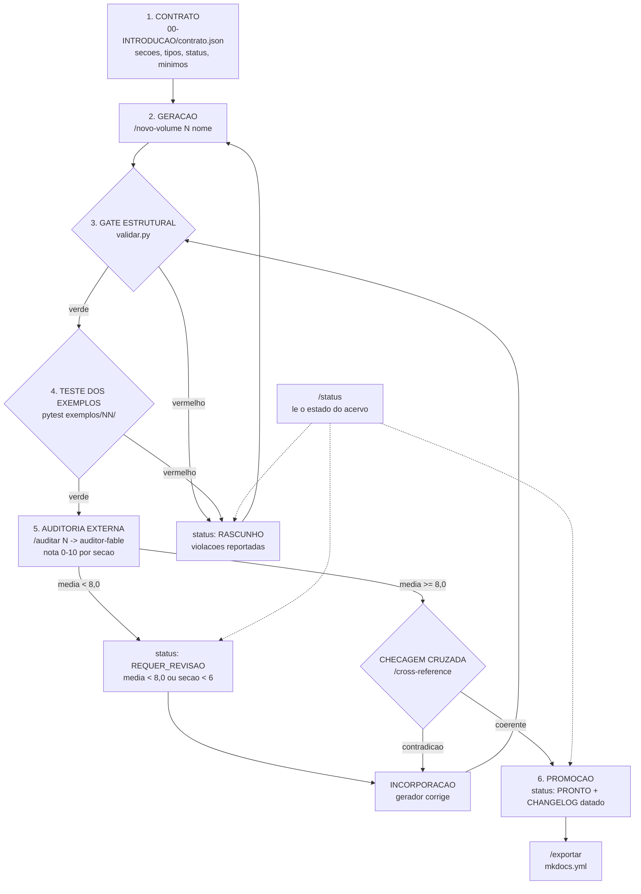

# AI-ENGINEERING-FRAMEWORK

> Framework proprietário desta plataforma · atualizado em 2026-07-29
> **Estado de atribuição:** `PROPRIETARIO` — formulado nesta plataforma, versão 1.0.0,
> alinhado ao `contrato.json` v1.0.0.
> **É o único framework proprietário deste acervo.** A razão de não haver outros está em
> [`_backlog.md`](../_backlog.md).

## O problema que ele resolve

Produzir conhecimento técnico com apoio de modelo de linguagem é barato; produzir
conhecimento técnico **confiável** com apoio de modelo de linguagem não é. O modo de falha
não é o erro grosseiro — é o texto competente, bem organizado, com a extensão certa, que
afirma coisas que ninguém verificou. Esse texto passa em revisão humana por leitura rápida,
porque a fluência é lida como sinal de apuração.

Nenhuma quantidade de instrução no prompt resolve isso. "Não invente", "cite fontes", "seja
rigoroso" são pedidos, e um pedido não é um mecanismo. Este framework é a tentativa de
transformar essas três frases em **mecanismo**: seis fases, das quais três são programas cujo
veredicto não se negocia, e uma é um segundo modelo cujo trabalho é discordar.

A tese em uma frase: **o que garante qualidade não é o gerador ser bom, é o gate ser
independente do gerador.**

## As seis fases

### 1. Contrato

Antes de gerar qualquer coisa, existe um contrato legível por máquina:
`00-INTRODUCAO/contrato.json`. Ele declara as 18 seções canônicas, os cinco tipos de volume e
quais seções cada tipo exige, os três status válidos (`RASCUNHO`, `REQUER_REVISAO`, `PRONTO`),
os campos obrigatórios de front-matter, os marcadores de trabalho inacabado que são proibidos,
os mínimos de prosa por seção e os 42 volumes com nome, tipo e marca de perecível.

O contrato é **fonte única**. `00-INTRODUCAO/Convencoes.md` documenta a mesma tabela para
humanos, e o teste `test_contrato.py::test_convencoes_nao_derivou` falha se as duas versões
divergirem. Isso é o que impede a deriva silenciosa entre a regra que o humano lê e a regra que
a máquina aplica — o defeito que mata praticamente todo padrão de documentação em dois
trimestres.

A fase de contrato responde a uma pergunta que costuma ficar implícita: *qual é a definição de
completo?* Enquanto ela é implícita, cada geração negocia o próprio critério.

### 2. Geração

`/novo-volume N nome` produz o volume. Ela lê `Convencoes.md`, o `CHANGELOG.md` e os volumes
declarados em `depende_de`, resolve o `tipo` no contrato, gera as seções aplicáveis àquele tipo,
cria os exemplos `.py` com seus testes, e então roda os gates — nesta ordem, sem pular.

Duas regras de honestidade valem desde a geração. A primeira: **`/novo-volume` nunca grava
`PRONTO` com gate vermelho.** Se o gate reprova, ela grava `RASCUNHO` e reporta as violações. A
segunda: o que não se sabe **não é preenchido** — vai para o backlog correspondente, do mesmo
modo que os treze nomes de [`_backlog.md`](../_backlog.md).

### 3. Gate estrutural

`ferramentas/validar.py` — código Python, biblioteca padrão, sem LLM no caminho. Devolve
`exit ≠ 0` com uma lista `arquivo:linha` para cada violação: front-matter ausente ou
incompleto, seção obrigatória faltando para o tipo, seção abaixo do mínimo de prosa
(**código não conta como prosa** — a contagem ignora blocos cercados, de propósito, porque
inflar seção com listagem é o atalho mais fácil), marcador de trabalho inacabado, bloco Mermaid
sem parágrafo descritivo depois, referência a exemplo cujo arquivo não existe, exemplo sem
teste, link interno que não resolve, ciclo em `depende_de`.

Este é o gate que converte "nunca gere conteúdo superficial" de aspiração em teste que quebra.
A escolha de implementá-lo como programa, e não como instrução de revisão, é o núcleo do
framework: um programa não é persuadível, não tem dia ruim e não fica mais tolerante depois de
quinze minutos de conversa.

### 4. Teste dos exemplos

`pytest` sobre `exemplos/<volume>/`. Todo trecho de código citado por um volume existe como
arquivo executável, e todo arquivo executável tem teste. A regra é simples e tem consequência
grande: **volume não cita código que não roda.**

Documentação com trecho ilustrativo que nunca foi executado é a maior fonte de erro silencioso
em acervo técnico, porque o leitor confia no código mais do que na prosa — e o código está no
texto justamente para ser copiado. Aqui, o código citado é o código testado.

### 5. Auditoria independente

`/auditar N` dispara o subagente `auditor-fable` — **modelo diferente do que gerou**. Ele
atribui nota de 0 a 10 por seção, lista problemas e sugestões, e grava um relatório datado em
`auditorias/VOL-NN-auditoria-YYYY-MM-DD.md`.

A independência é o ponto, e ela é dupla. Independência de **modelo**, porque um gerador
avaliando o próprio texto tende a ratificá-lo: os vieses que produziram o defeito são os mesmos
que o julgam aceitável. E independência de **critério**, porque o auditor pontua contra o
contrato, não contra a intenção do autor. Média abaixo de 8,0 grava `REQUER_REVISAO`; o
resultado volta para incorporação, não segue adiante.

O que a auditoria pega e o gate estrutural não pega: contradição entre volumes, afirmação sem
fonte, exemplo que ilustra o conceito errado, seção que cumpre o mínimo de palavras sem dizer
nada. O que ela **não** substitui: o gate. Nota alta com gate vermelho não promove nada.

### 6. Promoção

Só aqui o status pode virar `PRONTO`, e só se as quatro condições da **Definição de PRONTO**
estiverem satisfeitas ao mesmo tempo:

1. `validar.py` retorna `exit 0` para o volume;
2. `pytest` passa nos exemplos do volume;
3. a auditoria registra **média ≥ 8,0 e nenhuma seção < 6**;
4. o resultado está registrado no `CHANGELOG.md` **com data**.

A quarta condição não é burocracia. Ela é o que torna a promoção um evento datado e auditável
em vez de um estado que apareceu no arquivo sem que ninguém saiba quando nem por quê. E note
que a Definição de PRONTO **substitui contagem de páginas**: as metas numéricas do autor
("8.000+ páginas", "2.000+ prompts", "300+ agentes", "500+ exemplos") estão registradas no
`ROADMAP.md` como estimativa e **explicitamente não são critério de aceite**.

Antes da promoção corre ainda `/cross-reference`, que roda `validar.py --cross-refs`
(determinístico) e depois um passe semântico procurando contradições entre volumes. Depois da
promoção, `/exportar` gera o `mkdocs.yml` a partir da estrutura real.

## O ciclo

O diagrama mostra o que a prosa acima afirma e que só fica evidente em forma de grafo: **não
existe caminho que chegue a `PRONTO` sem atravessar os três gates e a auditoria.** Toda aresta
de falha retorna para a geração ou para a incorporação — nenhuma delas contorna um gate ou salta
para a promoção. Note também que a incorporação de feedback (`IN`) volta ao **gate estrutural**,
não à auditoria: corrigir o apontamento do auditor pode quebrar a estrutura, e por isso a
verificação determinística roda de novo antes de qualquer nova avaliação. Os três estados
possíveis do volume (`RASCUNHO`, `REQUER_REVISAO`, `PRONTO`) são os únicos nós terminais de
estado do grafo, e `/status` lê os três — o que significa que o estado do acervo é sempre
consultável sem executar nada, porque ele está gravado no front-matter e não na cabeça de quem
trabalhou nele.

## Os cinco comandos e as fases

| Comando | Fase | O que faz de concreto | Pode gravar `PRONTO`? |
|---|---|---|---|
| `/novo-volume N nome` | 2, e dispara 3 e 4 | lê contrato e dependências, gera seções do tipo, cria exemplos + testes, roda `validar.py` e `pytest`, grava status conforme o resultado, registra no `CHANGELOG.md` | **Não** — nunca com gate vermelho |
| `/auditar N` | 5 | dispara `auditor-fable`, grava `auditorias/VOL-NN-auditoria-YYYY-MM-DD.md`, atualiza status | Não; grava `REQUER_REVISAO` se média < 8,0 |
| `/status` | transversal | roda `ferramentas/status.py`: tabela de volumes por estado, pendências e bloqueios | Não — é leitura |
| `/cross-reference` | antes de 6 | `validar.py --cross-refs` e depois passe semântico procurando contradição entre volumes | Não |
| `/exportar` | depois de 6 | `ferramentas/exportar.py`: gera `mkdocs.yml` da estrutura real e valida o build | Não |

Nenhum dos cinco comandos grava `PRONTO` por decisão própria. `PRONTO` é consequência das
quatro condições, verificada; não é um comando.

## Como se compara ao que já existe

Este framework **não compete** com LangChain, CrewAI, AutoGen ou Semantic Kernel — eles
constroem aplicações; este constrói **acervo auditado**. A comparação útil é de princípio:

| Princípio emprestado | De onde | Como aparece aqui |
|---|---|---|
| Regra vive no código, modelo decide quando invocá-la | [`semantic-kernel.md`](../conhecidos/semantic-kernel.md) | os três gates são programas, não instruções |
| Auditoria por outro participante | [`autogen.md`](../conhecidos/autogen.md), [`crewai.md`](../conhecidos/crewai.md) | `auditor-fable`, com modelo diferente |
| Veredicto fora da conversa | correção do risco de convergência entre agentes | `exit code`, não opinião |
| Orquestração separada da decisão | [`langchain.md`](../conhecidos/langchain.md) | skills orquestram; `validar.py` decide |
| Estado desejado verificável antes da mudança | [`BAB.md`](../conhecidos/BAB.md) | Definição de PRONTO precede a geração |

## Onde este framework falha

Um framework proprietário que só lista virtudes é propaganda. Estes são os limites conhecidos:

1. **O gate estrutural mede forma, não verdade.** Uma seção pode ter 400 palavras de prosa
   impecável, front-matter correto, Mermaid válido com parágrafo — e estar factualmente errada.
   O gate 3 não detecta isso; só a auditoria pode, e ela é probabilística.
2. **A auditoria é um modelo.** Ela reduz a correlação de vieses, não a elimina, e pode
   reprovar conteúdo bom ou aprovar conteúdo ruim. A média ≥ 8,0 é um limiar escolhido, não
   derivado.
3. **O mínimo de palavras é falseável.** Contagem de prosa é uma proxy grosseira de substância.
   Ela impede a seção vazia; ela não impede a seção verbosa. Nenhum limiar numérico impediria.
4. **Custa caro.** Seis fases, dois modelos, três execuções de gate por volume. Para conteúdo
   descartável, é desproporcional. Este framework supõe que o acervo será lido e usado por anos.
5. **A fonte única depende de um teste.** `test_convencoes_nao_derivou` é o que impede a deriva
   entre `contrato.json` e `Convencoes.md`. Se alguém desabilitar esse teste, a garantia
   desaparece silenciosamente — e essa é a fragilidade estrutural mais séria do desenho.
6. **Volume perecível continua perecendo.** `26-AI-MODELS`, `27-LLM-ROUTER` e
   `34-COST-OPTIMIZATION` são marcados `perecivel: true` e devem apontar para fonte viva em vez
   de fixar preços e limites. Nenhum gate detecta que um número virou obsoleto.

## Versão

`1.0.0`, coerente com `contrato.json` v1.0.0, ciclo `2026-07-29`. Mudança nas seis fases, nos
critérios da Definição de PRONTO ou no conjunto de comandos exige nova versão aqui **e** entrada
datada no `CHANGELOG.md`.

## Relacionados

- [`_catalogo.md`](../_catalogo.md) — estados de atribuição desta biblioteca.
- [`_backlog.md`](../_backlog.md) — por que este é o único framework proprietário.
- [`agentes/_catalogo.md`](../../agentes/_catalogo.md) — o auditor da fase 5.
- [`referencias/papers.md`](../../referencias/papers.md) — fundamento externo da fase 5
  (avaliação por modelo) e da fase 4 (verificação por execução).
