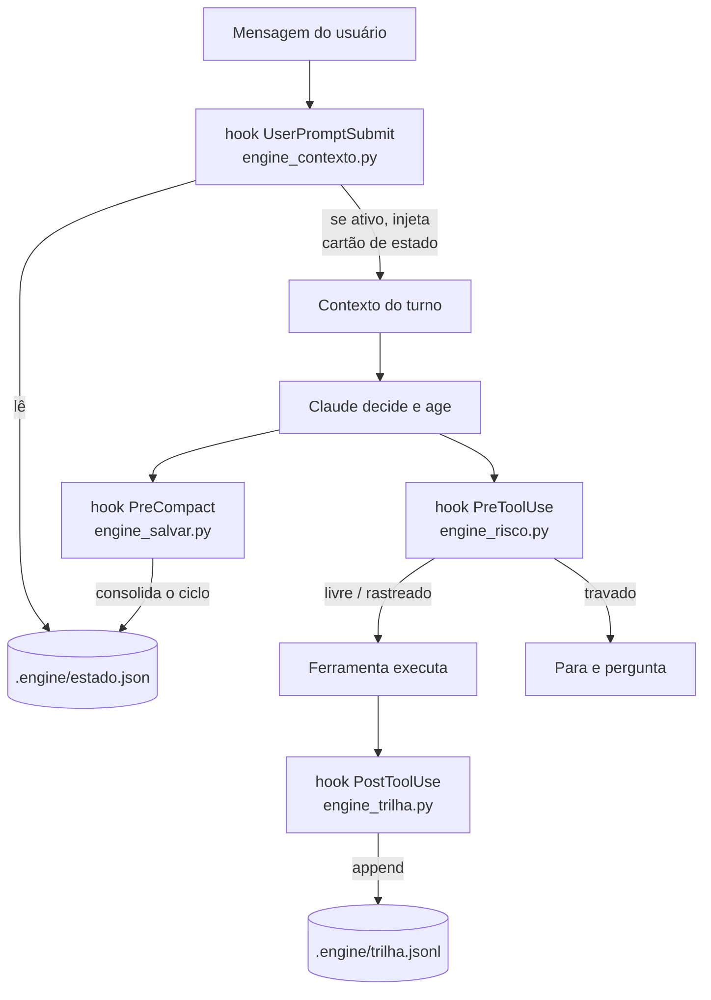
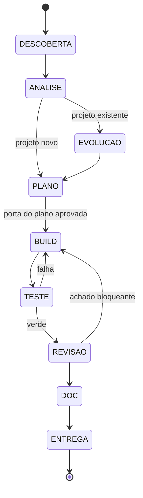

# ENGINE — Especificação de Desenho

- **Data:** 2026-07-30
- **Estado:** desenho aprovado, implementação não iniciada
- **Autor das decisões:** o usuário; escolhas registradas na seção 3

---

## 1. Problema

Um "modo de engenharia" para o Claude Code costuma ser tentado como **um prompt longo**
colado numa skill. Isso não funciona por um motivo mecânico, não estético: a skill carrega
**uma única vez**, no turno em que é invocada. A cada mensagem seguinte o texto afunda no
contexto, perde peso relativo, e na primeira compactação desaparece por completo. O que se
observa na prática é um comportamento excelente por três ou quatro turnos, seguido de
regressão silenciosa ao comportamento padrão — sem nenhum aviso de que o modo caiu.

O ENGINE existe para resolver isso: transformar "motor de engenharia" de **texto** em
**estado verificável**, com um ciclo de fases que uma máquina acompanha e um classificador
de risco que decide, por ação, o que pode acontecer sem perguntar.

## 2. Escopo

**É:** um plugin de escopo de usuário do Claude Code que instala um modo de trabalho
persistente — ciclo de engenharia em fases, elenco de agentes por papel, biblioteca de
conhecimento por tecnologia, e portas de segurança graduadas por risco. Vale em qualquer
projeto do usuário.

**Não é:** um substituto do ECC ou do superpowers (ambos permanecem instalados e são usados
como mão de obra); um gerador de documentação; e não tem relação com o acervo
AI-ENGINEERING-OS, que é outro projeto, já construído e selado.

**Fronteira de projeto.** O ENGINE vive em repositório próprio (`~/Desktop/ENGINE`). Nada
do seu desenvolvimento cria, edita ou apaga arquivo de outro projeto do usuário.

## 3. Decisões fixadas

| # | Decisão | Alternativas descartadas | Razão |
|---|---|---|---|
| D1 | Motor próprio completo: agents, hooks, commands e config próprios | roteador fino sobre o ECC; só um revisor de código | controle total do comportamento; escolha explícita do usuário, ciente do custo |
| D2 | Repositório próprio empacotado como plugin, instalado em escopo de usuário | escrever direto em `~/.claude`; dentro do AI-ENGINEERING-OS; no repositório de conciliação | versionável, testável, desinstalável; não mistura assunto com outros projetos |
| D3 | Autonomia **graduada por risco** | confirmação por fase; confirmação por arquivo existente; autônomo até a entrega | autonomia real no que é barato desfazer, trava no que não é; confirmação por arquivo vira aprovação automática, que é pior que não perguntar |
| D4 | 9 papéis + cartões de tecnologia | um agente por domínio (40+); mínimo de 4 papéis | 9 arquivos vivos em vez de 40; tecnologia nova custa 1 cartão de ~60 linhas |
| D5 | O ciclo é sempre do motor; ECC/superpowers executam **dentro** de uma fase | isolamento total; coexistência sem regra; sessão dedicada | aproveita os reviewers já instalados sem ceder o comando do ciclo |
| D6 | Direção visual é papel próprio (9º), não cartão | tratar UI/UX só como cartão consumido pelo implementador | propor direção visual é capacidade generativa, não checklist de validação |

## 4. Arquitetura

### 4.1 Persistência do modo

Três peças, e nenhuma delas é o texto da skill:



O diagrama mostra o laço que sustenta o modo: o estado em disco é lido antes de cada turno
e reescrito depois de cada ação relevante, de modo que nenhuma informação de controle
dependa de o texto original ainda estar visível no contexto.

O cartão de estado injetado a cada turno contém, e só contém: fase corrente, objetivo do
ciclo, decisões já fechadas (uma linha cada), cartões de tecnologia carregados, e os cinco
invariantes da seção 9. Teto duro de 40 linhas — se crescer além disso, o motor passa a
competir com o pedido do usuário pelo mesmo espaço de atenção, que é exatamente a doença
que ele veio curar.

### 4.2 `.engine/estado.json`

Fica no projeto onde o motor roda, não no repositório do plugin. Entra no `.gitignore` do
projeto hospedeiro. Valores abaixo são sintéticos.

```json
{
  "versao": 1,
  "ativo": true,
  "ciclo": {
    "id": "2026-07-30-1",
    "objetivo": "frase única, escrita na fase DESCOBERTA",
    "iniciado_em": "2026-07-30T14:02:11",
    "modo": "normal"
  },
  "fase": "BUILD",
  "fases_concluidas": ["DESCOBERTA", "ANALISE", "PLANO"],
  "cartoes": ["python", "fastapi", "pytest"],
  "decisoes": [
    {"o_que": "persistência em SQLite", "porque": "sem serviço externo no ambiente alvo"}
  ],
  "pendencias": [],
  "diffs_pendentes": ["app/servico.py"],
  "cobrancas_por_fase": {"BUILD": 0}
}
```

Datas e horas sempre em ISO (`YYYY-MM-DD`, `YYYY-MM-DDTHH:MM:SS`). `modo` aceita `normal`
ou `dry`; em `dry`, o classificador de risco rebaixa **toda** escrita para travada e o motor
produz plano e relatório sem tocar em disco.

`trilha.jsonl` é append-only, uma linha por ação: `{"quando", "fase", "papel", "ferramenta",
"alvo", "risco"}`.

### 4.3 Máquina de fases



O grafo é a definição normativa das transições: `ferramentas/estado.py` recusa qualquer
passagem que não esteja desenhada acima. Pular fase é possível **apenas** por instrução
explícita do usuário, e fica registrado no estado como pulo deliberado — o relatório final
diz quais fases não rodaram.

`EVOLUCAO` é obrigatória em projeto existente e produz um mapa de impacto: o que depende do
que vai mudar, o que precisa continuar compatível, o que quebra. É a tradução executável de
"nunca recomece o projeto".

**Porta do plano.** Único ponto de parada por fase. `engine.config.json` traz
`porta_plano: true` por padrão. O motor apresenta arquitetura, stack, estrutura e a
justificativa de cada decisão, e espera. Desligar a porta é escolha consciente do usuário,
não default.

## 5. Autonomia graduada — o classificador de risco

`ferramentas/risco.py` é a peça mais crítica do sistema. É a única coisa entre o motor e um
estrago irreversível, e por isso é a única que nasce com bateria de teste de mesa antes de
qualquer outra linha de código.

| Nível | Critério | Comportamento do hook |
|---|---|---|
| **travado** | casa uma das famílias da lista fechada abaixo (R1–R8) | **bloqueia** e devolve o motivo; o motor pergunta ao usuário com opções clicáveis |
| **livre** | **prova positiva de inocuidade**: leitura de arquivo que não é segredo; escrita em caminho inexistente em disco; escrita sob `tests/`; e, para comando, o segmento inteiro casar a **lista de permissões** (`COMANDOS_LIVRES` + `SUBCOMANDOS_GIT_LIVRES`, sem substituição de comando, sem redirecionamento, sem argumento de segredo) | permite; registra na trilha |
| **rastreado** | **DEFAULT** — tudo que não é comprovadamente travado nem comprovadamente livre: edição de arquivo que já existe, ferramenta desconhecida, comando ausente, e qualquer comando fora da lista de permissões | permite; acrescenta o caminho a `diffs_pendentes`; o motivo entra no relatório de fim de fase |

**O default é `rastreado`, e isso é uma inversão deliberada da arquitetura.** A versão
original classificava por lista de proibições: o que não casasse uma família proibida saía
`livre`. Quatro rodadas de revisão sobre essa versão acharam **doze bypasses**, e a quarta
rodada — já com onze correções aplicadas — ainda achou cinco novos, todos confirmados por
execução: quebra de linha não separava segmentos (`echo ok⏎rm -rf /dados`), substituição de
comando só era checada dentro de `echo` e do `-m` do git (`ls $(rm -rf /dados)`), os
interpretadores do Windows não eram reconhecidos (`cmd /c`, `pwsh -c`,
`powershell -EncodedCommand`) num projeto que roda em Windows, opção global despistava o
padrão do git (`git -C /repo push --force`), e ler segredo pelo shell escapava
(`cat .env`). A conclusão não é que faltou um padrão: é que **lista de proibições não
converge** — o conjunto de vetores é aberto, e cada correção só prova que o próximo ainda
não foi imaginado. Com a inversão, um vetor que ninguém previu deixa de ser livre **por não
estar na lista de permitidos**, sem precisar ter sido previsto. O preço é aceitar `rastreado`
como resposta normal para comando legítimo porém não enumerado: ele executa, e aparece no
relatório.

**Precedência.** Uma ação é avaliada contra os três níveis e recebe **o mais restritivo que
casar**. Criar um arquivo novo chamado `.env` é travado, não livre; rodar `pytest` num
comando encadeado com `rm` é travado, não livre. Nenhum critério de nível mais baixo
rebaixa um casamento de nível mais alto.

**Travado — lista fechada, ampliável só por edição do `engine.config.json`:**

1. Escrita de rede: `curl -X POST/PUT/DELETE`, `wget --post`, qualquer chamada a API de terceiros que não seja `GET`.
2. Git que sai da máquina ou reescreve história: `push`, `push --force`, `reset --hard`, `rebase`, `clean -fd`, `checkout --` sobre arquivo modificado.
3. Deleção: `rm`, `rmdir`, `Remove-Item`, `del`, e a ferramenta de deleção de arquivo.
4. Banco: `DROP`, `TRUNCATE`, `ALTER TABLE`, `DELETE FROM` sem `WHERE`, execução de migração.
5. Segredo: leitura **ou** escrita em `.env`, `*.pfx`, `*.pem`, `*.key`, `credentials*`, `*_secret*`; e qualquer conteúdo que case com padrões de chave conhecidos (`sk-`, `ghp_`, `AKIA`, JWT).
6. Deploy e infraestrutura: `docker push`, `kubectl apply`, `terraform apply`, `gh workflow run`, `npm publish`, `twine upload`.
7. Instalação global: `npm i -g`, `pip install` fora de venv, `winget install`, `choco install`.

**Falha segura.** Se `risco.py` levantar exceção, o hook classifica como **travado**. Um
classificador quebrado nunca libera; ele para. O modo de falha contrário — liberar quando
não consegue decidir — é o único que este projeto não pode ter.

**Contrato de teste.** Mínimo de 40 casos de mesa, cobrindo: cada item da lista travada; o
caso de arquivo que existe versus não existe; caminho com espaço e com acento (Windows);
comando encadeado (`git status && rm -rf x`), que precisa ser travado pelo pior elemento;
padrão travado aparecendo dentro de string literal, que **não** deve travar.

## 6. Os nove papéis

Formato de cada agente em `agents/<nome>.md`: front-matter (`name`, `description`, `tools`,
`model`) e corpo com **missão, entradas, saídas, ferramentas, limitações, critério de
pronto**. Só o `implementador` recebe escrita ampla; os demais leem e relatam — quem revisa
não conserta em silêncio, porque conserto silencioso destrói o valor do relatório.

| Papel | Missão | Entradas | Saídas | Escrita |
|---|---|---|---|---|
| `descobridor` | achar o objetivo real, requisitos explícitos e implícitos, regras de negócio, restrições, riscos | pedido do usuário; projeto | `objetivo` do ciclo + lista de requisitos e riscos | não |
| `cartografo` | mapear o projeto: arquitetura, dependências, padrões, duplicação, gargalos, vulnerabilidades, alvos de refatoração | árvore do projeto | mapa do projeto + cartões a carregar | não |
| `arquiteto` | decidir stack, estrutura, contratos, estratégia de teste e de deploy — **com justificativa por decisão** | objetivo + mapa | plano + ADRs | só o plano |
| `designer` | propor direção visual: layout, hierarquia, tipografia, cor, movimento, estados vazios e de erro | requisitos + cartão `ui-ux` + MCP `open-design` | direção visual + opções comparáveis | só a direção |
| `implementador` | escrever o código, completo e funcional | plano + direção + cartões | código | **sim** |
| `testador` | escrever e rodar teste; nunca ajustar teste para o código passar | plano + código | suíte + saída real da execução | testes |
| `revisor` | arquitetura, legibilidade, manutenibilidade | diff do ciclo | achados classificados por severidade | não |
| `sentinela` | segurança e performance; invoca `ecc:security-reviewer` e `ecc:performance-optimizer` como executores | diff do ciclo | achados consolidados | não |
| `documentador` | documentação técnica e funcional, diagramas Mermaid, ADR, contrato de API, modelo de dados | tudo do ciclo | docs | docs |

## 7. Cartões de tecnologia

Um cartão é um arquivo curto de conhecimento operacional, não um agente. Formato:

```markdown
---
tecnologia: fastapi
detectar: ["**/main.py", "pyproject.toml:fastapi", "requirements*.txt:fastapi"]
papeis: [arquiteto, implementador, testador, revisor]
versao: 2026-07-30
---

## Convenções
## Armadilhas
## Comandos (build, teste, lint)
## Checklist de review
```

`ferramentas/detectar.py` varre o projeto, casa os padrões de `detectar` e escreve a lista
em `estado.cartoes`. Cada papel carrega **apenas** os cartões que o listam em `papeis`.

**Elenco inicial — 12:** `python`, `fastapi`, `pytest`, `excel-vba`, `office-scripts`,
`power-query`, `react`, `typescript`, `postgresql`, `sqlite`, `ui-ux`, `mermaid`.

Tecnologia nova custa um arquivo. Esse é o ponto do desenho: o custo marginal de cobertura
precisa ser baixo o bastante para que ampliar cobertura não vire, ele próprio, um projeto.

## 8. Convivência com ECC e superpowers

Regra única, escrita no `CLAUDE.md` do plugin:

> Ferramenta alheia **executa dentro** de uma fase do motor. Nenhuma ferramenta alheia
> decide qual é a fase seguinte, nem quando o ciclo termina.

Na prática: `sentinela` e `revisor` invocam os reviewers do ECC e **consolidam** o resultado
no relatório do motor; o `testador` pode usar o fluxo de TDD do superpowers como método
dentro da fase `TESTE`. O que nunca acontece é uma skill externa abrir ciclo próprio,
declarar conclusão, ou pular a porta do plano.

Se o usuário invocar explicitamente uma skill externa com o motor ligado, ela roda — o motor
registra na trilha que a fase foi conduzida por ferramenta externa, e o relatório final diz
isso. Instrução direta do usuário sempre vence o motor.

## 9. Invariantes

Injetados no contexto a cada turno enquanto o motor estiver ativo. São herdados das regras
de casa do usuário e não são preferências de estilo:

1. **Nunca afirmar sucesso sem ter olhado.** Rodou o gate, cola a saída. Não rodou, diz que não rodou. "Deve passar" não é resultado.
2. **Nunca ajustar o teste para o código passar.** O teste é o contrato; o código é que cede.
3. **Nunca inventar arquivo, API, número ou regra de negócio.** Sem evidência, é pendência humana — não é palpite bem escrito.
4. **Nunca tocar em item fora do escopo declarado do ciclo.**
5. **Toda decisão técnica sai com a justificativa junto**, na mesma entrega.

## 10. Comandos

Uma skill, `engine`, com sub-verbos por argumento:

| Comando | Efeito |
|---|---|
| `/engine [pedido]` | liga o motor, cria o ciclo e entra em `DESCOBERTA` |
| `/engine off` | desliga, gera o relatório da sessão, preserva a trilha |
| `/engine status` | fase, ciclo, decisões, arquivos tocados, pendências, diffs por apresentar |
| `/engine retomar` | reconstrói o estado numa sessão nova a partir de `.engine/` |
| `/engine --dry [pedido]` | ciclo completo em modo seco: planeja e relata, não escreve |

## 11. Hooks

| Evento | Script | Comportamento | Falha segura |
|---|---|---|---|
| `UserPromptSubmit` | `engine_contexto.py` | se ativo, injeta o cartão de estado (teto 40 linhas) | erro → não injeta, avisa uma vez |
| `PreToolUse` | `engine_risco.py` | classifica e libera / rastreia / bloqueia | erro → **bloqueia** |
| `PostToolUse` | `engine_trilha.py` | append em `trilha.jsonl`: ferramenta, alvo, fase, papel | erro → segue, registra a falha |
| `PreCompact` | `engine_salvar.py` | consolida o ciclo no estado antes da compactação | erro → avisa; `/engine retomar` continua funcionando |
| `Stop` | `engine_gate.py` | se a fase exige evidência e ela não existe, cobra uma vez | **no máximo uma cobrança por fase** — contador `cobrancas_por_fase` impede laço |

O hook de `Stop` é o mais perigoso do conjunto: um gate sem contador vira laço infinito de
re-invocação. O contador por fase é requisito, não otimização.

## 12. Ferramentas Python

Biblioteca padrão apenas — sem dependência externa. Uma ferramenta de infraestrutura que
exige `pip install` para funcionar falha exatamente no ambiente em que mais se precisa dela.

| Módulo | Responsabilidade |
|---|---|
| `estado.py` | ler/gravar `.engine/estado.json`; validar transição de fase |
| `risco.py` | classificar uma ação em livre / rastreado / travado |
| `detectar.py` | varrer o projeto e resolver a lista de cartões |
| `trilha.py` | append-only em `trilha.jsonl` e leitura para relatório |
| `relatorio.py` | relatório de ciclo e de sessão, em Markdown |
| `config.py` | ler `engine.config.json` com defaults |

## 13. Estrutura do repositório

```
ENGINE/
├── .claude-plugin/plugin.json
├── CLAUDE.md
├── README.md
├── engine.config.json
├── skills/engine/SKILL.md
├── agents/                 descobridor, cartografo, arquiteto, designer,
│                           implementador, testador, revisor, sentinela, documentador
├── cartoes/                12 cartões + _catalogo.md
├── hooks/                  engine_contexto, engine_risco, engine_trilha,
│                           engine_salvar, engine_gate
├── ferramentas/
│   ├── estado.py  risco.py  detectar.py  trilha.py  relatorio.py  config.py
│   └── tests/
├── aceite/                 4 cenários de fumaça
└── docs/specs/
```

No projeto hospedeiro, apenas `.engine/estado.json` e `.engine/trilha.jsonl`, ambos
ignorados pelo git.

## 14. Verificação

Três camadas, porque o modo de falha típico deste tipo de projeto é **parecer** funcionar.

1. **Testes unitários** (`pytest`, stdlib): `risco` (≥40 casos de mesa), `estado`
   (transições válidas e inválidas), `detectar` (stack presente e ausente), `trilha`.
2. **`/engine --dry`**: o ciclo inteiro sem escrita. Prova que as fases encadeiam e que o
   relatório sai, sem arriscar nada.
3. **Cenários de aceite** em `aceite/`, com resultado esperado escrito antes da execução:
   - (a) CLI Python do zero — exercita o caminho de projeto novo;
   - (b) bug em código existente — exercita `EVOLUCAO` e o mapa de impacto;
   - (c) refatoração sem mudança de comportamento — exige que a suíte permaneça verde;
   - (d) macro Excel/VBA — exercita o cartão de Office e o caminho fora do mundo web.

**Critério de pronto do projeto:** as três camadas verdes, com a saída colada no
`CHANGELOG.md`. A fase 1 não se declara pronta sem os itens 1 e 2.

## 15. Faseamento

| Fase | Conteúdo | Critério de pronto |
|---|---|---|
| **1 — núcleo** | `estado.py`, `risco.py`, `config.py`; hooks `contexto` e `risco`; skill `/engine` com `on/off/status`; 4 papéis (arquiteto, implementador, revisor, documentador); 3 cartões (`python`, `pytest`, `ui-ux`); testes de risco e de estado | o modo sobrevive a 20 turnos e a uma compactação; as 7 famílias travadas travam de fato |
| **2 — elenco** | os outros 5 papéis (descobridor, cartografo, designer, testador, sentinela); os 9 cartões restantes; `trilha.py`, `relatorio.py`; hooks `trilha`, `salvar`, `gate`; `/engine retomar` | relatório de ciclo sai completo; `retomar` reconstrói o estado em sessão nova |
| **3 — prova** | `--dry`; os 4 cenários de aceite; cartões de Office completos; `README` e documentação de instalação do plugin | os 4 cenários passam com resultado igual ao previsto |

## 16. Riscos conhecidos

| Risco | Mitigação |
|---|---|
| Cartão de estado cresce e passa a competir com o pedido do usuário | teto duro de 40 linhas, verificado por teste |
| Hook `Stop` entra em laço | `cobrancas_por_fase` no estado; no máximo uma cobrança |
| Classificador com falso negativo libera ação destrutiva | falha segura = travado; ≥40 casos de mesa; lista travada fechada e versionada |
| Classificador com falso positivo trava trabalho legítimo, e o usuário passa a aprovar no automático | os casos de mesa incluem os falsos positivos conhecidos (padrão dentro de string, comando de leitura com nome parecido) |
| Motor e ECC produzem achado duplicado na revisão | `sentinela` e `revisor` **consolidam**; o relatório do motor é a única saída |
| Motor ligado numa sessão de outro projeto age fora do assunto | invariante 4; o `objetivo` do ciclo é escrito na `DESCOBERTA` e injetado a cada turno |

## 17. Fora de escopo

Registrado para não ser reaberto por esquecimento:

- **Um agente por tecnologia** (40+). Substituído por cartões (D4).
- **A lista de 42 especializações como conteúdo escrito.** É prosa, não capacidade.
- **Qualquer coisa do AI-ENGINEERING-OS.** Projeto distinto, já construído e selado.
- **Interface gráfica ou painel web para o motor.** Só depois de as três camadas de
  verificação estarem verdes.
