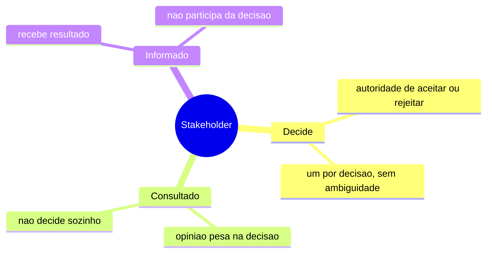
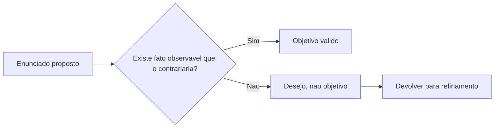

# Diagramas

A classificação em três categorias não é hierarquia de importância — um "Consultado" pode ser
tecnicamente mais informado que quem "Decide", e isso não muda a categoria: a categoria mede
autoridade formal sobre o resultado, não competência sobre o assunto. Confundir as duas é o erro
mais comum ao montar essa lista — colocar alguém em "Decide" porque é a pessoa mais experiente na
sala, não porque tem de fato o poder de aceitar ou rejeitar o entregável.

## Objetivo mensurável versus desejo

O teste é o mesmo que `04-REQUIREMENTS` aplica a requisito técnico, uma camada acima: em vez de
perguntar se o comportamento do sistema pode ser contrariado por um fato, pergunta-se se o
resultado de negócio pode. "Aumentar a satisfação do cliente" falha o teste; "reduzir o tempo
médio de resposta de suporte de 48h para 12h" passa, porque existe um número que provaria o
objetivo descumprido. O nó `D` (devolver para refinamento) não é falha do processo — é o
resultado esperado na primeira tentativa de captura, porque a maioria dos objetivos propostos
começa como desejo e só vira objetivo depois de alguém ser forçado a nomear o fato que o
contrariaria. Passar pelo ciclo `D` uma ou duas vezes antes de chegar em `C` é sinal de que o
processo está funcionando, não de que o stakeholder está sendo mal atendido pela pergunta.
