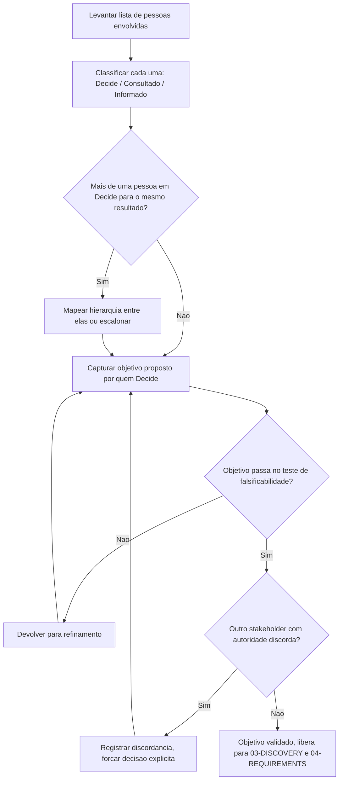

# Fluxogramas

O ciclo entre `E` e `G` (objetivo que falha o teste de falsificabilidade) e entre `E` e `I`
(discordância entre stakeholders com autoridade) são os dois pontos onde o processo mais
comumente trava — e travar ali é o comportamento correto, não uma falha do processo. A saída
`J` só é alcançada quando as duas condições — objetivo mensurável e concordância entre todos os
que têm autoridade — são satisfeitas ao mesmo tempo.

## O caminho que não deveria existir

Um objetivo que nunca passa pelo nó `F` (nunca é testado quanto à falsificabilidade) porque
alguém decide "pular essa etapa para agilizar" é o anti-padrão mais caro deste processo — a
agilidade aparente na captura vira retrabalho garantido em `04-REQUIREMENTS`, quando um requisito
técnico impecável não consegue ser ligado a nenhum critério de sucesso mensurável.

O ciclo entre `E` e `D` (mapear hierarquia ou escalonar quando há mais de um `DECIDE`) acontece
antes de qualquer objetivo ser proposto, de propósito: descobrir que existem dois decisores
concorrentes depois de já ter um objetivo capturado de cada um custa mais do que descobrir isso
antes — a ordem do fluxograma inteiro é desenhada para que o ponto mais caro de descoberta seja
sempre o mais cedo possível, nunca o mais tarde.
