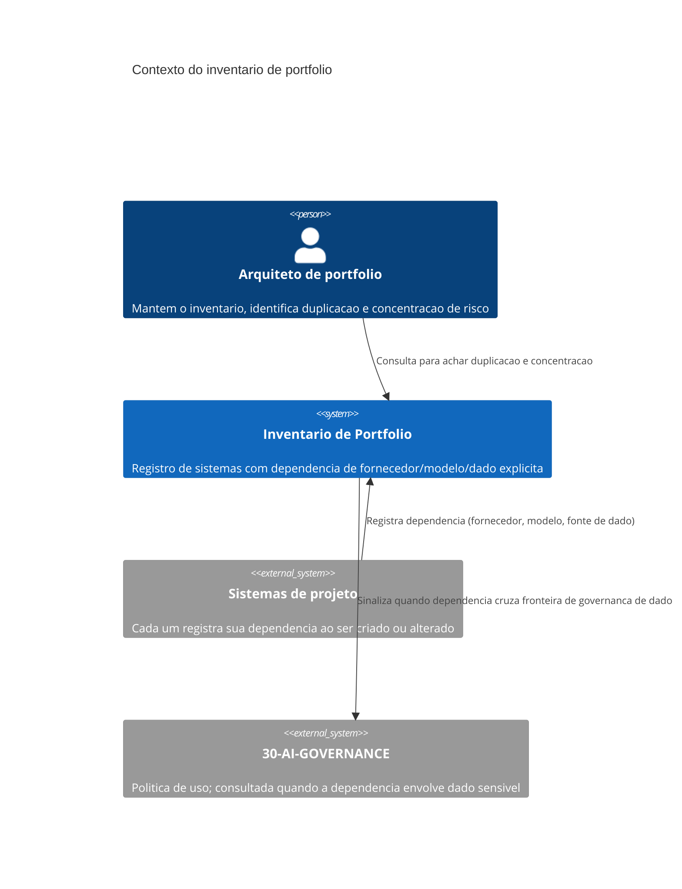

# Arquitetura

O inventário é o componente central, e deliberadamente passivo: ele não decide nada por conta
própria, só torna visível o que estava disperso entre projetos que não se enxergam. A decisão de
portfólio (bloquear um novo fornecedor, consolidar dois pipelines duplicados) continua sendo
humana, tomada por quem tem autoridade sobre portfólio — o mesmo padrão de `05-BUSINESS`, onde o
processo torna visível sem decidir sozinho.

## Por que o inventário não pode ser opcional

Um sistema que não se registra é invisível ao portfólio, e invisibilidade é exatamente a condição
que produz a dependência não decidida de propósito descrita em `01-Introducao.md`. O registro não
precisa ser burocrático nem lento — a forma mínima é um campo por sistema (fornecedor, modelo,
fonte de dado) atualizado no momento em que a decisão técnica correspondente é tomada, não numa
auditoria trimestral separada que sempre chega tarde.

O `arquiteto` do diagrama não é necessariamente um cargo dedicado — em empresas pequenas pode ser
a mesma pessoa que decide arquitetura técnica em `02-CORE`, usando um chapéu diferente. O que
importa não é o título, é que a consulta ao inventário aconteça por alguém com visão do
portfólio inteiro, não só do projeto em que está trabalhando naquele momento — a mesma pessoa
pode desempenhar os dois papéis sem que os dois colapsem num só.
