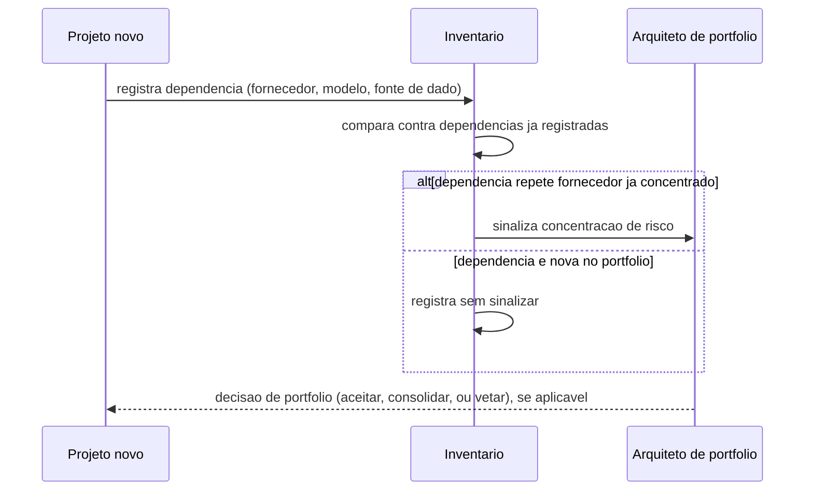
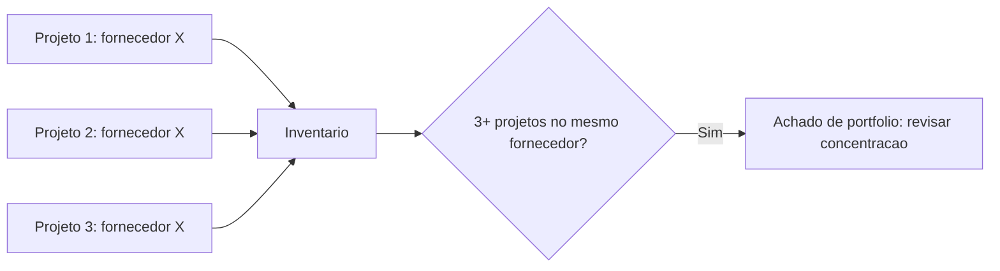

# Diagramas

A sinalização de concentração não bloqueia o registro — o projeto registra primeiro, a análise
acontece depois, de forma assíncrona. Bloquear o registro até a análise terminar criaria o
mesmo atrito que motiva equipes a pular o inventário inteiro; o custo de revisar depois é menor
que o custo de nunca ter o dado registrado.

## Concentração de fornecedor ao longo do tempo

O limiar de "3+" é ilustrativo, não uma regra fixa — o ponto do diagrama é que a detecção é
estrutural (contagem de dependência repetida), não intuição de quem lembra quais projetos usam o
quê. Sem o inventário, essa contagem simplesmente não existe em lugar nenhum.

A mesma estrutura de contagem serve para detectar duplicação de capacidade, trocando "fornecedor"
por "categoria de capacidade" no nó `E` — dois sistemas na mesma categoria, registrados por
projetos diferentes sem relação declarada entre si, disparam o mesmo tipo de achado que
concentração de fornecedor, só que com implicação distinta: não é risco de dependência, é
oportunidade de consolidação. A diferença de implicação é o motivo de as duas consultas serem
mantidas separadas no exemplo executável (`concentracao_por_fornecedor` e `duplicacoes`) em vez
de uma única função genérica — o número devolvido é parecido, mas a ação que ele sugere não é.
