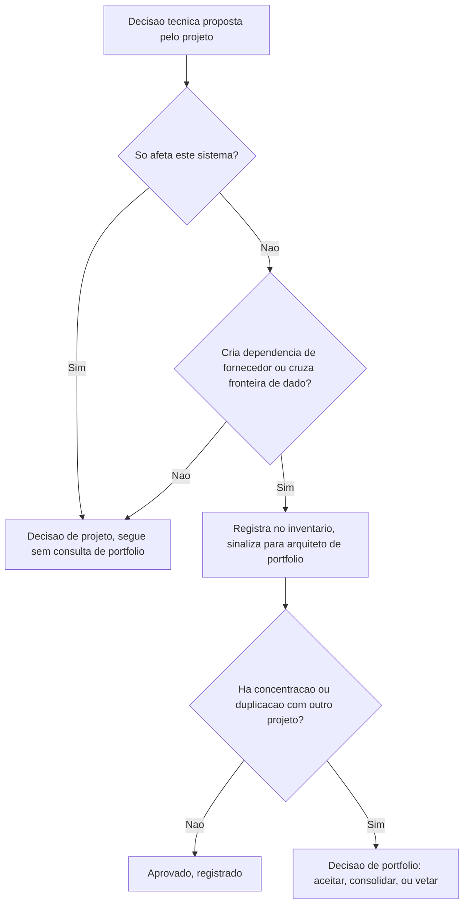

# Fluxogramas

O nó `B` é o filtro mais importante do fluxo: a maioria das decisões técnicas de um projeto nunca
chega a `D`, porque só afeta o próprio sistema. Tratar toda decisão como candidata a revisão de
portfólio produziria exatamente a lentidão que `01-Introducao.md` identifica como o extremo
ruim oposto à invisibilidade.

## O caminho que mais se ignora na prática

Decisão que cria dependência mas nunca passa por `E` — porque o projeto não sabia que deveria
registrar, não porque decidiu pular de propósito — é o modo de falha mais comum deste processo, e
a razão pela qual `09-Boas-Praticas.md` recomenda registrar no momento da decisão técnica, não
numa etapa administrativa separada que a equipe de projeto facilmente esquece.

O nó `H` (decisão de portfólio) nunca é automático — mesmo quando `F` detecta concentração ou
duplicação com alta confiança, a saída é sempre uma decisão humana registrada, nunca uma regra
que bloqueia ou aprova sozinha. Isso é coerente com E6: o inventário registra fato, quem decide
mérito é sempre uma pessoa com autoridade sobre portfólio. O fluxograma inteiro, lido de ponta a
ponta, tem uma propriedade que vale nomear: nenhum caminho leva a uma decisão de portfólio sem
que o achado que a motivou (`F`) tenha sido registrado antes — a decisão nunca aparece
desacompanhada do fato que a gerou.
