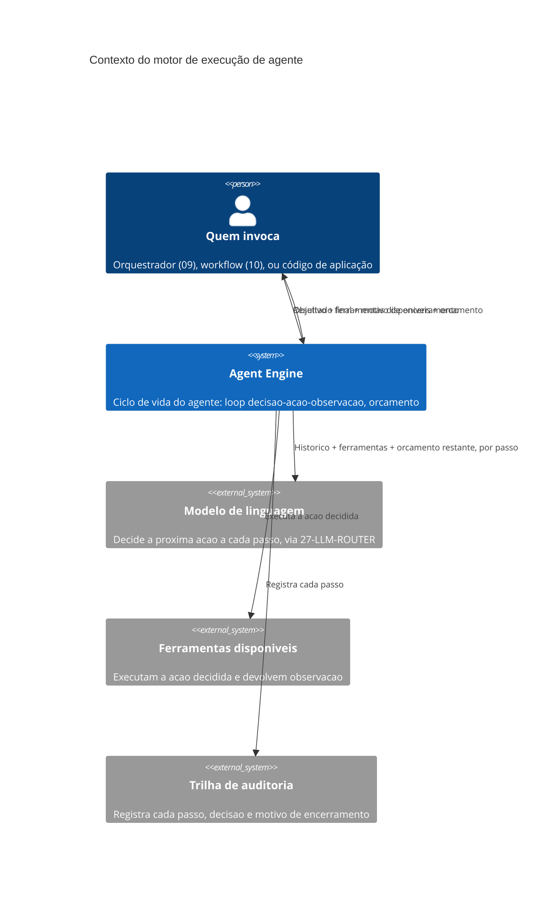

# Arquitetura

O motor fica entre quem invoca (que decide *que* agente rodar e com que objetivo) e três
dependências externas: o modelo de linguagem (que decide a ação a cada passo, mas não sabe nada
sobre orçamento além do que o motor informa), as ferramentas (que executam e devolvem
observação, sem saber que fazem parte de um agente), e a trilha (que registra para auditoria
posterior). Nenhuma dessas três dependências decide quando o ciclo termina — essa decisão é
exclusivamente do motor, aplicando as regras de orçamento e de objetivo atingido descritas em
`07-Regras.md`.

## Componentes internos

O **executor de passo** monta o prompt do passo (histórico + ferramentas + orçamento restante),
chama o modelo, e valida a resposta contra o contrato (uma ação por passo). O **despachante de
ferramenta** recebe a ação decidida, localiza a ferramenta correspondente, executa, e captura
tanto sucesso quanto erro como observação — erro de ferramenta nunca aborta o loop sozinho, ele
volta como observação para o próximo passo decidir o que fazer, a menos que o erro seja marcado
como não recuperável. O **guardião de orçamento** decrementa passos/tokens/tempo a cada passo e
força encerramento quando qualquer dimensão chega a zero, independente do que o modelo decidiu.
O **registrador de trilha** grava cada passo, cada decisão do guardião de orçamento, e o motivo
final de encerramento — é esse componente que faz a diferença entre "terminou" e "terminou por
quê" existir na auditoria.
