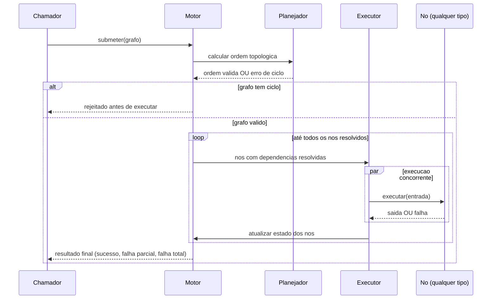
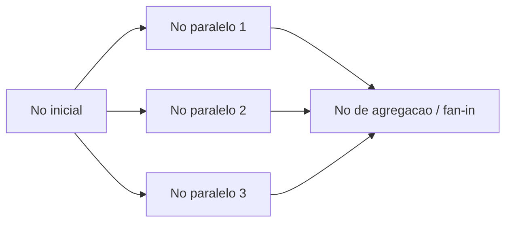

# Diagramas

A sequência separa claramente dois momentos: a validação do grafo (que acontece uma única vez,
antes de qualquer nó rodar) e a execução iterativa (que repete enquanto houver nó pendente). Um
grafo com ciclo nunca chega a disparar um único nó — a rejeição acontece inteiramente na fase de
planejamento, o que evita o cenário mais caro de detectar um ciclo: descobrir no meio da
execução que um nó está esperando por outro que, por sua vez, espera pelo primeiro, depois que
recursos já foram consumidos. O bloco `par` dentro do loop é o que representa a execução
concorrente de todos os nós que ficaram prontos na mesma rodada — o motor não espera um nó
terminar para disparar outro que já esteja pronto, e o limite de concorrência configurado é
quem decide quantos desses nós prontos de fato começam a executar imediatamente versus ficam
numa fila curta esperando um slot liberar.

## Fan-out e fan-in

O nó `A` é um fan-out: produz três nós dependentes sem dependência entre si, que o executor
concorrente pode disparar ao mesmo tempo, respeitando o limite de concorrência configurado. O nó
`C` é um fan-in: só entra no conjunto de "prontos" depois que os três nós paralelos terminam,
independente da ordem em que cada um termina. Se qualquer um dos três falhar e a política de
falha for "abortar dependentes", `C` nunca executa — ele herda a falha por dependência não
resolvida, não por falha própria.
