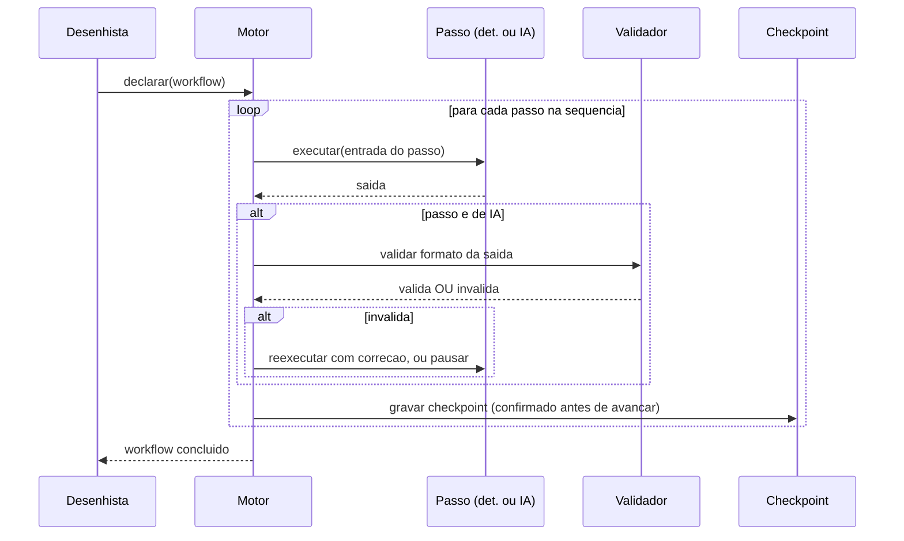
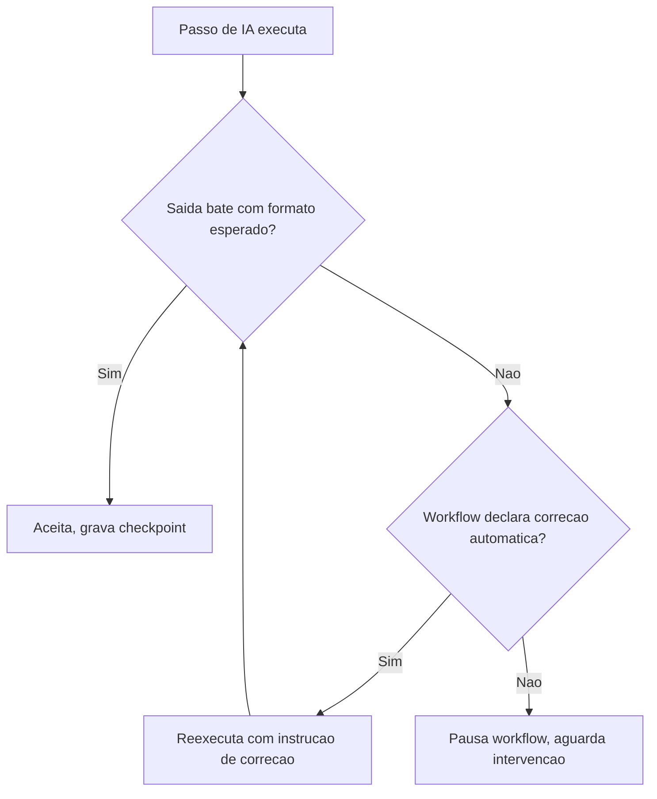

# Diagramas

A validação de saída só acontece para passos de IA — um passo determinístico, se a chamada teve
sucesso, tem sua saída aceita sem essa etapa adicional, porque a garantia de repetibilidade já
vem da própria natureza do passo. O checkpoint é gravado e confirmado antes do motor avançar para
o próximo passo da sequência — essa ordem (gravar, confirmar, só então avançar) é o que garante
que uma falha entre dois passos nunca deixa o workflow num estado onde o checkpoint diz "passo N
concluído" mas o passo N+1 já começou sem isso estar registrado.

## Passo de IA com falha de validação e recuperação

O fluxo mostra que a saída inválida de um passo de IA nunca é aceita silenciosamente — ou o
workflow tem uma estratégia declarada de correção automática (reexecutar com uma instrução
adicional apontando o que estava errado), ou o motor pausa e espera intervenção, nunca segue
adiante com dado que não bate com o contrato esperado pelo próximo passo. O ciclo de reexecução
com correção tem limite de tentativas (ver `08-Modelos.md` e `09-Boas-Praticas.md`) — sem esse
limite, uma saída consistentemente malformada faria o motor tentar indefinidamente sem nunca
convergir, consumindo tempo e tokens sem produzir resultado utilizável. Quando o limite se
esgota, o fluxo cai no mesmo ramo de `Pausado` que uma saída sem correção automática declarada
alcançaria diretamente — os dois caminhos convergem no mesmo estado de espera por intervenção.
