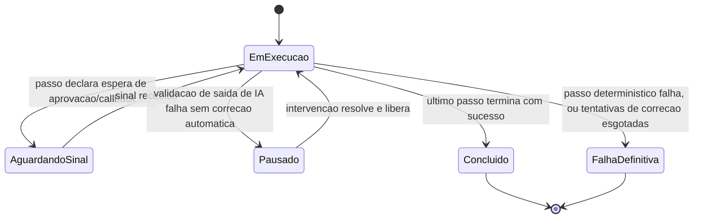

# Fluxogramas

O estado `AguardandoSinal` pode durar de segundos a dias, e é justamente por isso que o
checkpoint gravado antes de entrar nesse estado precisa ser suficiente para retomar mesmo que o
processo do motor seja reiniciado enquanto o workflow espera — não há garantia de que o mesmo
processo que entrou em `AguardandoSinal` seja o que vai processar o sinal quando ele chegar. O
estado `Pausado` é semelhante em durabilidade, mas o motivo é diferente: não é espera por evento
externo esperado, é uma saída de IA que não bateu com o contrato e não teve correção automática
configurada — a diferença importa para quem opera o workflow, porque `AguardandoSinal` é
comportamento esperado do processo de negócio, e `Pausado` é sinal de que algo precisa de atenção.

## Retomada a partir de checkpoint

Um workflow em `AguardandoSinal` ou `Pausado` que sofre reinício de processo não perde o
progresso: na próxima inicialização do motor, ele lê os checkpoints gravados e retoma cada
workflow interrompido exatamente no estado em que estava, sem reexecutar nenhum passo já
concluído. A garantia central é que o checkpoint contém tudo que é necessário para essa retomada
— nenhuma informação de estado do workflow deveria existir só em memória do processo, porque
memória não sobrevive a reinício.
