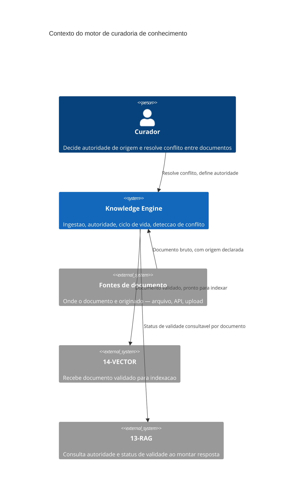

# Arquitetura

O motor fica entre a fonte bruta e o índice — nenhum documento chega a `14-VECTOR` sem passar
pela validação de autoridade e ciclo de vida deste volume primeiro. Essa ordem é deliberada: um
documento indexado sem curadoria prévia poderia ser recuperado por `13-RAG` antes de qualquer
verificação de validade acontecer.

## Componentes

O **validador de ingestão** recebe documento bruto e recusa entrada sem autoridade de origem
declarada — nunca aceita documento "por enquanto, valida depois". O **detector de conflito**
compara documento novo contra existentes sobre o mesmo fato e sinaliza para o curador quando há
divergência, sem decidir sozinho qual prevalece. O **gestor de ciclo de vida** move documento
entre os três estados (válido, expirando, expirado) e garante que a consulta de status nunca
devolve expirado como válido, mesmo que o índice ainda não tenha sido atualizado.

## Por que a ordem motor-antes-de-indice importa

Se um documento pudesse ser indexado por `14-VECTOR` antes de passar pelo validador deste
motor, `13-RAG` poderia recuperá-lo numa resposta antes que qualquer verificação de autoridade
ou conflito acontecesse — a garantia inteira do volume dependeria de disciplina de quem opera o
pipeline, não da arquitetura. Forçar a ordem estruturalmente (o índice só recebe o que já passou
por aqui) elimina essa dependência de disciplina.
