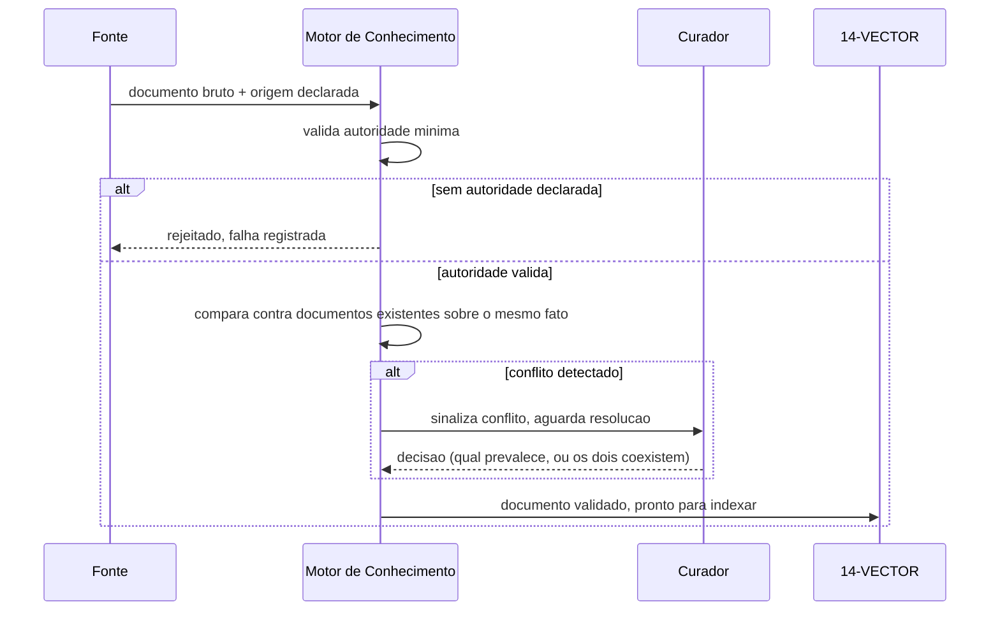
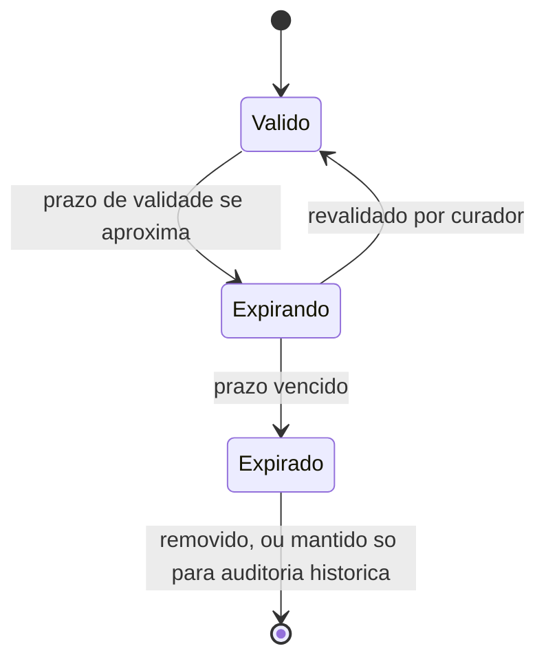

# Diagramas

A falha de ingestão (ramo superior) é tão importante quanto o caminho de sucesso — um documento
rejeitado por falta de autoridade precisa aparecer como evento registrado, não como ausência
silenciosa que só é percebida quando alguém procura por informação que deveria estar lá e não
está.

## Estados do ciclo de vida

O estado `Expirado` nunca é devolvido como `Valido` por consulta padrão — um consumidor que
precisa explicitamente de histórico (mesmo expirado) usa uma consulta diferente, marcada como
tal, nunca a consulta padrão de documento válido. A transição `Expirando -> Valido` é a única
seta que aponta para trás no diagrama, e isso é proposital: ela representa a única forma
legítima de um documento recuperar validade, sempre por ação humana explícita, nunca por
qualquer outra rota implícita que o diagrama poderia sugerir se desenhado de outra forma. Não
existe seta de `Expirado` de volta a nenhum outro estado — a ausência é deliberada, refletindo
que revalidar documento já expirado é reingestão de fato, não continuação do mesmo ciclo de vida.

## Por que a falha aparece no diagrama de sequência

A maioria dos diagramas de ingestão de conhecimento mostra só o caminho de sucesso. Este mostra
o ramo de rejeição no mesmo nível de detalhe do ramo de aceitação, porque K4 trata falha de
ingestão como evento de primeira classe — um diagrama que omite esse ramo sugere, mesmo sem
intenção, que rejeição é caso raro que não precisa de tratamento cuidadoso.
